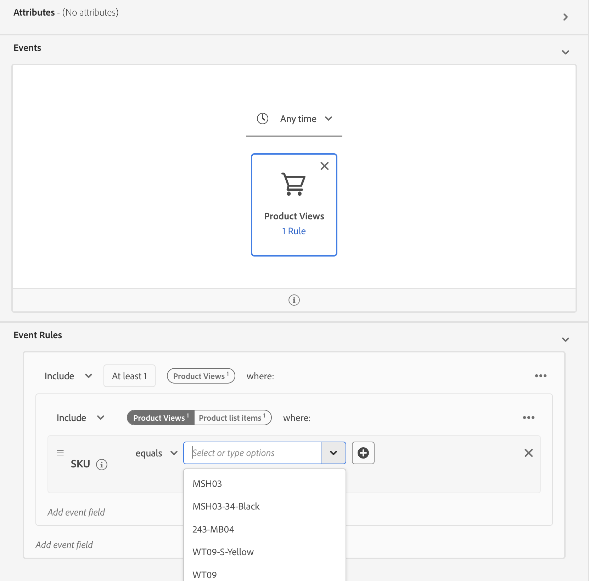

# Soorten publiek maken in Real-Time CDP met [!DNL Commerce] Gebeurtenisgegevens

Gebeurtenisgegevens gebruiken die zijn vastgelegd via uw [!DNL Commerce] winkel voor publiek in Real-Time CDP. De vastgelegde gegevens zijn gebaseerd op browsergedrag, aankopen in het verleden, profielkenmerken, eigenschappen die moeten worden omgezet of omgezet in een churn, loyaliteitsstatus, hoge en lage klantwaarde en meer.

## Welke gegevens moet ik overwegen te gebruiken?

Maak een publiek in Real-Time CDP met gegevens van winkel-, back-office- en profielgebeurtenissen.

| Gegevenstypen | Storefront-gegevens (gedragsgebeurtenissen) | Back Office-gegevens (server-side gebeurtenissen) | Klantprofiel en segmentgegevens |
|---|---|---|---|
| **Definitie** | Klik of acties die klanten op uw site uitvoeren. | Informatie over de levenscyclus en details van elke bestelling (verleden en huidig). | Wie zijn de kopers en voor welke segmenten komen ze in aanmerking? |
| **Gebeurtenissen vastgelegd door Adobe Commerce** | [productPageView](events.md#productpageview) [addToCart](events.md#addtocart) | [placeOrder](events.md#completecheckout) [geordend](events-backoffice.md#orderplaced) [orderLineItemRefunded](events-backoffice.md#orderlineitemrefunded) [bestelling geannuleerd](events-backoffice.md#ordercancelled) [ordergeschiedenis](connect-data.md#send-historical-order-data) | [createAccount](events.md#createaccount) [editAccount](events.md#editaccount) [Profielrecord](events-profilerecord.md) |

## Wat hebben andere klanten bereikt?

Adobe [!DNL Commerce] klanten hebben belangrijke bedrijfsgevolgen bereikt door in Real-Time CDP ingebouwd publiek te activeren en naar hun [!DNL Commerce] -instantie.

Een wereldwijde, multibrand-kledinghandelaar bereikte:

- Één bron van waarheid met 10 s van miljoenen verenigde klantenprofielen
- 40+ unieke doelgroepen van &quot;klanten met hoge intentie&quot; gemaakt voor deelname aan verschillende kanalen

Een wereldwijd drankenbedrijf verzamelde:

- 98 miljoen klantprofielen uit meer dan 100 landen

## Laten we beginnen

In dit artikel leert u hoe u:

- Maak een publiek in Real-Time CDP op basis van de [!DNL Commerce] gegevens die door gebeurtenissen worden verzameld
- Activeer dat publiek voor uw [!DNL Commerce] winkel
- Gebruik het publiek in [!DNL Commerce] informatie over een kartonprijsregel

>[!IMPORTANT]
>
>Voltooi de in dit artikel beschreven taken met behulp van uw [!DNL Commerce] sandboxomgeving. Dit zorgt ervoor dat de opslag en de gegevens van de achterkantoorgebeurtenis u naar Experience Platform verzendt uw gegevens van de productiegebeurtenis niet verdunnen.

### Vereisten

Voordat u begint, controleert u of:

- U bent ingericht om Real-Time CDP te gebruiken. Als u niet zeker bent, raadpleegt u uw systeemintegrator of ontwikkelingsteam dat projecten en omgevingen beheert.
- U [geïnstalleerd](install.md) en [geconfigureerd](connect-data.md) de [!DNL Data Connection] extensie in [!DNL Commerce].
- U [bevestigd](connect-data.md#confirm-that-event-data-is-collected) dat uw [!DNL Commerce] gebeurtenisgegevens arriveren bij het Experience Platform edge.

### 1. Een publiek maken

Een publiek is een reeks klanten die gelijkaardig gedrag of kenmerken delen. In deze oefening, creeer u een publiek dat mensen kwalificeert die in een bepaald product van uw winkel geinteresseerd zijn.

Om deze oefening te vereenvoudigen, gebruikt u gebeurtenisgegevens van [productPageView](events.md#productpageview) gebeurtenis. Deze gebeurtenis legt details vast over het product dat is weergegeven, zoals de productnaam, SKU, prijs, enzovoort.

Gebruik deze gebeurtenisgegevens om op te geven dat het publiek personen bevat met ten minste één gebeurtenis &quot;Productweergaven&quot; waarbij de SKU (product-id) gelijk is aan een specifiek product op uw site en de gebeurtenis plaatsvindt binnen de laatste dag. &#x200B;

1. Experience Platform openen en selecteren **[!UICONTROL Audiences]** in het navigatiemenu aan de linkerkant.

   

1. Klik op **[!UICONTROL Create Audience]**.

   

   De **Segment Builder** wordt weergegeven.

1. In de **Segment Builder** werkruimte, selecteert u de **Regel samenstellen** aanmaakmethode.

   

   De **Segment Builder** in de werkruimte definieert u de regels en voorwaarden voor uw publiek. &#x200B; Deze regels en voorwaarden zijn gebaseerd op gebeurtenis- en profielgegevens uit uw Commerce-winkel en definiëren de criteria die bepalen of een gebruiker voor het publiek in aanmerking komt. U kunt bijvoorbeeld een regel maken die gebruikers bevat die een bepaald product hebben weergegeven, of gebruikers die een aankoop binnen een bepaalde tijdsperiode hebben gedaan. Meer informatie over [Segment Builder](https://experienceleague.adobe.com/en/docs/experience-platform/segmentation/ui/segment-builder) en regels en voorwaarden.

1. Selecteer de [Gebeurtenissen](https://experienceleague.adobe.com/en/docs/experience-platform/segmentation/ui/segment-builder#events) tab.

   

1. Zoek naar het gebeurtenistype &quot;Productweergaven&quot;. Vervolgens sleept u het bestand naar het **Segment Builder** werkruimte.

1. Terugkeren naar de **Gebeurtenissen** tab en zoek naar &quot;SKU&quot; (gegevensveld onder de `productListItems` veld. Sleep het naar de **Segment Builder** werkruimte boven op de **Productweergave** gebeurtenis.

   De **Gebeurtenisregels** in de sectie wordt weergegeven waar u het specifieke product kunt opgeven waarvan u het publiek wilt maken.

   

1. Plaats het tijdinterval aan één dag door op te klikken **Willekeurig tijdstip** en selecteren *Laatste* met een waarde van *1*.

   Wanneer het bouwen van een publiek, kunt u een tijdinterval specificeren om recente activiteit te vangen. Door een tijdinterval in te stellen, kunt u gebruikers als doel instellen op basis van hun recente interacties of gedragingen binnen een bepaald tijdsbestek.

1. In de **Eigenschappen van publiek** aan de rechterkant van de werkruimte, stelt u de publiekseigenschappen in door een naam, beschrijving en evaluatiemethode voor het publiek op te geven.

1. Als u het publiek wilt opslaan, klikt u op **[!UICONTROL Save and Close]**.

   De details van het publiek worden weergegeven op het tabblad **Publiek** dashboard.

### 2. Activeer het publiek voor de [!DNL Commerce] doel

U stelt een publiek beschikbaar in [!DNL Commerce] door deze te activeren voor de [!DNL Commerce] bestemming.

>[!IMPORTANT]
>
>Als u nog niet hebt ingesteld [!DNL Commerce] als beschikbare bestemming om gegevens te ontvangen, zie [Adobe [!DNL Commerce] Verbinding](https://experienceleague.adobe.com/en/docs/experience-platform/destinations/catalog/personalization/adobe-commerce) onderwerp.

1. In de **Details** tabblad van uw publiek, klikt u op **Activeren naar doel**.

1. Selecteer uw [!DNL Commerce] bestemming. Klik vervolgens op **Volgende**.

1. Voltooi het activeringsproces door op **[!UICONTROL Finish]**.

## 3. Bekijk het publiek in het dashboard Soorten publiek

In [!DNL Commerce], kunt u alles weergeven [actief](https://experienceleague.adobe.com/en/docs/experience-platform/destinations/ui/activate/activate-edge-personalization-destinations) publiek dat voor uw [!DNL Commerce] instantie die de **Real-Time CDP-publiek** dashboard.

Als u toegang wilt krijgen tot **Real-Time CDP-publiek** dashboard, ga naar _Beheerder_ zijbalk, ga vervolgens naar **[!UICONTROL Customers]** > **[!UICONTROL Real-time CDP Audience]**.

Zoek in het dashboard naar het publiek dat u hebt gemaakt. Let op: het wordt niet gebruikt in een winkelprijregel of een dynamisch blok. In de volgende sectie koppelt u het publiek aan een regel voor de winkelwagenprijs.

### 4. Maak een regel voor de prijs van een winkelwagentje op basis van het publiek

In deze sectie ziet u hoe u een regel voor de winkelwagenprijs kunt maken op basis van uw nieuwe publiek.

1. Bevestig dat uw nieuwe publiek in wordt getoond **Real-Time CDP-publiek** dashboard.
1. [Een regel voor een winkelwagenprijs maken](https://experienceleague.adobe.com/en/docs/commerce-admin/marketing/promotions/cart-rules/price-rules-cart-create).
1. [De voorwaarde instellen](https://experienceleague.adobe.com/en/docs/commerce-admin/marketing/promotions/cart-rules/price-rules-cart-create#use-real-time-cdp-audiences-to-set-a-condition) van de regel voor de prijs van het winkelwagentje met behulp van je nieuwe publiek.
1. [De handeling instellen](https://experienceleague.adobe.com/en/docs/commerce-admin/marketing/promotions/cart-rules/price-rules-cart-create#step-3-define-the-actions) dat u wilt voorkomen wanneer het product aan de kar wordt toegevoegd.
1. Ga door met het configureren van de regel voor de winkelwagenprijs.
1. Ga naar de klantenweergave van uw sandboxinstantie.
1. Voeg het product dat u hebt gemaakt, toe aan de winkelwagen. U ziet dat de prijsregel voor winkelwagentjes is ingeschakeld.

## Bezig met samenvoegen

In deze oefening creeerde u een publiek in Real-Time CDP en activeerde het aan het [!DNL Commerce] bestemming. Dan, in [!DNL Commerce] admin, creeerde u een regel van de kartprijs die op dat publiek wordt gebaseerd en liet de regel in uw zandbakmilieu toe.
