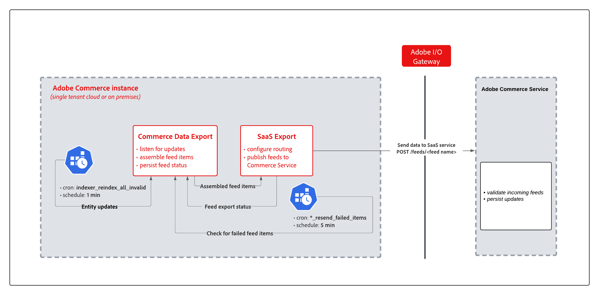

# Gegevens synchroniseren met SaaS-gegevensexport

Wanneer u een Commerce-service installeert waarvoor gegevens moeten worden geëxporteerd, zoals Catalog Service, Live Search of Product Recommendations, wordt een verzameling Saas-modules voor gegevensexport geïnstalleerd om het proces voor gegevensverzameling en -synchronisatie te beheren.

Bij het exporteren van SaaS-gegevens worden productgegevens doorlopend van een Adobe Commerce-instantie naar het Commerce Services-platform verplaatst om de gegevens up-to-date te houden. Product Recommendations vereist bijvoorbeeld de huidige catalogusinformatie om aanbevelingen met juiste namen, prijzen en beschikbaarheid correct te kunnen retourneren. Gebruik de [Gegevensbeheerdashboard](https://experienceleague.adobe.com/en/docs/commerce-merchant-services/user-guides/data-services/catalog-sync) observeren en beheren van het synchronisatieproces, of de bevel-lijn interface om een synchronisatie teweeg te brengen en productgegevens voor gebruik door Commerce Services te herindexeren.

Het volgende diagram toont de de gegevensuitvoerstroom van SaaS.

{width="900" zoomable="yes"}

De belangrijkste onderdelen van de SaaS-gegevensexportstroom zijn:

- SaaS-gegevensexportmodules die de gegevens voor feeds uit Adobe Commerce verzamelen, items in feed samenstellen, luisteren naar updates en de status van feed behouden.
- De de uitvoermodules van SaaS die gegevens uitvoeren, het verpletteren vormen, en het voer aan de verbonden diensten publiceren.
- De Adobe Commerce Service beheert het gegevensinvoerproces om binnenkomende feeds te valideren en updates van verbonden services te behouden.

## Synchronisatiemodi

De gegevensuitvoer van SaaS heeft twee wijzen om entiteitsvoer te verwerken:

- **Modus Direct exporteren**—In deze modus worden gegevens verzameld en onmiddellijk naar de Commerce Service verzonden in één iteratie. Deze modus versnelt de levering van entiteitsupdates aan de Commerce Service en verkleint de opslaggrootte van de voedertabellen.

- **Oudere exportmodus**—In deze modus worden gegevens verzameld in één proces. Dan, verzendt een kroonbaan de verzamelde gegevens naar de verbonden handelsdiensten. In de ingangen van het gegevensuitvoerlogboek, de voer die de erfeniswijze gebruiken wordt geëtiketteerd `(legacy)`.

## Synchronisatietypen

SaaS-gegevensexport ondersteunt drie synchronisatietypen: volledige synchronisatie, gedeeltelijke synchronisatie en opnieuw proberen mislukte items te synchroniseren.

### Volledige synchronisatie

Nadat u een Adobe Commerce-instantie hebt verbonden met Commerce Service, voert u een volledige synchronisatie uit om gegevens van de entiteitsfeed van Adobe Commerce naar de verbonden service te verzenden.

>[!NOTE]
>
>Volledige synchronisatie is vooral bedoeld voor de instapfase. Vermijd regelmatig gebruik om databaseoverbelasting te voorkomen. Na de eerste synchronisatie worden doorlopende wijzigingen automatisch gesynchroniseerd met gedeeltelijke synchronisatie.

### Gedeeltelijke synchronisatie

Met gedeeltelijke synchronisatie, verzendt de gegevensuitvoer van SaaS automatisch updates van de toepassing van Commerce, zoals productnaamveranderingen of prijsupdates, naar de verbonden handelsdiensten.

Bij het exporteren van gegevens worden de volgende uitsnijdtaken gebruikt om de gedeeltelijke synchronisatie te automatiseren.

- &quot;index&quot; voor taken van de structuurgroep:
   - De `indexer_reindex_all_invalid` taak wijzigt alle ongeldige feeds opnieuw. Het is een standaard Adobe Commerce-bouwtaak.
   - De `saas_data_exporter` taak is voor verouderde exportfeeds.
   - De `sales_data_exporter` Deze taak is specifiek voor de exportfeed van verkoopgegevens.

Deze banen lopen elke minuut.

Voor gedeeltelijke synchronisatie is de volgende configuratie vereist voor de Commerce-toepassing:

- [Taakplanning is ingeschakeld via uitsnijdtaken](https://experienceleague.adobe.com/docs/commerce-operations/installation-guide/next-steps/configuration.html)

- Alle SaaS gegevens de uitvoerindexen worden gevormd binnen `Update by Schedule` -modus.

  In SaaS-gegevensexportversie 103.1.0 en hoger: `Update by Schedule` De modus is standaard ingeschakeld. U kunt indexconfiguratie op de server verifiëren gebruikend het bevel van Commerce CLI, `bin/magento indexer:show-mode | grep -i feed`

### Opnieuw Mislukte items synchroniseren

Bij Opnieuw proberen mislukte items synchroniseren wordt een afzonderlijk proces gebruikt om items opnieuw te verzenden die niet konden worden gesynchroniseerd vanwege fouten tijdens het synchronisatieproces, bijvoorbeeld een toepassingsfout, netwerkverstoring of SaaS-servicefout. De implementatie voor deze synchronisatie is ook gebaseerd op uitsnijdtaken.

- `resync_failed_feeds_data_exporter` banen voor de cron-groep:
   - De `<feed name>_feed_resend_failed_feeds_items` taak herstelt items die niet gesynchroniseerd zijn, bijvoorbeeld `products_feed_resend_failed_items`.

### Het synchronisatieproces weergeven en beheren

De meeste synchronisatieactiviteiten worden automatisch verwerkt op basis van de toepassingsconfiguratie. De SaaS-gegevensexport biedt echter ook tools om het proces te beheren.

- Admin-gebruikers kunnen de voortgang van de synchronisatie weergeven en volgen en informatie over de gegevens ophalen via het [Gegevensbeheerdashboard](https://experienceleague.adobe.com/en/docs/commerce-admin/systems/data-transfer/data-dashboard).

- Ontwikkelaars, systeemintegrators of beheerders met toegang tot de Commerce-toepassingsserver kunnen het synchronisatieproces en de gegevensinvoer beheren met behulp van het opdrachtregelprogramma van Adobe Commerce (CLI). Zie [Opdrachtverwijzing gegevens exporteren](data-export-cli-commands.md).

### Configuratie Commerce-toepassing controleren

Gedeeltelijke synchronisatie en Opnieuw mislukte items synchroniseren werken alleen als het Commerce-exemplaar correct is geconfigureerd. De configuratie wordt meestal voltooid wanneer u de Commerce Service instelt. Controleer de volgende configuratie als de gegevensexport niet correct werkt.

- [Bevestig dat Cron-taken worden uitgevoerd](https://experienceleague.adobe.com/en/docs/commerce-knowledge-base/kb/troubleshooting/miscellaneous/cron-readiness-check-issues).

- Controleer of de indexen worden uitgevoerd vanaf de [Beheerder](https://experienceleague.adobe.com/en/docs/commerce-admin/systems/tools/index-management) of door het Commerce CLI bevel te gebruiken `bin/magento indexer:info`.

- Controleer of de indexeerprogramma&#39;s voor de volgende feeds zijn ingesteld op `Update by Schedule`: Cataloguskenmerken, Product, Productoverschrijvingen en Productvariabele. U kunt de indexen controleren vanuit [Indexbeheer](https://experienceleague.adobe.com/en/docs/commerce-admin/systems/tools/index-management) in de Admin of met gebruik van de CLI (`bin/magento indexer:show-mode | grep -i feed`).
