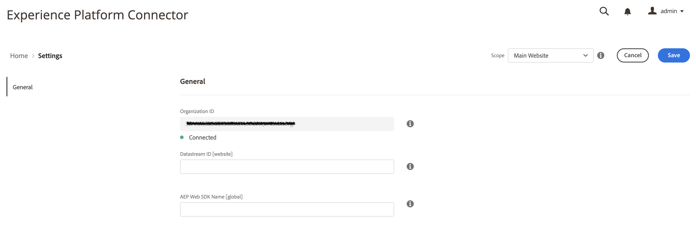

# Connect Commerce-gegevens naar Adobe Experience Platform {#connectaep}

Als u uw Adobe Commerce-instantie wilt verbinden met de Adobe Experience Platform, moet u een organisatie-id en een gegevensstroom-id opgeven.

1. Meld u aan bij uw Adobe-account in het dialoogvenster [Commerce Services Connector](../landing/saas.md#organizationid) en selecteer uw organisatie-id.

1. Ga in Beheer naar **Systeem** > Services > **Experience Platform Connector**.

1. In de **Toepassingsgebied** vervolgkeuzelijst, selecteert u de context of het &quot;bereik&quot; van de winkelweergave.

1. In de **Organisatie-id** in het veld wordt de id weergegeven die is gekoppeld aan uw Adobe Experience Platform-account, zoals deze is geconfigureerd in het dialoogvenster [Commerce Services Connector](../landing/saas.md#organizationid). De organisatie-id is algemeen. Per Adobe Commerce-exemplaar kan slechts één organisatie-id worden gekoppeld.

1. In de **DataStream-id** veld, plak de id van de gegevensstroom die u [gemaakt](https://experienceleague.adobe.com/docs/experience-platform/edge/datastreams/overview.html) in de Adobe Experience Platform.

## Relatie tussen gegevensstroom-id en uw voorvertoning van de instance Commerce

De gegevensstroom identiteitskaart laat gebeurtenis toe door:sturen van Adobe Experience Platform aan andere Adobe DX producten en kan aan een specifieke opslagmening binnen uw specifieke instantie van Adobe Commerce worden geassocieerd. U kunt veelvoudige opslagmeningen aan zelfde Datasstream identiteitskaart ook associëren. Het hangt van af wat het meest voor uw zaken zinvol is. [Meer informatie](https://experienceleague.adobe.com/docs/experience-platform/edge/datastreams/overview.html?lang=en#event-forwarding-settings) over het doorsturen van gebeurtenissen.

## Veldomschrijvingen

| Veld | Beschrijving |
|--- |--- |
| Toepassingsgebied | Specifieke opslagweergave waarop u de configuratie-instellingen wilt toepassen. |
| Organisatie-id (wereldwijd) | Id die behoort tot de organisatie die het Adobe DX-product heeft aangeschaft. Deze id koppelt uw Adobe Commerce-exemplaar aan Adobe Experience Platform. |
| DataStream-id (weergave Winkel) | ID die gegevens om van Adobe Experience Platform aan andere Adobe DX producten toestaat te stromen. Deze id kan worden gekoppeld aan een specifieke winkelweergave in uw specifieke Adobe Commerce-exemplaar. |

Als de extensie voor de aansluiting van het Experience Platform is geïnstalleerd, wordt de koppeling tussen Adobe Commerce en Adobe Experience Platform gemaakt en wordt de DataStream-id opgegeven. De gegevens van de handel gaan dan naar de Adobe Experience Platform-rand en naar andere Adobe DX-producten.

>[!NOTE]
>
> De hoeveelheid tijd die nodig is om gegevens van de rand naar andere Adobe DX-producten te laten stromen, kan variëren.

## Commerciële gegevens aan de rand

Wanneer de gegevens van de Handel naar de rand van Adobe Experience Platform worden verzonden, kunt u rapporten als het volgende bouwen:

_Commerciële gegevens in Adobe Experience Manager_
