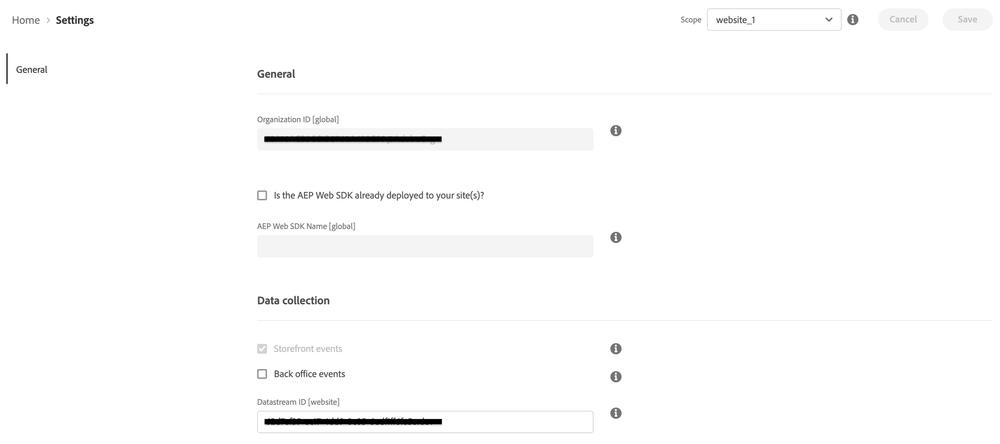

# Connect Commerce-gegevens naar Adobe Experience Platform {#connectaep}

Als u uw Adobe Commerce-instantie wilt verbinden met de Adobe Experience Platform, moet u een organisatie-id en een gegevensstroom-id opgeven.

## Algemeen

1. Meld u aan bij uw Adobe-account in het dialoogvenster [Commerce Services Connector](../landing/saas.md#organizationid) en selecteer uw organisatie-id.

1. Ga in Beheer naar **Systeem** > Services > **Experience Platform Connector**.

1. In de **Toepassingsgebied** vervolgkeuzelijst, de context instellen op **Website**.

1. In de **Organisatie-id** in het veld wordt de id weergegeven die is gekoppeld aan uw Adobe Experience Platform-account, zoals deze is geconfigureerd in het dialoogvenster [Commerce Services Connector](../landing/saas.md#organizationid). De organisatie-id is algemeen. Per Adobe Commerce-exemplaar kan slechts één organisatie-id worden gekoppeld.

1. (Optioneel) Als u al een [AEP Web SDK (legering)](https://experienceleague.adobe.com/docs/experience-platform/edge/home.html) opgesteld aan uw plaats, laat checkbox toe en voeg de naam van uw Web SDK van AEP toe. Anders, verlaat deze gebieden leeg en de schakelaar van het Experience Platform stelt voor u op.

   >[!NOTE]
   >
   >Als u uw eigen SDK van het Web van AEP specificeert, gebruikt de schakelaargebruik van het Experience Platform identiteitskaart verbonden aan die SDK en niet gegevensstroom ID die op deze pagina (als om het even welk) wordt gespecificeerd.

## Gegevensverzameling

>[!NOTE]
>
>Voor handelaren die reeds in ons achterkantoor bètaprogramma worden ingeschreven, zult u checkbox zien om achterkantoorgebeurtenissen toe te laten. Als u wilt deelnemen aan het bètaprogramma voor het back office kantoor, neemt u contact op met [drios@adobe.com](mailto:drios@adobe.com).

In de **Gegevensverzameling** kunt u opgeven welke typen gegevens u wilt verzamelen en naar de rand van het Experience Platform wilt verzenden. Standaard worden storefront-gebeurtenissen automatisch verzonden zolang de AEP Web SDK en Organisatie-id geldig zijn. Zie het gebeurtenisonderwerp om meer over te leren [storefront](events.md#storefront-events) en [achterkantoor](events.md#beta-order-status-events) gebeurtenissen.

>[!NOTE]
>
>Alle velden in het dialoogvenster **Gegevensverzameling** van toepassing op **Website** bereik of hoger.

1. Selecteren **Back office evenementen** als u de statusinformatie van een bestelling wilt verzenden, bijvoorbeeld of een bestelling is geplaatst, geannuleerd, terugbetaald of verzonden.

   >[!NOTE]
   >
   >Standaard worden alle gegevens van het achterkantoor naar de rand van het Experience Platform verzonden. Als een winkelier ervoor kiest zich af te melden voor gegevensverzameling, moet u de privacyvoorkeur van de winkels expliciet instellen in het Experience Platform. Dit is anders dan storefront-gebeurtenissen waarbij de verzamelaar al toestemming afhandelt op basis van de voorkeuren van de winkels. [Meer informatie](https://experienceleague.adobe.com/docs/experience-platform/landing/governance-privacy-security/consent/adobe/dataset.html) over het instellen van de privacyvoorkeur van een winkelier in het Experience Platform.

1. (Sla deze stap over als u uw eigen AEP Web SDK gebruikt.) [Maken](https://experienceleague.adobe.com/docs/experience-platform/edge/datastreams/configure.html#create) een gegevensstroom in de Adobe Experience Platform of selecteer een bestaande gegevensstroom u voor inzameling wilt gebruiken.

1. (Sla deze stap over als u uw eigen AEP Web SDK gebruikt.) In de **DataStream-id** veld, plakt u de id van die nieuwe of bestaande gegevensstroom.

## Veldomschrijvingen

| Veld | Beschrijving |
|--- |--- |
| Toepassingsgebied | Specifieke website waarop u de configuratie-instellingen wilt toepassen. |
| Organisatie-id (wereldwijd) | Id die behoort tot de organisatie die het Adobe DX-product heeft aangeschaft. Deze id koppelt uw Adobe Commerce-exemplaar aan Adobe Experience Platform. |
| Is de AEP Web SDK reeds opgesteld aan uw plaats | Schakel dit selectievakje in als u uw eigen AEP Web SDK aan uw site hebt toegewezen |
| AEP Web SDK Name (Global) | Als u reeds een Experience Platform Web SDK hebt die aan uw plaats wordt opgesteld, specificeer de naam van die SDK op dit gebied. Dit staat de Collector van de Gebeurtenis Storefront en de Gebeurtenis SDK toe om uw Experience PlatformWeb SDK eerder dan de versie te gebruiken die door de schakelaar van het Experience Platform wordt opgesteld. Als u geen Experience Platform Web SDK hebt die aan uw plaats wordt opgesteld, verlaat dit gebied leeg en de schakelaar van het Experience Platform stelt voor u op. |
| Gebeurtenissen van Storefront | Wordt standaard ingeschakeld zolang de organisatie-id en de gegevensstroom-id geldig zijn. Met Storefront-gebeurtenissen worden geanonimiseerde gedragsgegevens verzameld bij kopers die door uw site bladeren. |
| Back Office-gebeurtenissen (bèta) | Als deze optie is ingeschakeld, bevat de gebeurtenislading geanonimiseerde gegevens over de status van de bestelling, zoals of een bestelling is geplaatst, geannuleerd, terugbetaald of verzonden. |
| DataStream-id (website) | ID die gegevens om van Adobe Experience Platform aan andere Adobe DX producten toestaat te stromen. Deze id moet zijn gekoppeld aan een specifieke website in uw specifieke Adobe Commerce-exemplaar. Als u uw eigen SDK van het Web van het Experience Platform specificeert, specificeer geen gegevensstroom identiteitskaart op dit gebied. De verbindingslijn van het Experience Platform gebruikt gegevensstroom identiteitskaart verbonden aan die SDK en negeert om het even welke gegevensstroom ID die op dit gebied (als om het even welk) wordt gespecificeerd. |

Als de extensie voor de aansluiting van het Experience Platform is geïnstalleerd, wordt de koppeling tussen Adobe Commerce en Adobe Experience Platform gemaakt en wordt de DataStream-id opgegeven. De gegevens van de handel gaan dan naar de Adobe Experience Platform-rand en naar andere Adobe DX-producten.

>[!NOTE]
>
> De hoeveelheid tijd die nodig is om gegevens van de rand naar andere Adobe DX-producten te laten stromen, kan variëren.

## Commerciële gegevens aan de rand

Wanneer de gegevens van de Handel naar de rand van Adobe Experience Platform worden verzonden, kunt u rapporten als het volgende bouwen:

_Commerciële gegevens in Adobe Experience Manager_
