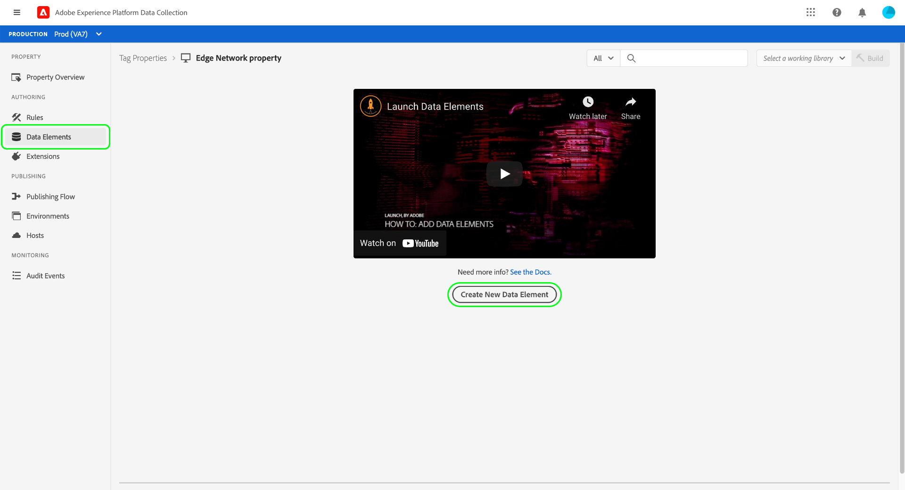
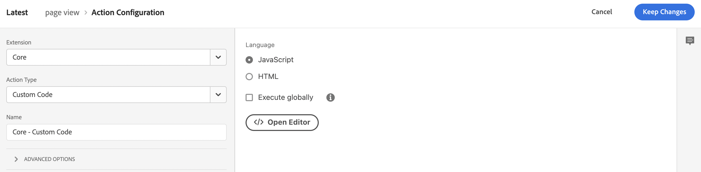

# Gegevens voor handel verzamelen met Adobe Experience Platform-tags

Terwijl u de schakelaar van het Experience Platform kunt gebruiken om aan storefront gebeurtenissen te publiceren en in te tekenen, zouden sommige handelaren reeds een oplossing van de gegevensinzameling, zoals kunnen gebruiken [Adobe Experience Platform-tags](https://experienceleague.adobe.com/docs/platform-learn/data-collection/tags/create-a-property.html?lang=en). Voor die handelaren biedt Adobe Commerce een alleen-publicatieoptie in de Experience Platform-connector die gebruikmaakt van de Adobe Commerce Event SDK.


_Gegevensstroom Experience Platform Connector met tags_

In dit onderwerp, zult u leren hoe te om de waarden van de storefront gebeurtenis in kaart te brengen die door de schakelaar van het Experience Platform aan de de markeringsoplossing van Adobe Experience Platform worden verstrekt u reeds gebruikt.

## Gebeurtenisgegevens verzamelen vanuit Adobe Commerce

Gegevens over Commerce-gebeurtenissen verzamelen:

- Installeer de [Adobe Commerce Events SDK](https://github.com/adobe/commerce-events/tree/main/packages/commerce-events-sdk). Voor PHP-winkels raadpleegt u de [installeren](install.md) onderwerp. Voor PWA Studio-winkels raadpleegt u de [Hulplijn PWA Studio](https://developer.adobe.com/commerce/pwa-studio/integrations/adobe-commerce/aep/).

   >[!NOTE]
   >
   > Do **niet** [vormen](connect-data.md) de organisatie-id en de gegevensstroom-id.

## Opslaggegevens voor Handel toewijzen aan Adobe Experience Platform

Als u de gegevens van de Commerce-winkel wilt toewijzen aan Adobe Experience Platform, configureert en installeert u het volgende binnen Adobe Experience Platform-tags:

1. [Een eigenschap voor een tag instellen](https://experienceleague.adobe.com/docs/platform-learn/implement-in-websites/configure-tags/create-a-property.html?lang=en) in Adobe Experience Platform Data Collection.

1. Onder **Authoring**, selecteert u **Extensies** en installeer en vorm de volgende uitbreidingen:

   - [Gegevenslaag Adobe-client](https://experienceleague.adobe.com/docs/experience-platform/tags/extensions/adobe/client-data-layer/overview.html)

   - [Adobe Experience Platform Web SDK](https://experienceleague.adobe.com/docs/experience-platform/edge/fundamentals/installing-the-sdk.html)

1. [Tag voor publiceren](https://experienceleague.adobe.com/docs/experience-platform/tags/publish/overview.html) naar uw ontwikkelomgeving.

1. Volg de **Gebeurtenistoewijzing** de stappen hieronder om gegevenselementen en regels voor specifieke gebeurtenissen te vormen.

### Gebeurtenistoewijzing

Omdat gegevensverzameling met tags verschilt van het gebruik van de Adobe Commerce Event SDK, is het belangrijk dat u de equivalente termen begrijpt die in beide frameworks worden gebruikt.

| Adobe Experience Platform-tagterm | Adobe Commerce Event SDK term |
|---|---|
| _gegevenselementen_ | context |
| _regels_ | event |
|  | _algemene voorwaarden_ - gebeurtenislisteners (van ACDL)<br><br>_handelingen regel_ - gebeurtenishandlers (verzenden naar Adobe Experience Platform) |

Wanneer u de gegevenselementen en regels in Adobe Experience Platform-tags bijwerkt met Adobe Commerce-specifieke gebeurtenisgegevens, worden een aantal veelvoorkomende stappen uitgevoerd.

Laten we bijvoorbeeld de Adobe Commerce toevoegen `signOut` -gebeurtenis naar Adobe Experience Platform-tags. In de onderstaande stappen wordt beschreven, behalve voor specifieke waarden die u instelt, hoe u kunt toevoegen [gegevenselementen](https://experienceleague.adobe.com/docs/experience-platform/collection/e2e.html#data-element) en [regels](https://experienceleague.adobe.com/docs/experience-platform/collection/e2e.html#create-a-rule), die van toepassing zijn op alle Adobe Commerce-gebeurtenissen die u aan tags toevoegt.

1. Een gegevenselement maken:

   
   _Nieuw gegevenselement maken_

1. Set **Naam** tot `sign out`.

1. Set **Extensie** tot `Adobe Experience Platform Web SDK`.

1. Set **Type gegevenselement** tot `XDM object`.

1. Selecteer **Sandbox** en **Schema** die u wilt bijwerken.

1. Onder **userAccount** > **afmelden** stelt u de **value** in **Afmelden bij bezoeker** tot `1`.

   
   _Waarde voor afmelden bijwerken_

1. Selecteren **Opslaan**.

1. Een regel maken:

   
   _Nieuwe regel maken_

1. Selecteren **Toevoegen** krachtens **GEBEURTENISSEN**.

1. Set **Extensie** tot `Adobe Client Data Layer`.

1. Set **Type gebeurtenis** tot `Data Pushed`.

1. Selecteren **Specifieke gebeurtenis** en stelt de **Gebeurtenis/sleutel waarvoor u zich wilt registreren** tot `sign-out`.

1. Selecteren **Wijzigingen behouden** om de nieuwe regel op te slaan.

1. Voeg een handeling toe.

1. Set **Extensie** tot `Adobe Experience Platform Web SDK`.

1. Set **Type handeling** tot `Send Event`.

1. Set **Instance** tot `Alloy`.

1. Set **Type** tot `userAccount.logout`.

1. Set **XDM-gegevens** tot `%sign out%`.

1. Klikken **Opslaan**.

   U hebt een gegevenselement in uw schema gemaakt voor de `signOut` uit Adobe Commerce. U hebt ook een regel gemaakt met een specifieke actie die moet worden uitgevoerd wanneer die gebeurtenis vanuit de Adobe Commerce-storefront wordt geactiveerd.

Herhaal bovenstaande stappen in tags voor elk van de Adobe Commerce-gebeurtenissen die hieronder worden beschreven.

## Beschikbare gebeurtenissen

Wijs voor elk van de volgende gebeurtenissen de Adobe Commerce-gebeurtenissen toe aan uw XDM door de bovenstaande stappen uit te voeren.

- [` signOut`](#signout)
- [` signIn`](#signin)
- [` createAccount`](#createaccount)
- [` editAccount`](#editaccount)
- [` pageView`](#pageview)
- [` productView`](#productview)
- [` searchRequestSent`](#searchrequestsent)
- [` searchResponseReceived`](#searchresponsereceived)
- [` addToCart`](#addtocart)
- [` viewCart`](#viewcart)
- [` removeFromCart`](#removefromcart)
- [&quot;initilCheckout&quot;](#initiatecheckout)
- [` placeOrder`](#placeorder)

### signOut {#signout}

Wordt geactiveerd wanneer een winkelier zich afmeldt.

#### Gegevenselementen

Maak het volgende gegevenselement:

1. Afmelden:

   - **Naam**: `Sign out`
   - **Extensie**: `Adobe Experience Platform Web SDK`
   - **Type gegevenselement**: `XDM object`
   - **Veldgroep**: `userAccount` > `logout`
   - **Afmelden bij bezoeker**: **Waarde** = `1`

#### Regels 

- **Naam**: `Sign out`
- **Extensie**: `Adobe Client Data Layer`
- **Type gebeurtenis**: `Data Pushed`
- **Specifieke gebeurtenis**: `sign-out`

##### Handelingen

- **Extensie**: `Adobe Experience Platform Web SDK`
- **Type handeling**: `Send event`
- **Type**: `userAccount.logout`
- **XDM-gegevens**: `%sign-out%`

### signIn {#signin}

Wordt geactiveerd wanneer een winkelier zich probeert aan te melden.

#### Gegevenselementen

Maak de volgende gegevenselementen:

1. E-mailadres account:

   - **Naam**: `account email`
   - **Extensie**: `Adobe Client Data Layer`
   - **Type gegevenselement**: `Data Layer Computed State`
   - **[Optioneel] pad**: `accountContext.emailAddress`

1. Accounttype:

   - **Naam**: `account type`
   - **Extensie**: `Adobe Client Data Layer`
   - **Type gegevenselement**: `Data Layer Computed State`
   - **[Optioneel] pad**: `accountContext.accountType`

1. Account-id:

   - **Naam**: `account id`
   - **Extensie**: `Adobe Client Data Layer`
   - **Type gegevenselement**: `Data Layer Computed State`
   - **[Optioneel] pad***: `accountContext.accountId`

1. Aanmelden:

   - **Naam**: `sign in`
   - **Extensie**: `Adobe Experience Platform Web SDK`
   - **Type gegevenselement**: `XDM object`
   - **Veldgroep**: `person` > `accountID`
   - **Account-id**: **Waarde** = `%account id%`
   - **Veldgroep**: `person` > `accountType`
   - **Accounttype**: **Waarde** = `%account type%`
   - **Veldgroep**: `person` > `personalEmailID`
   - **Persoonlijk e-mailadres**: **Waarde** = `%account email%`
   - **Veldgroep**: `personalEmail` > `address`
   - **Adres**: **Waarde** = `%account email%`
   - **Veldgroep**: `userAccount` > `login`
   - **Aanmelden bij bezoeker**: **Waarde** = `1`

#### Regels 

- **Naam**: `sign in`
- **Extensie**: `Adobe Client Data Layer`
- **Type gebeurtenis**: `Data Pushed`
- **Specifieke gebeurtenis**: `sign-in`

##### Handelingen

- **Extensie**: `Adobe Experience Platform Web SDK`
- **Type handeling**: `Send event`
- **Type**: `userAccount.login`
- **XDM-gegevens**: `%sign in%`

### createAccount {#createaccount}

Wordt geactiveerd wanneer een winkelier een account probeert te maken.

#### Gegevenselementen

Maak de volgende gegevenselementen:

1. E-mailadres account:

   - **Naam**: `account email`
   - **Extensie**: `Adobe Client Data Layer`
   - **Type gegevenselement**: `Data Layer Computed State`
   - **[Optioneel] pad**: `accountContext.emailAddress`

1. Accounttype:

   - **Naam**: `account type`
   - **Extensie**: `Adobe Client Data Layer`
   - **Type gegevenselement**: `Data Layer Computed State`
   - **[Optioneel] pad**: `accountContext.accountType`

1. Account-id:

   - **Naam**: `account id`
   - **Extensie**: `Adobe Client Data Layer`
   - **Type gegevenselement**: `Data Layer Computed State`
   - **[Optioneel] pad**: `accountContext.accountId`

1. Account maken:

   - **Naam**: `Create account`
   - **Extensie**: `Adobe Experience Platform Web SDK`
   - **Type gegevenselement**: `XDM object`
   - **Veldgroep**: `person` > `accountID`
   - **Account-id**: **Waarde** = `%account id%`
   - **Veldgroep**: `person` > `accountType`
   - **Accounttype**: **Waarde** = `%account type%`
   - **Veldgroep**: `person` > `personalEmailID`
   - **Persoonlijk e-mailadres**: **Waarde** = `%account email%`
   - **Veldgroep**: `personalEmail` > `address`
   - **Adres**: **Waarde** = `%account email%`
   - **Veldgroep**: `userAccount` > `createProfile`
   - **Accountprofiel maken**: **Waarde** = `1`

#### Regels 

- **Naam**: `Create account`
- **Extensie**: `Adobe Client Data Layer`
- **Type gebeurtenis**: `Data Pushed`
- **Specifieke gebeurtenis**: `create-account`

##### Handelingen

- **Extensie**: `Adobe Experience Platform Web SDK`
- **Type handeling**: `Send event`
- **Type**: `userAccount.createProfile`
- **XDM-gegevens**: `%create account%`

### editAccount {#editaccount}

Wordt geactiveerd wanneer een gebruiker een account probeert te bewerken.

#### Gegevenselementen

Maak de volgende gegevenselementen:

1. E-mailadres account:

   - **Naam**: `account email`
   - **Extensie**: `Adobe Client Data Layer`
   - **Type gegevenselement**: `Data Layer Computed State`
   - **[Optioneel] pad**: `accountContext.emailAddress`

1. Accounttype:

   - **Naam**: `account type`
   - **Extensie**: `Adobe Client Data Layer`
   - **Type gegevenselement**: `Data Layer Computed State`
   - **[Optioneel] pad**: `accountContext.accountType`

1. Account-id:

   - **Naam**: `account id`
   - **Extensie**: `Adobe Client Data Layer`
   - **Type gegevenselement**: `Data Layer Computed State`
   - **[Optioneel] pad**: `accountContext.accountId`

1. Account bewerken:

   - **Naam**: `Edit account`
   - **Extensie**: `Adobe Experience Platform Web SDK`
   - **Type gegevenselement**: `XDM object`
   - **Veldgroep**: `person` > `accountID`
   - **Account-id**: **Waarde** = `%account id%`
   - **Veldgroep**: `person` > `accountType`
   - **Accounttype**: **Waarde** = `%account type%`
   - **Veldgroep**: `person` > `personalEmailID`
   - **Persoonlijk e-mailadres**: **Waarde** = `%account email%`
   - **Veldgroep**: `personalEmail` > `address`
   - **Adres**: **Waarde** = `%account email%`
   - **Veldgroep**: `userAccount` > `updateProfile`
   - **Accountprofiel maken**: **Waarde** = `1`

#### Regels

- **Naam**: `Edit account`
- **Extensie**: `Adobe Client Data Layer`
- **Type gebeurtenis**: `Data Pushed`
- **Specifieke gebeurtenis**: `edit-account`

##### Handelingen

- **Extensie**: `Adobe Experience Platform Web SDK`
- **Type handeling**: `Send event`
- **Type**: `userAccount.updateProfile`
- **XDM-gegevens**: `%edit account%`

### pageView {#pageview}

Wordt geactiveerd wanneer een pagina wordt geladen.

#### Gegevenselementen

Maak de volgende gegevenselementen:

1. Paginanaam:

   - **Naam**: `page name`
   - **Extensie**: `Adobe Client Data Layer`
   - **Type gegevenselement**: `Data Layer Computed State`
   - **[Optioneel] pad**: `pageContext.pageName`

#### Regels 

- **Naam**: `page view`
- **Extensie**: `Adobe Client Data Layer`
- **Type gebeurtenis**: `Data Pushed`
- **Specifieke gebeurtenis**: `page-view`

##### Handelingen

- **Extensie**: `Adobe Experience Platform Web SDK`
- **Type handeling**: `Send event`
- **Type**: `web.webPageDetails.pageViews`
- **XDM-gegevens**: `%page view%`

### productView {#productview}

Wordt geactiveerd wanneer een productpagina wordt geladen.

#### Gegevenselementen

Maak de volgende gegevenselementen:

1. Productnaam:

   - **Naam**: `product name`
   - **Extensie**: `Adobe Client Data Layer`
   - **Type gegevenselement**: `Data Layer Computed State`
   - **[Optioneel] pad**: `productContext.name`

1. Product SKU:

   - **Naam**: `product sku`
   - **Extensie**: `Adobe Client Data Layer`
   - **Type gegevenselement**: `Data Layer Computed State`
   - **[Optioneel] pad**: `productContext.sku`

1. URL afbeelding product:

   - **Naam**: `product image`
   - **Extensie**: `Adobe Client Data Layer`
   - **Type gegevenselement**: `Data Layer Computed State`
   - **[Optioneel] pad**: `productContext.mainImageUrl`

1. Productvaluta:

   - **Naam**: `product currency`
   - **Extensie**: `Adobe Client Data Layer`
   - **Type gegevenselement**: `Data Layer Computed State`
   - **[Optioneel] pad**: `productContext.pricing.currencyCode`

1. Valutacode:

   - **Naam**: `currency code`
   - **Extensie**: `Core`
   - **Type gegevenselement**: `Custom Code`
   - **Editor openen**:

   ```bash
   return _satellite.getVar('product currency') || _satellite.getVar('storefront').storeViewCurrencyCode
   ```

1. Speciale prijs:

   - **Naam**: `special price`
   - **Extensie**: `Adobe Client Data Layer`
   - **Type gegevenselement**: `Data Layer Computed State`
   - **[Optioneel] pad**: `productContext.pricing.specialPrice`

1. Gewone prijs:

   - **Naam**: `regular price`
   - **Extensie**: `Adobe Client Data Layer`
   - **Type gegevenselement**: `Data Layer Computed State`
   - **[Optioneel] pad**: `productContext.pricing.regularPrice`

1. Productprijs:

   - **Naam**: `product price`
   - **Extensie**: `Core`
   - **Type gegevenselement**: `Custom Code`
   - **Editor openen**:

   ```bash
   return _satellite.getVar('product regular price') || _satellite.getVar('product special price')
   ```

1. Productweergave:

   - **Naam**: `product view`
   - **Extensie**: `Adobe Experience Platform Web SDK`
   - **Type gegevenselement**: `XDM object`
   - **Veldgroep**: `productListItems`. Selecteren **Afzonderlijke items opgeven** en klik op de knop **Item toevoegen** knop. Omdat deze weergave voor een PDP is, kunt u één item vullen.
   - **Veldgroep**: `productListItems` > `name`
   - **Naam**: **Waarde** = `%product name%`
   - **Veldgroep**: `productListItems` > `SKU`
   - **SKU**: **Waarde** = `%product sku%`
   - **Veldgroep**: `productListItems` > `priceTotal`
   - **Prijstotaal**: **Waarde** = `%product price%`
   - **Veldgroep**: `productListItems` > `currencyCode`
   - **Valutacode**: **Waarde** = `%currency code%`
   - **Veldgroep**: `productListItems` > `ProductImageUrl`
   - **ProductImageUrl**: **Waarde** = `%product image%`
   - **Veldgroep**: `commerce` > `productViews` > `value`
   - **value**: **Waarde** = `1`

#### Regels 

- **Naam**: `product view`
- **Extensie**: `Adobe Client Data Layer`
- **Type gebeurtenis**: `Data Pushed`
- **Specifieke gebeurtenis**: `product-page-view`

##### Handelingen

- **Extensie**: `Adobe Experience Platform Web SDK`
- **Type handeling**: `Send event`
- **Type**: `commerce.productViews`
- **XDM-gegevens**: `%product view%`

### searchRequestSent {#searchrequestsent}

Wordt geactiveerd door gebeurtenissen in het pop-upvenster &quot;Zoeken terwijl u typt&quot; en door gebeurtenissen op pagina&#39;s met zoekresultaten.

#### Gegevenselementen

Maak de volgende gegevenselementen:

1. Zoeken in invoer

   - **Naam**: `search input`
   - **Extensie**: `Adobe Client Data Layer`
   - **Type gegevenselement**: `Data Layer Computed State`
   - **[Optioneel] pad**: `searchInputContext.units[0]`

1. Invoeruitdrukking zoeken

   - **Naam**: `search input phrase`
   - **Extensie**: `Core`
   - **Type gegevenselement**: `Custom Code`
   - **Editor openen**:

   ```bash
   return _satellite.getVar('search input').phrase;
   ```

1. Invoersortering zoeken

   - **Naam**: `search input sort`
   - **Extensie**: `Core`
   - **Type gegevenselement**: `Custom Code`
   - **Editor openen**:

   ```bash
   const searchInput = _satellite.getVar('search input');
   const sortFromInput = searchInput ? searchInput.sort : [];
   const sort = sortFromInput.map((searchSort) => {
       return {
           attribute: searchSort.attribute,
           order: searchSort.direction,
       };
   });
   return sort;
   ```

1. Invoerfilters zoeken

   - **Naam**: `search input filters`
   - **Extensie**: `Core`
   - **Type gegevenselement**: `Custom Code`
   - **Editor openen**:

   ```bash
   const searchInput = _satellite.getVar('search input');
   const filtersFromInput = searchInput ? searchInput.filter : [];
   const filters = filtersFromInput.map(
       (searchFilter) => {
           let value = [];
           let isRange = false;
           if (searchFilter.eq) {
               value.push(searchFilter.eq);
           } else if (searchFilter.in) {
               value = searchFilter.in;
           } else if (searchFilter.range) {
               isRange = true;
               value.push(String(searchFilter.range.from));
               value.push(String(searchFilter.range.to));
           }
           return {
               attribute: searchFilter.attribute,
               value,
               isRange,
           };
       }
   );
   
   return filters;
   ```

1. Zoekverzoek:

   - **Naam**: `search request`
   - **Extensie**: `Adobe Experience Platform Web SDK`
   - **Type gegevenselement**: `XDM object`
   - **Veldgroep**: `siteSearch` > `phrase`
   - **value**: Nog niet beschikbaar
   - **Veldgroep**: `siteSearch` > `sort`. Selecteren **Geheel object opgeven**.
   - **Veldgroep**: `siteSearch` > `filter`. Selecteren **Geheel object opgeven**.
   - **Veldgroep**: `searchRequest` > `value`
   - **value**: **Waarde** = `1`

#### Regels 

- **Naam**: `search request sent`
- **Extensie**: `Adobe Client Data Layer`
- **Type gebeurtenis**: `Data Pushed`
- **Specifieke gebeurtenis**: `search-request-sent`

##### Handelingen

- **Extensie**: `Adobe Experience Platform Web SDK`
- **Type handeling**: `Send event`
- **Type**: `searchRequest`
- **XDM-gegevens**: `%search request%`

### searchResponseReceived {#searchresponsereceived}

Wordt geactiveerd wanneer Live zoeken resultaten oplevert voor de popover- of zoekresultatenpagina &quot;Zoeken zoals u typt&quot;.

#### Gegevenselementen

Maak de volgende gegevenselementen:

1. Zoekresultaten:

   - **Naam**: `search results`
   - **Extensie**: `Adobe Client Data Layer`
   - **Type gegevenselement**: `Data Layer Computed State`
   - **[Optioneel] pad**: `searchResultsContext.units[0]`

1. Zoekresultaat aantal producten:

   - **Naam**: `search result number of products`
   - **Extensie**: `Core`
   - **Type gegevenselement**: `Custom Code`
   - **Editor openen**:

   ```bash
   return _satellite.getVar('search result').products.length;
   ```

1. Producten zoekresultaten:

   - **Naam**: `search result products`
   - **Extensie**: `Core`
   - **Type gegevenselement**: `Custom Code`
   - **Editor openen**:

   ```bash
   const searchResult = _satellite.getVar('search result');
   const productsFromResult = searchResult.products ? searchResult.products : [];
   const products = productsFromResult.map(
       (product) => {
           return { SKU: product.sku, name: product.name };
       }
   );
   return products;
   ```

1. Suggesties voor zoekresultaten:

   - **Naam**: `search result products`
   - **Extensie**: `Core`
   - **Type gegevenselement**: `Custom Code`
   - **Editor openen**:

   ```bash
   const searchResult = _satellite.getVar('search result');
   const suggestionsFromResult = searchResult.suggestions ? searchResult.suggestions : [];
   const suggestions = suggestionsFromResult.map((suggestion) => suggestion.suggestion);
   return suggestions;
   ```

1. URL afbeelding product:

   - **Naam**: `product image`
   - **Extensie**: `Adobe Client Data Layer`
   - **Type gegevenselement**: `Data Layer Computed State`
   - **[Optioneel] pad**: `productContext.mainImageUrl`

1. Zoeken in reactie:

   - **Naam**: `search response`
   - **Extensie**: `Adobe Experience Platform Web SDK`
   - **Type gegevenselement**: `XDM object`
   - **Veldgroep**: `siteSearch` > `suggestions`. Selecteren **Geheel object opgeven**.
   - **Gegevenselement**: `%search result suggestions%`
   - **Veldgroep**: `siteSearch` > `numberOfResults`
   - **value**: `%search result number of products%`
   - **Veldgroep**: `productListItems`. Selecteren **Geheel object opgeven**.
   - **Veldgroep**: `productListItems` > `ProductImageUrl`
   - **ProductImageUrl**: **Waarde** = `%product image%`
   - **Gegevenselement**: `%search result products%`
   - **Veldgroep**: `searchResponse` > `value`
   - **value**: **Waarde** = `1`

#### Regels 

- **Naam**: `search response received`
- **Extensie**: `Adobe Client Data Layer`
- **Type gebeurtenis**: `Data Pushed`
- **Specifieke gebeurtenis**: `search-response-received`

##### Handelingen

- **Extensie**: `Adobe Experience Platform Web SDK`
- **Type handeling**: `Send event`
- **Type**: `searchResponse`
- **XDM-gegevens**: `%search response%`

### addToCart {#addtocart}

Wordt geactiveerd wanneer een product aan een kar wordt toegevoegd of telkens wanneer de hoeveelheid van een product in het kar wordt verhoogd.

#### Gegevenselementen

Maak de volgende gegevenselementen:

1. Productnaam:

   - **Naam**: `product name`
   - **Extensie**: `Adobe Client Data Layer`
   - **Type gegevenselement**: `Data Layer Computed State`
   - **[Optioneel] pad**: `productContext.name`

1. Productsku:

   - **Naam**: `product sku`
   - **Extensie**: `Adobe Client Data Layer`
   - **Type gegevenselement**: `Data Layer Computed State`
   - **[Optioneel] pad**: `productContext.sku`

1. Valutacode:

   - **Naam**: `currency code`
   - **Extensie**: `Adobe Client Data Layer`
   - **Type gegevenselement**: `Data Layer Computed State`
   - **[Optioneel] pad**: `productContext.pricing.currencyCode`

1. Speciale prijs product:

   - **Naam**: `product special price`
   - **Extensie**: `Adobe Client Data Layer`
   - **Type gegevenselement**: `Data Layer Computed State`
   - **[Optioneel] pad**: `productContext.pricing.specialPrice`

1. URL afbeelding product:

   - **Naam**: `product image`
   - **Extensie**: `Adobe Client Data Layer`
   - **Type gegevenselement**: `Data Layer Computed State`
   - **[Optioneel] pad**: `productContext.mainImageUrl`

1. Gewone prijs product:

   - **Naam**: `product regular price`
   - **Extensie**: `Adobe Client Data Layer`
   - **Type gegevenselement**: `Data Layer Computed State`
   - **[Optioneel] pad**: `productContext.pricing.regularPrice`

1. Productprijs:

   - **Naam**: `product price`
   - **Extensie**: `Core`
   - **Type gegevenselement**: `Custom Code`
   - **Editor openen**:

   ```bash
   return _satellite.getVar('product regular price') || _satellite.getVar('product special price') 
   ```

1. Winkelwagentje:

   - **Naam**: `cart`
   - **Extensie**: `Adobe Client Data Layer`
   - **Type gegevenselement**: `Data Layer Computed State`
   - **[Optioneel] pad**: `shoppingCartContext`

1. Kart-id:

   - **Naam**: `cart id`
   - **Extensie**: `Core`
   - **Type gegevenselement**: `Custom Code`
   - **Editor openen**:

   ```bash
   return _satellite.getVar('cart').id
   ```

1. Toevoegen aan winkelwagentje:

   - **Naam**: `add to cart`
   - **Extensie**: `Adobe Experience Platform Web SDK`
   - **Type gegevenselement**: `XDM object`
   - **Veldgroep**: `productListItems`. Selecteren **Afzonderlijke items opgeven** en klik op de knop **Item toevoegen** knop. Omdat deze weergave voor een PDP is, kunt u één item vullen.
   - **Veldgroep**: `productListItems` > `name`
   - **Naam**: **Waarde** = `%product name%`
   - **Veldgroep**: `productListItems` > `SKU`
   - **SKU**: **Waarde** = `%product sku%`
   - **Veldgroep**: `productListItems` > `priceTotal`
   - **Prijstotaal**: **Waarde** = `%product price%`
   - **Veldgroep**: `productListItems` > `currencyCode`
   - **Veldgroep**: `productListItems` > `ProductImageUrl`
   - **ProductImageUrl**: **Waarde** = `%product image%`
   - **Valutacode**: **Waarde** = `%currency code%`
   - **Veldgroep**: `commerce` > `cart` > `cartID`
   - **Illustratie-id**: **Waarde** = `%cart id%`
   - **Veldgroep**: `commerce` > `productListAdds` > `value`
   - **value**: **Waarde** = `1`

#### Regels 

- **Naam**: `add to cart`
- **Extensie**: `Adobe Client Data Layer`
- **Type gebeurtenis**: `Data Pushed`
- **Specifieke gebeurtenis**: `add-to-cart`

##### Handelingen

- **Extensie**: `Adobe Experience Platform Web SDK`
- **Type handeling**: `Send event`
- **Type**: `commerce.productListAdds`
- **XDM-gegevens**: `%add to cart%`

### viewCart {#viewcart}

Wordt geactiveerd wanneer een winkelwagenpagina wordt geladen.

#### Gegevenselementen

Maak de volgende gegevenselementen:

1. Storefront:

   - **Naam**: `storefront`
   - **Extensie**: `Adobe Client Data Layer`
   - **Type gegevenselement**: `Data Layer Computed State`
   - **[Optioneel] pad**: `storefrontInstanceContext`

1. URL afbeelding product:

   - **Naam**: `product image`
   - **Extensie**: `Adobe Client Data Layer`
   - **Type gegevenselement**: `Data Layer Computed State`
   - **[Optioneel] pad**: `productContext.mainImageUrl`
   1. Winkelwagentje:
   - **Naam**: `cart`
   - **Extensie**: `Adobe Client Data Layer`
   - **Type gegevenselement**: `Data Layer Computed State`
   - **[Optioneel] pad**: `shoppingCartContext`


1. Kart-id:

   - **Naam**: `cart id`
   - **Extensie**: `Core`
   - **Type gegevenselement**: `Custom Code`
   - **Editor openen**:

   ```bash
   return _satellite.getVar('cart').id
   ```

1. Objecten in de productlijst:

   - **Naam**: `product list items:`
   - **Extensie**: `Core`
   - **Type gegevenselement**: `Custom Code`
   - **Editor openen**:

   ```bash
   const storefrontContext = _satellite.getVar('storefront');
   const cart = _satellite.getVar('cart');
   
   const returnList = [];
   cart.items.forEach(item => {
       const selectedOptions = [];
       item.configurableOptions?.forEach(option => {
           selectedOptions.push({
               attribute: option.optionLabel,
               value: option.valueLabel,
           });
       });
   
       const productListItem = {
           SKU: item.product.sku,
           name: item.product.name,
           quantity: item.quantity,
           priceTotal: item.prices.price.value * item.quantity,
           currencyCode: item.prices.price.currency ? item.prices.price.currency : storefrontContext.storeViewCurrencyCode,
           selectedOptions: selectedOptions,
       };
   
       returnList.push(productListItem);
   });
   return returnList;
   ```

1. Kaart weergeven:

   - **Naam**: `view cart`
   - **Extensie**: `Adobe Experience Platform Web SDK`
   - **Type gegevenselement**: `XDM object`
   - **Veldgroep**: `productListItems`. Voor `productListItems`Er kunnen meerdere vooraf berekende items zijn. Selecteren **productListItems** > **Volledige array vullen**.
   - **Gegevenselement**: `%product list items%`
   - **Veldgroep**: `productListItems` > `ProductImageUrl`
   - **ProductImageUrl**: **Waarde** = `%product image%`
   - **Veldgroep**: `commerce` > `cart` > `cartID`
   - **Illustratie-id**: **Waarde** = `%cart id%`
   - **Veldgroep**: `commerce` > `productListViews` > `value`
   - **value**: **Waarde** = `1`

#### Regels

- **Naam**: `view cart`
- **Extensie**: `Adobe Client Data Layer`
- **Type gebeurtenis**: `Data Pushed`
- **Specifieke gebeurtenis**: `shopping-cart-view`

##### Handelingen

- **Extensie**: `Adobe Experience Platform Web SDK`
- **Type handeling**: `Send event`
- **Type**: `commerce.productListViews`
- **XDM-gegevens**: `%view cart%`

### removeFromCart {#removefromcart}

Wordt geactiveerd wanneer een product uit een winkelwagentje wordt verwijderd of telkens wanneer de hoeveelheid van een product in het winkelwagentje wordt verlaagd.

#### Gegevenselementen

Maak de volgende gegevenselementen:

1. Productnaam:

   - **Naam**: `product name`
   - **Extensie**: `Adobe Client Data Layer`
   - **Type gegevenselement**: `Data Layer Computed State`
   - **[Optioneel] pad**: `productContext.name`

1. Productsku:

   - **Naam**: `product sku`
   - **Extensie**: `Adobe Client Data Layer`
   - **Type gegevenselement**: `Data Layer Computed State`
   - **[Optioneel] pad**: `productContext.sku`

1. Valutacode:

   - **Naam**: `currency code`
   - **Extensie**: `Adobe Client Data Layer`
   - **Type gegevenselement**: `Data Layer Computed State`
   - **[Optioneel] pad**: `productContext.pricing.currencyCode`

1. Speciale prijs product:

   - **Naam**: `product special price`
   - **Extensie**: `Adobe Client Data Layer`
   - **Type gegevenselement**: `Data Layer Computed State`
   - **[Optioneel] pad**: `productContext.pricing.specialPrice`

1. Gewone prijs product:

   - **Naam**: `product regular price`
   - **Extensie**: `Adobe Client Data Layer`
   - **Type gegevenselement**: `Data Layer Computed State`
   - **[Optioneel] pad**: `productContext.pricing.regularPrice`

1. Productprijs:

   - **Naam**: `product price`
   - **Extensie**: `Core`
   - **Type gegevenselement**: `Custom Code`
   - **Editor openen**:

   ```bash
   return _satellite.getVar('product regular price') || _satellite.getVar('product special price') 
   ```

1. Winkelwagentje:

   - **Naam**: `cart`
   - **Extensie**: `Adobe Client Data Layer`
   - **Type gegevenselement**: `Data Layer Computed State`
   - **[Optioneel] pad**: `shoppingCartContext`

1. Kart-id:

   - **Naam**: `cart id`
   - **Extensie**: `Core`
   - **Type gegevenselement**: `Custom Code`
   - **Editor openen**:

   ```bash
   return _satellite.getVar('cart').id
   ```

1. Verwijderen uit winkelwagentje:

   - **Naam**: `remove from cart`
   - **Extensie**: `Adobe Experience Platform Web SDK`
   - **Type gegevenselement**: `XDM object`
   - **Veldgroep**: `productListItems`. Selecteren **Afzonderlijke items opgeven** en klik op de knop **Item toevoegen** knop. Omdat deze weergave voor een PDP is, kunt u één item vullen.
   - **Veldgroep**: `productListItems` > `name`
   - **Naam**: **Waarde** = `%product name%`
   - **Veldgroep**: `productListItems` > `SKU`
   - **SKU**: **Waarde** = `%product sku%`
   - **Veldgroep**: `productListItems` > `priceTotal`
   - **Prijstotaal**: **Waarde** = `%product price%`
   - **Veldgroep**: `productListItems` > `currencyCode`
   - **Valutacode**: **Waarde** = `%currency code%`
   - **Veldgroep**: `commerce` > `cart` > `cartID`
   - **Illustratie-id**: **Waarde** = `%cart id%`
   - **Veldgroep**: `commerce` > `productListRemovals` > `value`
   - **value**: **Waarde** = `1`

#### Regels 

- **Naam**: `remove from cart`
- **Extensie**: `Adobe Client Data Layer`
- **Type gebeurtenis**: `Data Pushed`
- **Specifieke gebeurtenis**: `remove-from-cart`

##### Handelingen

- **Extensie**: `Adobe Experience Platform Web SDK`
- **Type handeling**: `Send event`
- **Type**: `commerce.productListRemovals`
- **XDM-gegevens**: `%remove from cart%`

### initikout {#initiatecheckout}

Wordt geactiveerd wanneer de gebruiker op een uitcheckknop klikt.

#### Gegevenselementen

Maak de volgende gegevenselementen:

1. Storefront:

   - **Naam**: `storefront`
   - **Extensie**: `Adobe Client Data Layer`
   - **Type gegevenselement**: `Data Layer Computed State`
   - **[Optioneel] pad**: `storefrontInstanceContext`

1. URL afbeelding product:

   - **Naam**: `product image`
   - **Extensie**: `Adobe Client Data Layer`
   - **Type gegevenselement**: `Data Layer Computed State`
   - **[Optioneel] pad**: `productContext.mainImageUrl`

1. Winkelwagentje:

   - **Naam**: `cart`
   - **Extensie**: `Adobe Client Data Layer`
   - **Type gegevenselement**: `Data Layer Computed State`
   - **[Optioneel] pad**: `shoppingCartContext`

1. Kart-id:

   - **Naam**: `cart id`
   - **Extensie**: `Core`
   - **Type gegevenselement**: `Custom Code`
   - **Editor openen**:

   ```bash
   return _satellite.getVar('cart').id
   ```

1. Objecten in de productlijst:

   - **Naam**: `product list items`
   - **Extensie**: `Core`
   - **Type gegevenselement**: `Custom Code`
   - **Editor openen**:

   ```bash
   const storefrontContext = _satellite.getVar('storefront');
   const cart = _satellite.getVar('cart');
   
   const returnList = [];
   cart.items.forEach(item => {
       const selectedOptions = [];
       item.configurableOptions?.forEach(option => {
           selectedOptions.push({
               attribute: option.optionLabel,
               value: option.valueLabel,
           });
       });
   
       const productListItem = {
           SKU: item.product.sku,
           name: item.product.name,
           quantity: item.quantity,
           priceTotal: item.prices.price.value * item.quantity,
           currencyCode: item.prices.price.currency ? item.prices.price.currency : storefrontContext.storeViewCurrencyCode,
           selectedOptions: selectedOptions,
       };
   
       returnList.push(productListItem);
   });
   return returnList;
   ```

1. Afhandeling starten:

   - **Naam**: `initiate checkout`
   - **Extensie**: `Adobe Experience Platform Web SDK`
   - **Type gegevenselement**: `XDM object`
   - **Veldgroep**: `productListItems`. Voor `productListItems`Er kunnen meerdere vooraf berekende items zijn. Selecteren **productListItems** > **Volledige array vullen**.
   - **Gegevenselement**: `%product list items%`
   - **Veldgroep**: `productListItems` > `ProductImageUrl`
   - **ProductImageUrl**: **Waarde** = `%product image%`
   - **Veldgroep**: `commerce` > `cart` > `cartID`
   - **Illustratie-id**: **Waarde** = `%cart id%`
   - **Veldgroep**: `commerce` > `checkouts` > `value`
   - **value**: **Waarde** = `1`

#### Regels 

- **Naam**: `initiate checkout`
- **Extensie**: `Adobe Client Data Layer`
- **Type gebeurtenis**: `Data Pushed`
- **Specifieke gebeurtenis**: `initiate-checkout`

##### Handelingen

- **Extensie**: `Adobe Experience Platform Web SDK`
- **Type handeling**: `Send event`
- **Type**: `commerce.checkouts`
- **XDM-gegevens**: `%initiate checkout%`

### placeOrder {#placeorder}

Wordt geactiveerd wanneer de gebruiker een bestelling plaatst.

#### Gegevenselementen

Maak de volgende gegevenselementen:

1. Storefront:

   - **Naam**: `storefront`
   - **Extensie**: `Adobe Client Data Layer`
   - **Type gegevenselement**: `Data Layer Computed State`
   - **[Optioneel] pad**: `storefrontInstanceContext`

1. URL afbeelding product:

   - **Naam**: `product image`
   - **Extensie**: `Adobe Client Data Layer`
   - **Type gegevenselement**: `Data Layer Computed State`
   - **[Optioneel] pad**: `productContext.mainImageUrl`

1. Winkelwagentje:

   - **Naam**: `cart`
   - **Extensie**: `Adobe Client Data Layer`
   - **Type gegevenselement**: `Data Layer Computed State`
   - **[Optioneel] pad**: `shoppingCartContext`

1. Kart-id:

   - **Naam**: `cart id`
   - **Extensie**: `Core`
   - **Type gegevenselement**: `Custom Code`
   - **Editor openen**:

   ```bash
   return _satellite.getVar('cart').id
   ```

1. Volgorde:

   - **Naam**: `order`
   - **Extensie**: `Adobe Client Data Layer`
   - **Type gegevenselement**: `Data Layer Computed State`
   - **[Optioneel] pad**: `orderContext`

1. Handelsorder:

   - **Naam**: `commerce order`
   - **Extensie**: `Core`
   - **Type gegevenselement**: `Custom Code`
   - **Editor openen**:

   ```bash
   const order = _satellite.getVar('order');
   const storefront = _satellite.getVar('storefront');
   
   if (order.payments && order.payments.length) {
       payments = order.payments.map(payment => {
           return {
               paymentAmount: payment.total,
               paymentType: payment.paymentMethodCode,
               transactionID: order.orderId.toString(),
           };
       });
   } else {
       payments = [
           {
               paymentAmount: order.grandTotal,
               paymentType: order.paymentMethodCode,
               transactionID: order.orderId.toString(),
           },
       ];
   }
   
   return {
       purchaseID: order.orderId.toString(),
       currencyCode: storefront.storeViewCurrencyCode,
       payments,
   };
   ```

1. Verzending bestellen:

   - **Naam**: `order shipping`
   - **Extensie**: `Core`
   - **Type gegevenselement**: `Custom Code`
   - **Editor openen**:

   ```bash
   const order = _satellite.getVar('order');
   return {
       shippingMethod: order.shipping.shippingMethod,
       shippingAmount: order.shipping.shippingAmount || 0,
   }
   ```

1. Promotie-id:

   - **Naam**: `promotion id`
   - **Extensie**: `Core`
   - **Type gegevenselement**: `Custom Code`
   - **Editor openen**:

   ```bash
   return _satellite.getVar('order').appliedCouponCode
   ```

1. Objecten in de productlijst:

   - **Naam**: `product list items`
   - **Extensie**: `Core`
   - **Type gegevenselement**: `Custom Code`
   - **Editor openen**:

   ```bash
   const storefrontContext = _satellite.getVar('storefront');
   const cart = _satellite.getVar('cart');
   
   const returnList = [];
   cart.items.forEach(item => {
       const selectedOptions = [];
       item.configurableOptions?.forEach(option => {
           selectedOptions.push({
               attribute: option.optionLabel,
               value: option.valueLabel,
           });
       });
   
       const productListItem = {
           SKU: item.product.sku,
           name: item.product.name,
           quantity: item.quantity,
           priceTotal: item.prices.price.value * item.quantity,
           currencyCode: item.prices.price.currency ? item.prices.price.currency : storefrontContext.storeViewCurrencyCode,
           selectedOptions: selectedOptions,
       };
   
       returnList.push(productListItem);
   });
   return returnList;
   ```

1. Plaatsingsvolgorde:

   - **Naam**: `place order`
   - **Extensie**: `Adobe Experience Platform Web SDK`
   - **Type gegevenselement**: `XDM object`
   - **Veldgroep**: `productListItems`. Voor `productListItems`Er kunnen meerdere vooraf berekende items zijn. Selecteren **productListItems** > **Volledige array vullen**.
   - **Gegevenselement**: `%product list items%`
   - **Veldgroep**: `productListItems` > `ProductImageUrl`
   - **ProductImageUrl**: **Waarde** = `%product image%`
   - **Veldgroep**: `commerce` > `order`
   - **Unieke id**: **Waarde** = `%commerce order%`
   - **Veldgroep**: `commerce` > `shipping`
   - **Unieke id**: **Waarde** = `%order shipping%`
   - **Veldgroep**: `commerce` > `promotionID`
   - **Promotie-id**: **Waarde** = `%promotion id%`
   - **Veldgroep**: `commerce` > `purchases` > `value`
   - **value**: **Waarde** = `1`

#### Regels 

- **Naam**: `place order`
- **Extensie**: `Adobe Client Data Layer`
- **Type gebeurtenis**: `Data Pushed`
- **Specifieke gebeurtenis**: `place-order`

##### Handelingen

- **Extensie**: `Adobe Experience Platform Web SDK`
- **Type handeling**: `Send event`
- **Type**: `commerce.order`
- **XDM-gegevens**: `%place order%`

## Identiteit instellen

De profielen van de de schakelaarschakelaar van het Experience Platform worden aangesloten bij en worden geproduceerd gebaseerd op `personID` en de `personalEmail` identiteitsvelden in XDM Experience-gebeurtenissen. 

Als u een vorige instelling hebt die afhankelijk is van verschillende velden, kunt u deze instellingen blijven gebruiken. Als u identiteitsvelden van verbindingsprofielen voor Experience Platforms wilt instellen, moet u de volgende velden instellen:

- `personalEmail` - Alleen accountgebeurtenissen - volg de bovenstaande stappen voor accountgebeurtenissen
- `personID` - Alle andere gebeurtenissen:

   - Als u al vastlegt `ECID` in tags kunt u instellen `personID` in al uw Adobe Experience Platform Web SDK-regels op `%ECID%`.
   - Vastleggen `ECID` in tags, moet u een **Aangepaste code** handeling naar uw verzendgebeurtenisregels volgens de [Documentatie over tags](https://experienceleague.adobe.com/docs/experience-platform/edge/extension/accessing-the-ecid.html). Zie het onderstaande voorbeeld.

### Voorbeeld

De volgende afbeeldingen laten zien hoe u een `pageView` gebeurtenis met `personID` in Experience Platform-aansluiting:

1. Gegevenselement configureren met aangepaste code voor ECID:

   
   _Gegevenselement configureren met aangepaste code_

1. Aangepaste ECID-code toevoegen:

   
   _Code om ECID in gegevenselement in te stellen_

1. Werk XDM-schema bij met personID ingesteld als ECID:

   
   _PersonenID instellen als ECID_

1. Bepaal regelacties die ECID terugwinnen:

   
   _ECID ophalen_

## Vaststelling van de toestemming

De toestemming voor het verzamelen van gegevens van Adobe Commerce- en Experience Platforms-connectors is standaard ingeschakeld. Uitschakelen wordt beheerd via de [`mg_dnt` koekje](https://docs.magento.com/user-guide/stores/cookie-reference.html). U kunt de hier beschreven stappen volgen als u verkiest te gebruiken `mg_dnt` om de toestemming te beheren. De [Adobe Experience Platform Web SDK-documentatie](https://experienceleague.adobe.com/docs/experience-platform/edge/consent/supporting-consent.html?lang=en) beschikt over verschillende aanvullende opties voor het beheer van de toestemming.

1. Een **Aangepaste kerncode** gegevenselement (`%do not track cookie%`) voor de `mg_dnt` cookie:

   
   _Maken om gegevenselement niet bij te houden_

1. Een **Aangepaste kerncode** gegevenselement (`%consent%`) die wordt geretourneerd `out` als cookie is ingesteld en `in` anders:

   
   _Gegevenselement voor toestemming maken_

1. Adobe Experience Platform Web SDK Extension configureren met `%consent%` gegevenselement:

   
   _SDK bijwerken met toestemming_

## Waarschuwingen

- Als u geen stappen uitvoert om het verzamelen van Experience Platforms uit te schakelen, worden gebeurtenissen dubbel geteld
- Het niet instellen van toewijzingen/gebeurtenissen zoals beschreven in dit onderwerp kan gevolgen hebben voor Adobe Analytics-borden
- U kunt Doel niet instellen via de aansluiting van het Experience Platform als gegevensverzameling is uitgeschakeld
