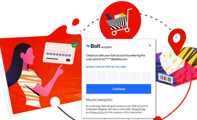
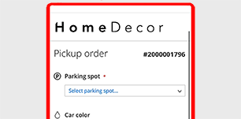

# Adobe Commerce Services-hulplijnen

De Adobe verstrekt een inzameling van de Handel, de integratie, en de gegevensdiensten om handelaren te helpen zeer belangrijke componenten van hun zaken steunen.

>[!BEGINSHADEBOX &quot;Release-informatie&quot;]

Zie [nieuwe functies in onze documentatie](whats-new.md) of [releaseopmerkingen](release-notes-all.md) voor elke dienst van de Handel.

>[!ENDSHADEBOX]

## Commerciële diensten

<table>
<tr>
  <td valign="top" width="200">
      </td>
   <td valign="top"><a href="https://experienceleague.adobe.com/docs/commerce-merchant-services/live-search/overview.html"><strong>[!DNL Live Search]</strong></a>  
    
Implementeer dit door AI aangedreven zoekprogramma dat slimmere, snellere en relevante resultaten oplevert voor B2C-kopers.

  </td>
   </tr>
<tr>
   <td valign="top" width="200">
       </td>
   <td valign="top">
   <a href="https://experienceleague.adobe.com/docs/commerce-merchant-services/product-recommendations/overview.html"><strong>[!DNL Product Recommendations]</strong></a>
    
Voeg op AI gebaseerde aanbevelingen toe die op verkoopgedrag, populaire tendensen, productgelijkenis, en meer worden gebaseerd.

  </td>
   </tr>
<tr>
    <td valign="top" width="200px">
       </td>
   <td valign="top"><a href="https://experienceleague.adobe.com/docs/commerce-merchant-services/catalog-service/guide-overview.html"> <strong>Catalogusservice</strong></a>  
    
Geef uw klanten een geoptimaliseerde productervaring terwijl het verhogen van prestaties, het verbeteren van scalability, en het verhogen van omzettingen.

  </td>
   </tr>
<tr>
  <td valign="top" width="200px">
    </td>
   <td valign="top"><a href="https://experienceleague.adobe.com/docs/commerce-merchant-services/payment-services/guide-overview.html"><strong>Betalingsdiensten</strong></a>   <em>(Beschikbaar voor Magento Open Source)</em>
    
De tevredenheid van de klant vergroten door eenvoudig verschillende betalingsmethoden aan te bieden, waaronder renteloze betalingstermijnen, en één overzicht van betalingsverwerking, bestellingen en facturen.

  </td>
    </tr>
<tr>
  <td valign="top" width="200px">
    </td>
   <td valign="top"><a href="https://experienceleague.adobe.com/docs/commerce-merchant-services/quick-checkout/overview.html"><strong>Snelle afhandeling</strong></a>   <em>(Beschikbaar voor Magento Open Source)</em>
    
Eenmalige klanten converteren naar loyale rekeninghouders met een snelle en intuïtieve boodschapervaring.

  </td>
    </tr>
<tr>
    <td valign="top" width="200px">
       </td>
   <td valign="top"><a href="https://experienceleague.adobe.com/docs/commerce-merchant-services/store-fulfillment/guide-overview.html"> <strong>Afhandeling van winkel</strong></a> 
    
Lever een superieure aankoop online, haal in-store (BOPIS) klantenervaring op en maximaliseer werknemersproductiviteit door een uitvoerige uitvoeringswerkschema te verstrekken die door een mobiel apparaat wordt toegelaten.

  </td>
   </tr>
<tr>
    <td valign="top" width="200px">
       </td>
   <td valign="top"><a href="https://experienceleague.adobe.com/docs/commerce-channels/amazon/guide-overview.html"> <strong>Amazon-verkoopkanaal</strong></a>  <em>(Beschikbaar voor Magento Open Source)</em>
    
Integreer met 's werelds grootste online winkelbestemming om verkoop in Amazon mogelijk te maken, gegevensautomatisering en -synchronisatie te bieden, aanbiedingen in Amazon te beheren en meer via één dashboard.

  </td>
   </tr>
<tr>
    <td valign="top">
       </td>
   <td valign="top"><a href="https://experienceleague.adobe.com/docs/commerce-channels/channel-manager/guide-overview.html"> <strong>Kanaalbeheer</strong></a>  <em>(Beschikbaar voor Magento Open Source)</em>
    
Verhoog de omzet, bereikt nieuwe klanten, stroomlijnt verrichtingen, en bespaar tijd door met de Marketplace van de Markt van de Markeren te integreren. Laat personeel toe om de verkoop, de inventaris, en de prijs van de Marketplace van de Markt van de Walmart foutloos-allen in Handel te beheren.

  </td>
   </tr>
</table>

## Gegevensdiensten

<table>
<tr>
  <td valign="top" width="200">
      </td>
   <td valign="top"><a href="https://experienceleague.adobe.com/docs/commerce-merchant-services/experience-platform-connector/overview.html"><strong>[!DNL Experience Platform Connector]</strong></a>  
    
Gebruik de verbinding tussen Adobe Commerce en Adobe Experience Platform edge om de gegevens van de Handel voor andere producten van Adobe Experience Cloud, zoals Adobe Analytics en Adobe Target te gebruiken.

  </td>
   </tr>
<tr>
   <td valign="top" width="200">
       </td>
   <td valign="top">
   <a href="https://experienceleague.adobe.com/docs/commerce-merchant-services/user-guides/integration-services/saas.html"><strong>[!DNL Services Connector]</strong></a>
    
De Commerce Services Connector biedt de integratie voor uw Adobe Commerce- of Magento Open Source-instantie met behulp van een API-sleutel en een persoonlijke sleutel. Voor gegevensservices (alleen Adobe Commerce) kunt u ook de gegevensruimte in de configuratie opgeven.

  </td>
   </tr>
</table>

## Integratiediensten

<table>
<tr>
   <td valign="top" width="200">
      </td>
   <td valign="top"><a href="https://experienceleague.adobe.com/docs/commerce-merchant-services/user-guides/data-services/catalog-sync.html"><strong>[!DNL Catalog Sync]</strong></a>  
    
Met catalogussynchronisatie worden productgegevens van de Commerce-server naar de Commerce-services geëxporteerd om de services up-to-date te houden. Indexers, die worden geactiveerd door gebeurtenissen zoals een wijziging van de productprijs of het voorraadniveau, compileren catalogusgegevens. U kunt dit proces waarnemen en beheren via het *Catalog Sync* dashboard of de bevel-lijn interface.

  </td>
</tr>
</table>
