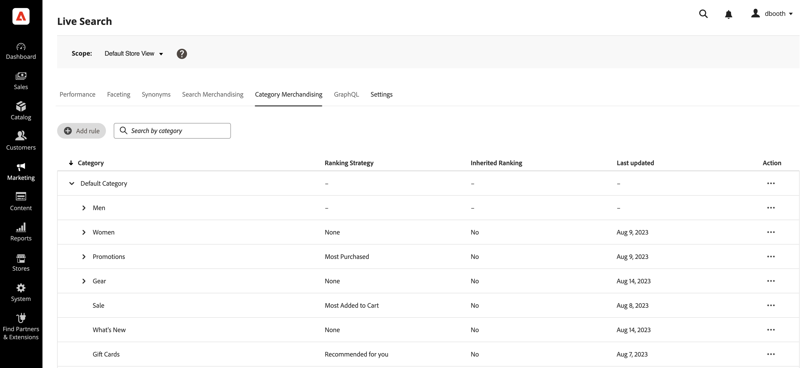

# Categorieverhandeling

Bij het verhandelen van categorieën kunnen eigenaars van winkels het volgende toepassen: [!DNL Live Search] Intelligente classificatie [regels](rules.md) naar productcategorieën en subcategorieën.

Deze video is een inleiding op Categorie Merchandising.

>[!VIDEO](https://video.tv.adobe.com/v/3424617)

De functie is toegankelijk via de beheerfunctie op **Marketing** > SEO &amp; Search > **[!DNL Live Search]** > **Categorieverhandeling**.

>[!NOTE]
>
>Rubriekhandel is beschikbaar via [!DNL Live Search] [3.0.0 of hoger](release-notes.md). Als u het lusje van de Verkoop van de Categorie ziet maar het niet met gegevens bevolkt, werk bij [!DNL Live Search] -module.

De mening van de Verkoop van de Categorie toont bepaalde categorieregels, met kolommen voor:

* Categorie
* Rangschikkingsstrategie
* Overgenomen classificatie
* Laatst bijgewerkt
* Handeling

U kunt een categorie of subcategorie zoeken in het veld Zoeken op categorie.

## Rangorde van strategieën

Bij het verwisselen van categorieën worden dezelfde rangschikkingstypen gebruikt als bij [afzonderlijke producten](rules-workspace.md).
Er zijn twee soorten rangschikkingen: Intelligent en Handmatig.

**Intelligente classificatie** hefboomwerkingen storefront gedragsgegevensanalyse door [Adobe Sensei](https://www.adobe.com/sensei.html) alle producten binnen gekozen categorieën te sorteren op een bepaald algoritme. Zodra een intelligente rangschikking wordt gekozen, zal de specifieke volgorde van de producten naar verwachting in de loop der tijd veranderen naarmate de onderliggende gegevens doorlopend opnieuw door Adobe Sensei worden geanalyseerd. De bovenste trendproducten veranderen bijvoorbeeld automatisch in de loop van de tijd wanneer de winkelvoorkeuren veranderen.
Intelligente classificatiemethoden zijn:

* De meeste aankopen: producten worden gerangschikt op basis van de frequentie waarmee ze in de afgelopen zeven dagen door kopers zijn gekocht.
* Meestal toegevoegd aan winkelwagentje: rankt producten op basis van hoe vaak ze de afgelopen zeven dagen door kopers aan het winkelwagentje werden toegevoegd.
* Het meest bekeken: producten worden gerangschikt op basis van hoe vaak ze de afgelopen zeven dagen door kopers werden bekeken.
* Aanbevolen voor u: op basis van het vorige en huidige on-site gedrag van elke winkelier wordt de mate van interactie tussen de winkelier en elke klant bepaald.
* Trending: rangschikt producten op basis van weergaven op basis van recente opwaartse bewegingen in populariteit.
* Geen: producten worden in de standaardvolgorde gerangschikt.

**Handmatige classificatie** Hiermee kunnen gebruikers de automatische sorteervolgorde van de producten overschrijven door handmatig spelden, boost, bury en hide in te stellen.

## Overgenomen classificatie

Als handelaar zou u alle slijtcategorieën van vrouwen kunnen selecteren die door &quot;trending&quot; worden gesorteerd. Hieronder vallen de subcategorieën &quot;Vrouwenbroek&quot;, &quot;Vrouwenhemden&quot; en &quot;Vrouwenaccessoires&quot;. Dit mag geen invloed hebben op de categorieën mannen. Hiervoor kunt u overerfde classificaties gebruiken.

Als u een intelligente waarderingsmethode selecteert voor een categorie of subcategorie met subcategorieën, kunt u de optie **Intelligente classificaties toepassen op subcategorieën** -optie. Hiermee past u de waarderingsmethode toe op alle subcategorieën.

Deze subcategorieën erven nu die regel van de oudercategorie (&quot;ja&quot;in de Geërfde kolom van de Rangschikking). In de kolom Actie zijn de enige beschikbare opties: **Regel bewerken**, en **Details weergeven**. De **Verwijderen** Deze optie is uitgeschakeld voor overerfde regels voor subcategorieën. Als u overerving van subcategorieën verwijdert, moet overerving van de bovenliggende categorie ongedaan worden gemaakt.

Voor elke categorie of subcategorie kan slechts één intelligente classificatie tegelijk worden toegepast. Ze kunnen ook extra handmatige classificaties hebben toegepast.

Als u een Intelligente classificatie toepast op een categorie en de optie **Intelligente classificatie toepassen op subcategorieën** , worden alle Intelligente classificaties die al op de subcategorieën zijn toegepast, overschreven.

{width="700"}

Als u op **Alles weergeven**, wordt een dialoog geopend met bijzonderheden over de voorgestelde wijzigingen.

Wanneer u een Intelligent ranking rechtstreeks toevoegt aan een categorie met een overgeërfde Intelligent ranking, wordt de overerving overschreven door de nieuwe Intelligent ranking.

Wanneer u de classificatie Intelligent uit de categorie verwijdert, wordt de overerving opnieuw ingesteld.
In beide scenario&#39;s worden handmatige classificaties gehandhaafd.

Als u een Intelligente rangschikking uit een categorie verwijdert en de subcategorieovererving is geselecteerd, worden alleen de overgeërfde Intelligente classificaties uit de subcategorieën verwijderd. Handmatige classificaties zijn niet onderhevig aan overerving en zullen blijven bestaan.

Er wordt een dialoogvenster weergegeven waarin wordt uitgelegd welke overgeërfde subcategorieën worden beïnvloed door wijzigingen die u aanbrengt in een categorie op een hoger niveau.

{width="1200"}

## Een categorieregel maken

Een categorieregel maken:

1. Klik op de knop **Regel toevoegen** knop.
1. In de _Categorie selecteren_ Klik op de categorieën en subcategorieën.
1. Schakel het selectievakje in om de categorie te selecteren die u wilt rangschikken.
1. Klikken **Toepassen**.

   

1. In de _Categorieregel toevoegen_ Selecteer de methode voor intelligente classificaties die u op de categorie wilt toepassen.
Op de pagina Voorvertoning categorie worden de werkelijke resultaten van de geselecteerde positie weergegeven met behulp van uw Live zoeken-gegevens.
1. Klikken **Opslaan en publiceren** om de regel op te slaan.

De [!DNL Live Search] de dienst verwerkt de regel en activeert het op de opslag wanneer gebeëindigd.

## Categorieregels wijzigen

Een bestaande regel wijzigen:

1. Klik op de knop **...** in de kolom Actie en kies **Bewerken**.
1. Breng in de regelweergave Categorie bewerken de vereiste wijzigingen aan en klik op **Opslaan en publiceren**.

De wijzigingen worden weerspiegeld in de winkel wanneer [!DNL Live Search] heeft de wijziging verwerkt.

## Categorieregels verwijderen

Een categorieregel verwijderen:

1. Klik op de knop **...** in de kolom Actie en kies **Verwijderen**.
1. In de _Regel verwijderen_ modal, selecteer **Verwijderen** om de regel te verwijderen of **Annuleren** om de handeling te annuleren.

## Handmatige classificatie

Met de functie voor handmatig plaatsen kunt u de productvolgorde overschrijven die is bepaald door de eventuele intelligente rangschikkingsregels en kunt u handmatig bepalen waar de producten binnen de resultaten verschijnen.

Gebeurtenissen zijn acties die de zoekresultaten wijzigen als aan bepaalde voorwaarden wordt voldaan. Een handmatige classificatie kan tot 25 gebeurtenissen hebben.

* Verhogen: verplaatst een product hoger in de zoekresultaten.
* Branden: hiermee verplaatst u een product lager in de zoekresultaten.
* Een product vastzetten: een product naar een specifieke positie in de resultaten verplaatsen.
* Een product verbergen: sluit een product uit van de zoekresultaten.

Een handmatige classificatie maken:

1. Stel een intelligente rangschikkingsregel in voor een categorie zoals hierboven beschreven. De resultaten van de query worden weergegeven in de weergave Voorvertoning van categoriepagina. Hierbij worden de werkelijke live zoekgegevens gebruikt om de resultaten te bekijken.

1. Klik op een product en sleep het in de weergave Voorvertoning van categorie. Sleep de aanwijzer naar de gewenste positie. De velden Product en Positie worden automatisch ingevuld in het deelvenster Gebeurtenissen.

U kunt ook op het speldpictogram klikken om een product op de huidige locatie vast te zetten. Gebruik het contextmenu voor ovalen om &#39;Aan de bovenkant vastzetten&#39; of &#39;Aan de onderkant vastzetten&#39;.

Een gebeurtenis handmatig toevoegen:

1. Klik onder Handmatige volgorde op de knop **Een gebeurtenis selecteren** en kiest u een gebeurtenis die moet plaatsvinden wanneer aan de bijbehorende voorwaarden wordt voldaan.
1. Voer de naam in van het product waarop u de bewerking wilt toepassen. Producten worden voorgesteld terwijl u typt.
1. Voor meerdere gebeurtenissen kiest u andere gebeurtenissen die u wilt activeren als aan de voorwaarden is voldaan.
