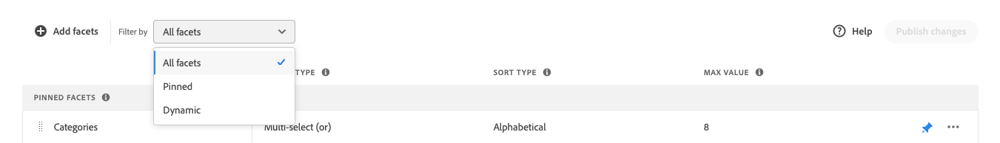

# Facturen beheren

Volg deze instructies om de eigenschappen van bestaande facetten bij te werken of hun presentatie in de winkel te veranderen.

## Prijsfacetgroepen configureren

Zie [Instellingen](settings.md) om prijsafhankelijke intervallen en groepen te vormen.

## facet bewerken

1. Zoek het facet dat u wilt bewerken.
1. Als de lijst veel facetten bevat, stelt u *Filteren op* op een van de volgende wijzen:

   * Vastgezet
   * Dynamisch

   Ga voor meer informatie naar [Typen gezichten](facets-type.md).

   

1. Klik op **Meer** (...) opties.
1. Klikken **Bewerken**

   

1. Voer een van de volgende handelingen uit om het label van het facet te bewerken:

   * Voor een [!DNL Commerce] opslaan, bewerkt u de [kenmerklabel](https://experienceleague.adobe.com/docs/commerce-admin/catalog/product-attributes/product-attributes.html).
   * Voor een implementatie zonder kop klikt u op de waarde in de eerste kolom en bewerkt u de tekst naar wens.

   

1. (Alleen koptekst) Als u de methode wilt wijzigen waarmee de waarden van facetten worden gesorteerd, klikt u op de waarde in het dialoogvenster *Sorteertype* en kies een van de volgende opties:

   * Alfabetisch
   * Aantal

   

1. In de **Max. waarde** , stelt u het maximale aantal (van 0 tot 10) waarden voor het facetfilter in dat in de winkel moet worden weergegeven.
1. Klik op **Opslaan**.
De wijzigingen worden pas na publicatie in de winkelruimte weergegeven.

## Vastzetten/vastzetten van facet

Wanneer op het punt wordt geklikt, verandert de kleur van het punt. Het punt wordt gebruikt om het facet naar een van de *Vastgezette gezichten* of de *Dynamische factoren* sectie.

1. Een facet vastzetten op de bovenkant van het dialoogvenster *Filters* lijst, zoek het facet in *Dynamische factoren* en klik op het grijze punt ().
De pin wordt blauw en de facet wordt naar de *Vastgezette gezichten* sectie.
1. Als u een facet wilt losmaken, zoekt u het facet in het dialoogvenster *Vastgezette gezichten* en klik op het blauwe punt ().
De pin wordt grijs en het facet wordt naar de *Dynamische factoren* sectie.

   

## Vastgezet facet verplaatsen

U kunt de volgorde van vastgezette facetten wijzigen door de rij naar een andere positie te verplaatsen. Vastgezette facetten hebben een *Verplaatsen* icon () aan het begin van de rij. In tegenstelling tot vastgezette facetten kunnen dynamische facetten niet worden verplaatst.

1. Het facet zoeken in de *Vastgezette gezichten* van de lijst.
1. Gebruik de **Verplaatsen** () gebruiken om de rij naar een nieuwe positie in de *Vastgezette gezichten* sectie.
Nadat de wijzigingen zijn gepubliceerd, worden de opnieuw geordende facetten weergegeven in de winkel *Filters* lijst.

## Facet verwijderen

1. Vind het facet in de lijst en klik **Meer** (...) opties.
1. Klikken **Verwijderen**.
1. Klik wanneer u wordt gevraagd om te bevestigen **Facet verwijderen**.
Het facet wordt verwijderd uit het winkelcentrum nadat de wijzigingen zijn gepubliceerd.

## Wijzigingen publiceren

1. Als u de winkel wilt bijwerken met uw wijzigingen, klikt u op **Wijzigingen publiceren**.
1. Wacht ongeveer 15 minuten totdat de updates in uw winkel worden weergegeven.
