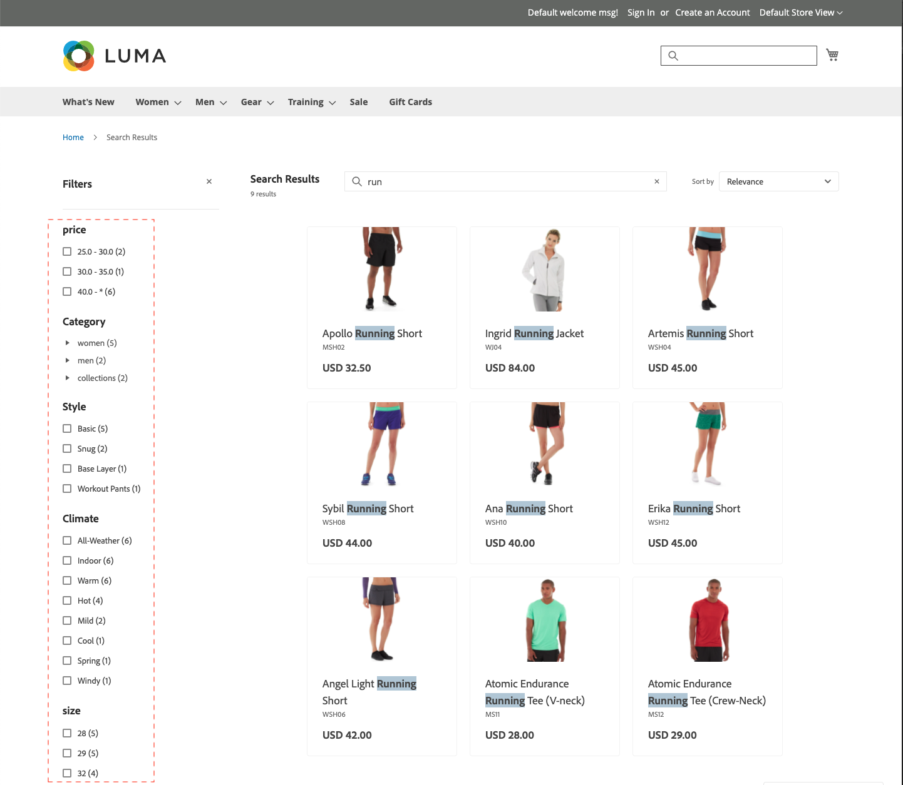

# Facetten

Faceting is een methode voor het filteren van hoge prestaties waarbij meerdere dimensies van kenmerkwaarden worden gebruikt als zoekcriteria. Gefactureerde zoekopdracht is vergelijkbaar, maar aanzienlijk &quot;slimmer&quot; dan de standaard [gelaagde navigatie](https://experienceleague.adobe.com/docs/commerce-admin/catalog/catalog/navigation/navigation-layered.html). De lijst met beschikbare filters wordt bepaald door de [filterbare kenmerken](https://experienceleague.adobe.com/docs/commerce-admin/catalog/catalog/navigation/navigation-layered.html#filterable-attributes) van producten die in de zoekresultaten worden geretourneerd.

[!DNL Live Search] gebruikt de `productSearch` query, die faceting en andere gegevens retourneert die specifiek zijn voor [!DNL Live Search]. Zie [`productSearch` query](https://developer.adobe.com/commerce/webapi/graphql/schema/live-search/queries/product-search/) in de ontwikkelaarsdocumentatie voor codevoorbeelden.

Elke gedefinieerde facet kan als een URL-parameter worden gebruikt en de resultaten worden gefilterd op basis van de parameterwaarden: `http://yourstore.com?brand=acme&color=red`.

## Faciliteitseisen

De categorie- en productkenmerkvereisten voor facetten zijn vergelijkbaar met de filterbare kenmerken die worden gebruikt voor gelaagde navigatie. De storefront-eigenschappen van elk kenmerk moeten zijn ingesteld op `filterable (with results)`.

[!DNL Live Search] ondersteunt maximaal:

* 100 kenmerken geconfigureerd als facetten
* 50 sorteerbare kenmerken
* 200 filterbare kenmerken
* 200 doorzoekbare kenmerken

| Instelling | Beschrijving |
|--- |--- |
| [Weergave-instellingen voor categorie](https://experienceleague.adobe.com/docs/commerce-admin/catalog/categories/create/categories-display-settings.html) | Anker - `Yes` |
| [Eigenschappen van kenmerk](https://experienceleague.adobe.com/docs/commerce-admin/catalog/product-attributes/create/attribute-product-create.html) | [Invoertype catalogus](https://experienceleague.adobe.com/docs/commerce-admin/catalog/product-attributes/attributes-input-types.html) - `Yes/No`, `Dropdown`, `Multiple Select`, `Price`, `Visual swatch` (alleen widget), `Text swatch` (alleen widget) |
| Eigenschappen van kenmerkarchief | Gebruiken in gelaagde navigatie met zoekresultaten - `Yes` |

## Facetaggregatie

Facetsamenvoeging wordt als volgt uitgevoerd: als de winkel drie facetten (categorieën, kleur en prijs) heeft en de verkoopfilters op alle drie (kleur = blauw, de prijs is van $10.00-50.00, categorieën = `promotions`).

* `categories` aggregatie - aggregaten `categories`past vervolgens de `color` en `price` , maar niet de `categories` filter.
* `color` aggregatie - aggregaten `color`past vervolgens de`price` en `categories` , maar niet de `color` filter.
* `price` aggregatie - aggregaten `price`past vervolgens de `color` en `categories` , maar niet de `price` filter.

## Standaardkenmerkwaarden

De volgende productkenmerken hebben [storefront, eigenschappen](https://experienceleague.adobe.com/docs/commerce-admin/catalog/product-attributes/product-attributes.html) die door [!DNL Live Search] en standaard ingeschakeld.

| Eigenschap | Storefront, eigenschap | Kenmerk |
|---|---|---|
| Sorteerbaar | Wordt gebruikt voor sorteren in de productlijst | `price` |
| Doorzoekbaar | Gebruiken in Zoeken | `price`  `sku` `name` |
| FilterableInSearch | Gebruik in gelaagde navigatie - Filterbaar (met resultaten) | `price` `visibility` `category_name` |

## Standaardeigenschappen van niet-systeemkenmerken

In de volgende tabel worden de standaardzoekeigenschappen en filterbare eigenschappen van niet-systeemkenmerken weergegeven, inclusief de eigenschappen die specifiek zijn voor de Luminantiemonsteringsgegevens. De instelling van *Gebruiken in Zoeken* eigenschap attribute to `Yes` maakt het kenmerk doorzoekbaar in beide [!DNL Live Search] en native Adobe Commerce.

| Kenmerkcode | Doorzoekbaar | Gebruiken in gelaagde navigatie |
|--- |--- |--- |
| activiteit | Ja | Filterbaar (met resultaten) |
| attributes_brand | Ja | Nee |
| merk | Ja | Nee |
| klimaat | Ja | Filterbaar (met resultaten) |
| halsband | Ja | Filterbaar (met resultaten) |
| kleur | Ja | Filterbaar (met resultaten) |
| kosten | Ja | Nee |
| eco_collection | Ja | Filterbaar (met resultaten) |
| sekse | Ja | Filterbaar (met resultaten) |
| fabrikant | Ja | Filterbaar (met resultaten) |
| materiaal | Ja | Filterbaar (met resultaten) |
| doel | Ja | Filterbaar (met resultaten) |
| riem_tassen | Ja | Filterbaar (met resultaten) |
| style_general | Ja | Filterbaar (met resultaten) |

## Standaardsysteemkenmerkeigenschappen

In de volgende tabel worden de standaardzoekeigenschappen en filterbare eigenschappen van systeemkenmerken weergegeven.

| Kenmerkcode | Doorzoekbaar | Gebruiken in gelaagde navigatie |
|--- |--- |--- |
| allow_open_amount | Ja | Filterbaar (met resultaten) |
| beschrijving | Ja | Nee |
| name | Ja | Nee |
| prijs | Ja | Filterbaar (met resultaten) |
| short_description | Ja | Nee |
| sku | Ja | Nee |
| status | Ja | Nee |
| tax_class_id | Ja | Nee |
| url_key | Ja | Nee |
| gewicht | Ja | Nee |
