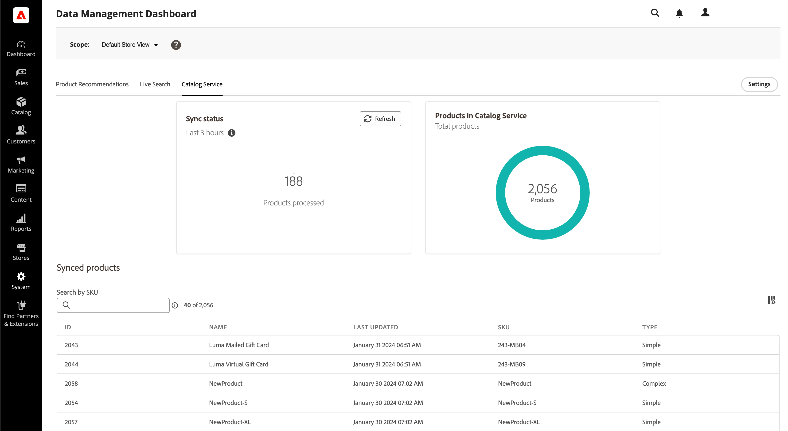

# Opzetten voor succes met [!DNL Live Search]

Adobe Commerce [!DNL Live Search] en [[!DNL Catalog Service]](../catalog-service/guide-overview.md) samen te werken om een krachtige, relevante en intuïtieve zoekoplossing te bieden waarmee uw klanten snel precies kunnen vinden wat ze nodig hebben. Specifiek: [!DNL Catalog Service] oppervlakken van uw catalogusgegevens voor SaaS-services, zoals [!DNL Live Search] te gebruiken.

Dit artikel bevat stapsgewijze instructies voor de implementatie [!DNL Live Search] with [!DNL Catalog Service].

>[!IMPORTANT]
>
>Adobe Commerce biedt opties voor het zoeken naar sites. Zorg ervoor dat u het document [Grenzen en grenzen](boundaries-limits.md) vóór de uitvoering [!DNL Live Search] is geschikt voor uw bedrijfsbehoeften.

## Publiek

Dit artikel is bedoeld voor de ontwikkelaar of systeemintegrator in uw team die verantwoordelijk is voor de installatie en configuratie van uw Adobe Commerce-exemplaar.

## Vereisten

- [Adobe Commerce](https://business.adobe.com/products/magento/magento-commerce.html) 2.4.4+
- PHP 8.1 / 8.2 / 8.3
- [!DNL Composer]

## Ondersteunde platforms

- Adobe Commerce on Cloud (ECE) : 2.4.4+
- Adobe Commerce on-prem (EE) : 2.4.4+

## Workflowoverzicht

Op een hoog niveau [!DNL Live Search] vereist dat u:


## 1. Installeer de [!DNL Live Search] extension

[!DNL Live Search] is geïnstalleerd als een extensie van [Adobe Marketplace](https://commercemarketplace.adobe.com/magento-live-search.html) doorheen [Composer](https://getcomposer.org/). Nadat u hebt geïnstalleerd en geconfigureerd [!DNL Live Search], ADOBE [!DNL Commerce] begint onderzoek en catalogusgegevens met de diensten te delen SaaS. Op dit punt *Beheerder* gebruikers kunnen zoekfacetten, synoniemen en regels voor het wijzigen van handelsversies instellen, aanpassen en beheren.

>[!NOTE]
>
>Vanaf [!DNL Live Search] 3.0.2. [!DNL Catalog Service] extensie is gebundeld in de [!DNL Live Search] installatie.

1. Bevestig dat [kroonbanen](https://experienceleague.adobe.com/en/docs/commerce-operations/configuration-guide/cli/configure-cron-jobs) en [indexeerders](https://experienceleague.adobe.com/en/docs/commerce-admin/systems/tools/index-management) worden uitgevoerd.

   >[!IMPORTANT]
   >
   >Gezien de Elasticsearch 7 eindeaankondiging voor augustus 2023, wordt aanbevolen dat alle Adobe Commerce-klanten naar de OpenSearch 2.x zoekmachine migreren. Voor informatie over het migreren van uw zoekmachine tijdens een productupgrade raadpleegt u [Migreren naar OpenSearch](https://experienceleague.adobe.com/en/docs/commerce-operations/upgrade-guide/prepare/opensearch-migration) in de _Upgradehandleiding_.

1. Download de `live-search` pakket van de [Adobe Marketplace](https://commercemarketplace.adobe.com/magento-live-search.html).

1. Voer de volgende handelingen uit vanaf de opdrachtregel:

   ```bash
   composer require magento/live-search
   ```

   Als u de [!DNL Live Search] uitbreiding van een **new** Adobe Commerce-installatie, voer het volgende uit om uit te schakelen [!DNL OpenSearch] en bijbehorende modules, en installeren [!DNL Live Search]. Ga vervolgens verder met stap 4.

   ```bash
      bin/magento module:disable Magento_Elasticsearch Magento_Elasticsearch7 Magento_OpenSearch Magento_ElasticsearchCatalogPermissions Magento_InventoryElasticsearch Magento_ElasticsearchCatalogPermissionsGraphQl
   ```

   Als u de [!DNL Live Search] uitbreiding van een **bestaand** Adobe Commerce-installatie, voer het volgende uit om het [!DNL Live Search] modules die zoekresultaten leveren. Ga vervolgens verder met stap 4:

   ```bash
      bin/magento module:disable Magento_LiveSearchAdapter Magento_LiveSearchStorefrontPopover Magento_LiveSearchProductListing 
   ```

   [!DNL Elasticsearch] blijft zoekverzoeken van de winkel beheren terwijl de [!DNL Live Search] De dienst synchroniseert catalogusgegevens en indexeert producten op de achtergrond.

1. Voer de volgende handelingen uit:

   ```bash
   bin/magento setup:upgrade
   ```

1. Controleer of het volgende [indexeerders](https://experienceleague.adobe.com/en/docs/commerce-admin/systems/tools/index-management) zijn ingesteld op &quot;Bijwerken via schema&quot;:

   - Productfeed
   - Diervoeders voor productvarianten
   - Feed voor cataloguskenmerken
   - Diervoeders productprijzen
   - Websitegegevensfeed
   - Scopes Klantengroepen Gegevensfeed
   - Diervoeders voor categorieën
   - Diervoeders voor categorierechten

1. Als u installeert [!DNL Live Search] op een nieuw Commerce-exemplaar, bent u klaar en kunt u de [2. API-sleutels configureren](#2-configure-api-keys) sectie. Ga door met de volgende stap als u Live Search installeert op een bestaand Commerce-exemplaar.

1. Voer de volgende opdrachten uit om de [!DNL Live Search] extensie, uitschakelen [!DNL OpenSearch]en uitvoeren `setup`.

   ```bash
   bin/magento module:enable Magento_LiveSearchAdapter Magento_LiveSearchStorefrontPopover  Magento_LiveSearchProductListing 
   ```

   ```bash
   bin/magento module:disable Magento_Elasticsearch Magento_Elasticsearch6 Magento_Elasticsearch7 Magento_ElasticsearchCatalogPermissions Magento_InventoryElasticsearch 
   Magento_ElasticsearchCatalogPermissionsGraphQl
   ```

   ```bash
   bin/magento setup:upgrade
   ```

## 2. API-sleutels configureren

De Adobe Commerce API-sleutel en de bijbehorende persoonlijke sleutel zijn vereist om verbinding te maken [!DNL Live Search] naar een installatie van Adobe Commerce. De API-sleutel wordt gegenereerd en onderhouden in de account van de [!DNL Commerce] licentiehouder, die deze kan delen met de ontwikkelaar of de systeemintegrator. De ontwikkelaar kan vervolgens de SaaS-gegevensruimten maken en beheren namens de licentiehouder. Als u al een set API-sleutels hebt, hoeft u deze niet opnieuw te genereren.

Leer hoe u uw API-sleutels configureert in het dialoogvenster [Commerce Services Connector](../landing/saas.md) artikel.

## 3. Synchroniseer uw catalogusgegevens {#synchronize-catalog-data}

[!DNL Live Search] Hiermee verplaatst u catalogusgegevens naar de SaaS-infrastructuur van de Adobe. De gegevens worden geïndexeerd en de zoekresultaten worden vanuit deze index rechtstreeks aan de winkel geleverd. Afhankelijk van de grootte en complexiteit kan het indexeren 30 minuten tot een paar uur duren.

Voer de volgende opdrachten in deze volgorde uit om te beginnen met de eerste synchronisatie van uw catalogusgegevens naar SaaS-services:

```bash
bin/magento saas:resync --feed productattributes
bin/magento saas:resync --feed products
bin/magento saas:resync --feed scopesCustomerGroup
bin/magento saas:resync --feed scopesWebsite
bin/magento saas:resync --feed prices
bin/magento saas:resync --feed productoverrides
bin/magento saas:resync --feed variants
bin/magento saas:resync --feed categories
bin/magento saas:resync --feed categoryPermissions
```

Wanneer u deze opdrachten uitvoert, begint de eerste synchronisatie van de catalogusgegevens met de SaaS-services.

>[!WARNING]
>
> Terwijl de gegevens worden geïndexeerd en gesynchroniseerd, zijn de zoek en de categorie doorbladerbewerkingen niet beschikbaar in de winkel. Afhankelijk van de grootte van de catalogus kan het proces minstens een uur duren `cron` loopt om uw gegevens aan de diensten te synchroniseren SaaS.

### Synchronisatievoortgang controleren

U kunt de gesynchroniseerde en gedeelde gegevens weergeven met de [Gegevensbeheerdashboard](https://experienceleague.adobe.com/en/docs/commerce-admin/systems/data-transfer/data-dashboard). Dit dashboard biedt waardevolle inzichten in de beschikbaarheid van productgegevens voor uw winkel, zodat deze direct aan uw klanten kunnen worden weergegeven.



#### Updates voor toekomstige producten

Na de eerste synchronisatie kan het tot 15 minuten duren voordat de incrementele productupdates beschikbaar komen voor het zoeken naar een winkel. Zie voor meer informatie [Indexeren - productupdates streaming](indexing.md).

## 4. Controleer of de gegevens zijn geëxporteerd {#verify-export}

Om te controleren of de catalogusgegevens uit uw Adobe Commerce-exemplaar zijn geëxporteerd en zijn gesynchroniseerd voor [!DNL Live Search], hebt u een aantal opties:

- Zoek naar ingangen in de volgende lijsten:

   - `catalog_data_exporter_products`
   - `catalog_data_exporter_product_attributes`

- Gebruik de [GraphQL-speelplaats](https://developer.adobe.com/commerce/services/graphql/live-search/) met de standaardvraag om het volgende te verifiëren:

   - Het aantal geretourneerde producten ligt dicht bij wat u voor de winkelweergave verwacht.
   - Facetten worden geretourneerd.

Zie voor meer informatie [[!DNL Live Search] catalogus niet gesynchroniseerd](https://experienceleague.adobe.com/en/docs/commerce-knowledge-base/kb/troubleshooting/miscellaneous/live-search-catalog-data-sync) in de Support Knowledge Base.

## 5. Vorm de gegevens

Als u uw productgegevens correct configureert, bent u verzekerd van goede zoekresultaten voor uw klanten. In deze sectie schakelt u de widgets voor productlijsten in en wijst u categorieën toe.

### Widgets productlijst inschakelen

Wanneer u installeert [!DNL Live Search] 4.0.0+, zijn de Widgets van de Lijst van het Product standaard toegelaten. Wanneer widgets zijn ingeschakeld, wordt een andere UI-component gebruikt voor de pagina met zoekresultaten en voor de pagina met productaanbiedingen in de categorie. Deze component UI doet directe vraag aan [Catalogusservice-API](https://developer.adobe.com/commerce/services/graphql/catalog-service/product-search/), wat resulteert in snellere reactietijden.

Als u een [!DNL Live Search] Als u een hogere versie dan 4.0.0+ hebt, moet u de widget voor productaanbiedingen handmatig inschakelen.

1. Van de *Beheerder*, ga naar **[!UICONTROL Stores]** > _[!UICONTROL Settings]_>**[!UICONTROL Configuration]**.
1. Onder **[!UICONTROL Live Search]**, selecteert u **[!UICONTROL Storefront Features]**.
1. Set **[!UICONTROL Enable Product Listing Widgets]** tot `Yes`.

   

Wanneer u deze configuratie wijzigt, verschijnt het bericht `Page cache is invalidated` wordt weergegeven. U moet het Geheime voorgeheugen van het Magento leegmaken om uw verandering te bewaren.

1. Toegang krijgen tot de [Cachebeheer](https://experienceleague.adobe.com/en/docs/commerce-admin/systems/tools/cache-management) pagina door een van de volgende handelingen uit te voeren:

   - Klik op de knop **[!UICONTROL Cache Management]** in het bericht boven de werkruimte.
   - Op de _Beheerder_ zijbalk, ga naar **[!UICONTROL System]** > _[!UICONTROL Tools]_>**[!UICONTROL Cache Management]**.

1. Selecteer de **Configuratie** [!UICONTROL Cache Type] en klik op **[!UICONTROL Flush Magento Cache]**.

   Wijzigingen in de winkel worden direct na het leegmaken van de cache aangebracht.

### Categorieën toewijzen

Producten geretourneerd in [!DNL Live Search] moet worden toegewezen aan een [categorie](https://experienceleague.adobe.com/en/docs/commerce-admin/catalog/categories/categories). In Luma worden producten bijvoorbeeld ingedeeld in categorieën zoals &quot;Mannen&quot;, &quot;Vrouwen&quot; en &quot;Luma&quot;. Subcategorieën worden ook ingesteld voor Tops, Bottoms en Watches. Hierdoor wordt de korreligheid bij het filteren verbeterd.

## 6. Test de verbinding {#test-connection}

Met uw catalogusgegevens nu in SaaS, test om ervoor te zorgen de productgegevens in de volgende scenario&#39;s zijn teruggekeerd:

- De [!UICONTROL Search] geeft de resultaten correct weer
- Met bladeren door categorie worden de resultaten correct geretourneerd
- Factoren zijn als filters beschikbaar op pagina&#39;s met zoekresultaten

Als alles correct werkt, [!DNL Live Search] is geïnstalleerd, verbonden en gebruiksklaar.

Als er problemen optreden in de winkel, controleert u de `var/log/system.log` bestand voor API-communicatiefouten of -fouten aan de kant van de services.

Toestaan [!DNL Live Search] via een firewall toevoegen `commerce.adobe.io` op de lijst van gewenste personen.

## 7. Aanpassen voor je winkel

U hebt de [!DNL Live Search] extensie, gesynchroniseerd, gevalideerd en geconfigureerd. Nu wilt u ervoor zorgen dat de [!DNL Live Search] widgets zijn in overeenstemming met het uiterlijk van uw winkel.

U kunt de popover- en PLP-widgets opmaken door desgewenst aangepaste CSS-regels te definiëren. Zie [Popup-elementen opmaken](storefront-popover.md#styling-popover-example) en [Widget pagina met productaanbiedingen](plp-styling.md#styling-example).

Als u de functionaliteit van de widgets wilt uitbreiden, is de broncode voor elke widget beschikbaar in een openbare reactie.
In dit scenario, kunt u JavaScript voor uw eigen behoeften aanpassen en dan uw douanecode op uw CDN ontvangen. Dit aangepaste script communiceert met het [!DNL Live Search] De dienst en keert de resultaten als normaal terug, toestaand u om de functionaliteit van widget te controleren.

- [PLP-widgetreactie](https://github.com/adobe/storefront-product-listing-page)
- [Reactie op zoekbalk](https://github.com/adobe/storefront-search-as-you-type)

## Bijwerken [!DNL Live Search] {#update}

Voer voordat u Live zoeken bijwerkt de volgende handelingen uit vanaf de opdrachtregel om de geïnstalleerde versie van Live Search te controleren:

```bash
composer show magento/module-live-search | grep version
```

Bijwerken [!DNL Live Search], voert u de volgende handelingen uit vanaf de opdrachtregel:

```bash
composer update magento/live-search --with-dependencies
```

Als u wilt bijwerken naar een belangrijke versie zoals 3.1.1 en 4.0.0, bewerkt u de hoofdmap van het project [!DNL Composer] `.json` bestand als volgt:

1. Als uw huidige systeem is geïnstalleerd `magento/live-search` versie is `3.1.1` of lager en u werkt aan een upgrade naar de versie `4.0.0` of hoger, stel het volgende bevel vóór de verbetering in werking:

   ```bash
   bin/magento module:enable Magento_AdvancedSearch
   ```

   Voor informatie over de momenteel geïnstalleerde `magento/live-search` versie, voer het volgende bevel in:

   ```bash
   composer show magento/live-search
   ```

1. De hoofdmap openen `composer.json` bestand en zoek naar `magento/live-search`.

1. In de `require` het versienummer als volgt bijwerken:

   ```json
   "require": {
      ...
      "magento/live-search": "^4.0",
      ...
    }
   ```

1. Opslaan `composer.json`. Voer vervolgens de volgende handelingen uit vanaf de opdrachtregel:

   ```bash
   composer update magento/live-search --with-dependencies
   ```

## Verwijderen [!DNL Live Search] {#uninstall}

Om te verwijderen [!DNL Live Search], zie [Modules verwijderen](https://experienceleague.adobe.com/en/docs/commerce-operations/installation-guide/tutorials/uninstall-modules).

## [!DNL Live Search] pakketten {#packages}

De [!DNL Live Search] de extensie bestaat uit de volgende pakketten:

| Pakket | Beschrijving |
|--- |--- |
| `module-live-search` | Staat handelaars toe om hun onderzoeksmontages voor facetting, synoniemen, vraagregels, etc. te vormen en verleent toegang tot read-only GraphQL playground om vragen van te testen *Beheerder*. |
| `module-live-search-adapter` | Routes onderzoeksverzoeken van de winkel aan [!DNL Live Search] en geeft de resultaten weer in de winkel. <br />- Rubriekbrowse - Routaanvragen van de winkel [topnavigatie](https://experienceleague.adobe.com/en/docs/commerce-admin/catalog/catalog/navigation/navigation-top) aan de zoekdienst.<br />- Globale zoekactie - Routverzoeken van de [snel zoeken](https://experienceleague.adobe.com/en/docs/commerce-admin/catalog/catalog/search/search) in de rechterbovenhoek van de winkel [!DNL Live Search] service. |
| `module-live-search-storefront-popover` | De pop-up &#39;&#39;Zoeken terwijl u typt&#39;&#39; vervangt de standaard snelle zoekopdracht en retourneert gegevens en miniaturen van de bovenste zoekresultaten. |

## [!DNL Live Search] afhankelijkheden {#dependencies}

Het volgende [!DNL Live Search] afhankelijkheden worden vastgelegd door [!DNL Composer].

- `magento/module-saas-catalog`
- `magento/module-saas-category`
- `magento/module-saas-category-permissions`
- `magento/module-saas-product-override`
- `magento/module-saas-product-variant`
- `magento/module-saas-price`
- `magento/module-saas-scopes`
- `magento/module-bundle-product-data-exporter`
- `magento/module-catalog-inventory-data-exporter`
- `magento/module-catalog-url-rewrite-data-exporter`
- `magento/module-configurable-product-data-exporter`
- `magento/module-parent-product-data-exporter`
- `magento/module-gift-card-product-data-exporter`
- `magento/module-bundle-product-override-data-exporter`
- `data-services`
- `services-id`

## Geavanceerde concepten

De volgende secties verstrekken geavanceerdere onderwerpen wanneer het gebruiken [!DNL Live Search] en [!DNL Catalog Service].

### Endpoint

[!DNL Live Search] communiceert door het eindpunt bij `https://catalog-service.adobe.io/graphql`.

Als [!DNL Live Search] geen toegang heeft tot de volledige productdatabase; [!DNL Live Search] GraphQL en Commerce core GraphQL zullen geen volledige pariteit hebben.

Het wordt geadviseerd om SaaS APIs direct te roepen - specifiek het eindpunt van de Dienst van de Catalogus.

- Verhoog de prestaties en verlaag de processorbelasting door het Commerce-database/Graphql-proces te omzeilen
- Profiteer van de [!DNL Catalog Service] federatie [!DNL Live Search], [!DNL Catalog Service], en [!DNL Product Recommendations] vanaf één eindpunt.

In sommige gevallen is het misschien beter om te bellen [!DNL Catalog Service] voor productdetails en soortgelijke gevallen. Zie [refineProduct](https://developer.adobe.com/commerce/services/graphql/catalog-service/refine-product/) voor meer informatie .

Als u een aangepaste implementatie zonder kop hebt, checkt u de [!DNL Live Search] referentie-implementaties:

- [PLP-widget](https://github.com/adobe/storefront-product-listing-page)
- [Veld Live zoeken](https://github.com/adobe/storefront-search-as-you-type)

Als u niet de standaardcomponenten, zoals de Adapter of widgets van het Onderzoek op Luma, of AEM widgets gebruikt, zal de gebeurtenis (klikstroomgegevens die Adobe Sensei voor Intelligente Merchandising en prestatiesmetriek van de voer voorzien) niet uit de doos werken en zal de douaneontwikkeling vereisen om hoofdloze gebeurtenis uit te voeren.

De meest recente versie van [!DNL Live Search] reeds gebruikt [!DNL Catalog Service].

### Taalondersteuning

[!DNL Live Search] widgets ondersteunen de volgende talen:

|  |  |  |  |
|--- |--- |--- |--- |
| Taal | Regio | Taalcode | Landinstelling Magento |
| Bulgaars | Bulgarije | bg_BG | bg_BG |
| Catalaans | Spanje | ca_ES | ca_ES |
| Tsjechisch | Tsjechië | cs_CZ | cs_CZ |
| Deens | Denemarken | da_DK | da_DK |
| Duits | Duitsland | de_DE | de_DE |
| Grieks | Griekenland | el_GR | el_GR |
| Engels | Verenigd Koninkrijk | en_GB | en_GB |
| Engels | Verenigde Staten | nl_NL | nl_NL |
| Spaans | Spanje | es_ES | es_ES |
| Ests | Estland | et_EE | et_EE |
| Baskisch | Spanje | eu_ES | eu_ES |
| Perzisch | Iran | fa_IR | fa_IR |
| Fins | Finland | fi_FI | fi_FI |
| Frans | Frankrijk | fr_FR | fr_FR |
| Galicisch | Spanje | gl_ES | gl_ES |
| Hindi | India | hi_IN | hi_IN |
| Hongaars | Hongarije | hu_HU | hu_HU |
| Indonesische | Indonesië | id_ID | id_ID |
| Italiaans | Italië | it_IT | it_IT |
| Koreaans | Zuid-Korea | ko_KR | ko_KR |
| Litouws | Litouwen | lt_LT | lt_LT |
| Lets | Letland | lv_LV | lv_LV |
| Noors | Norway Bokmal | nb_NO | nb_NO |
| Nederlands | Nederland | nl_NL | nl_NL |
| Pools | Polen | pl_PL | pl_PL |
| Portugees | Brazilië | pt_BR | pt_BR |
| Portugees | Portugal | pt_PT | pt_PT |
| Roemeens | Roemenië | ro_RO | ro_RO |
| Russisch | Rusland | ru_RU | ru_RU |
| Zweeds | Zweden | sv_SE | sv_SE |
| Thai | Thailand | th_TH | th_TH |
| Turks | Turkije | tr_TR | tr_TR |
| Chinees | China | zh_CN | zh_Hans_CN |
| Chinees | Taiwan | zh_TW | zh_Hant_TW |

Als de widget detecteert dat de taalinstelling Commerce Admin (_Winkels_ > Instellingen > _Configuratie_ > _Algemeen_ > Landopties) komt overeen met een ondersteunde taal, de standaardtaal is die taal. Anders worden de widgets standaard ingesteld op Engels.

Beheerders kunnen ook de taal instellen van de [zoekindex](settings.md#language), zodat betere zoekresultaten worden verkregen.

### Widget-codeopslagplaats

De widget pagina met productlijsten en de widget veld Live zoeken kunnen beide worden gedownload van hun kleine opslagplaats.

Op deze manier kunnen ontwikkelaars de functionaliteit en opmaak volledig aanpassen. Deze gebruikers ontvangen de code zelf terwijl nog steeds de voordelen van [!DNL Live Search] service.

- [PLP-widget](https://github.com/adobe/storefront-product-listing-page)
- [Zoekbalk](https://github.com/adobe/storefront-search-as-you-type)

### Inventory management

[!DNL Live Search] supports [Inventory management](https://experienceleague.adobe.com/en/docs/commerce-admin/inventory/introduction) Mogelijkheden in Commerce (voorheen bekend als Multi-Source Inventory of MSI). Om volledige steun toe te laten, moet u [update](install.md#update) de afhankelijkheidsmodule `commerce-data-export` naar versie 102.2.0+.

[!DNL Live Search] Geeft een Booleaanse waarde die aangeeft of een product beschikbaar is in Inventory management, maar geen informatie bevat over de bron van de voorraad.

### Prijsindexering

Klanten met Live zoeken kunnen de nieuwe [SaaS-prijsindexer](../price-index/price-indexing.md), die snellere updates van prijswijzigingen en synchronisatietijd biedt.

### Prijsondersteuning

Live zoekwidgets bieden ondersteuning voor de meeste, maar niet voor alle typen prijzen die door Adobe Commerce worden ondersteund.

Momenteel worden de basisprijzen ondersteund. Geavanceerde prijzen die niet worden ondersteund zijn:

- Kosten
- Minimale geadverteerde prijs

Kijk naar [API-net](../catalog-service/mesh.md) voor complexere prijsberekeningen.

De prijsindeling ondersteunt de landinstellingsinstelling in de Commerce-instantie: *Winkels* > Instellingen > *Configuratie* > Algemeen > *Algemeen* > Lokale opties > Landinstelling.

### Ondersteuning voor headless Storefront

Mogelijk moet u het dialoogvenster `module-data-services-graphql` die de bestaande GraphQL-dekking van de toepassing uitbreidt en velden opneemt die vereist zijn voor het verzamelen van gedragsgegevens van de winkel.

```bash
composer require magento/module-data-services-graphql
```

Deze module voegt extra contexten aan de vragen van GraphQL toe:

- `dataServicesStorefrontInstanceContext`
- `dataServicesMagentoExtensionContext`
- `dataServicesStoreConfigurationContext`

### B2B-ondersteuning

[!DNL Live Search] supports [B2B-functionaliteit](https://experienceleague.adobe.com/en/docs/commerce-admin/b2b/guide-overview) met extra [beperkingen](boundaries-limits.md#b2b-and-category-permissions).

### PWA-ondersteuning

[!DNL Live Search] werkt met PWA Studio, maar gebruikers zien mogelijk kleine verschillen ten opzichte van andere Commerce-implementaties. De basisfunctionaliteit zoals zoeken en pagina met productlijsten werkt in Venia, maar sommige permutaties van Graphql werken mogelijk niet correct. Er kunnen ook prestatieverschillen zijn.

- De huidige PWA-uitvoering van [!DNL Live Search] vereist meer verwerkingstijd om zoekresultaten te retourneren dan [!DNL Live Search] met de native Commerce storefront.
- [!DNL Live Search] in PWA ondersteunt niet [gebeurtenisafhandeling](https://developer.adobe.com/commerce/services/shared-services/storefront-events/sdk/). Zodoende zullen zoekverslagen en intelligente koophandel werken.
- Rechtstreeks filteren op `description`, `name`, `short_description` wordt niet ondersteund door GraphQL bij gebruik met [PWA](https://developer.adobe.com/commerce/pwa-studio/), maar ze krijgen een meer algemeen filter.

Te gebruiken [!DNL Live Search] met PWA Studio moeten de integrators ook :

1. Installeren [livessearch-storefront-utils](https://www.npmjs.com/package/@magento/ds-livesearch-storefront-utils).
1. Stel de `environmentId` in de `storeDetails` object.

   ```javascript
   const storeDetails: StoreDetailsProps = {
       environmentId: <Storefront_ID>,
       websiteCode: "base",
       storeCode: "main_website_store",
       storeViewCode: "default",
       searchUnitId: searchUnitId,
       config: {
           minQueryLength: 5,
           pageSize: 8,
           currencySymbol: "$",
           },
       };
   ```

### Cookies

[!DNL Live Search] verzamelt gegevens over gebruikersinteractie als onderdeel van de basisfunctionaliteit en cookies worden gebruikt om deze gegevens op te slaan. Wanneer de gebruiker om het even welke gebruikersinformatie verzamelt, moet de gebruiker ermee instemmen om koekjes op te slaan. [!DNL Live Search] en [!DNL Product Recommendations] delen de gegevensstroom en daarom het zelfde koekjesmechanisme. Meer informatie hierover vindt u in [Cookie-beperkingen verwerken](https://experienceleague.adobe.com/en/docs/commerce-merchant-services/product-recommendations/developer/setting-cookie).
