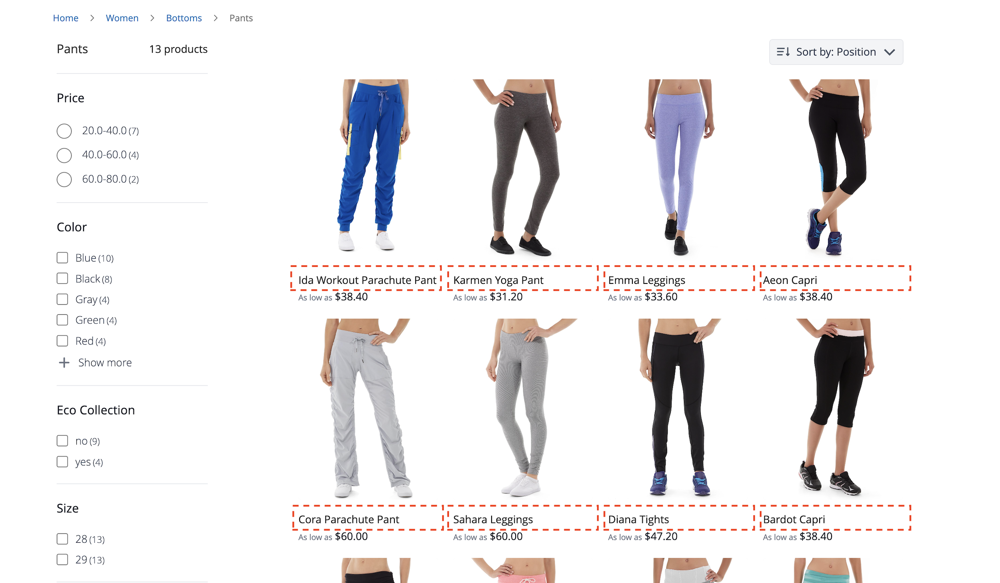
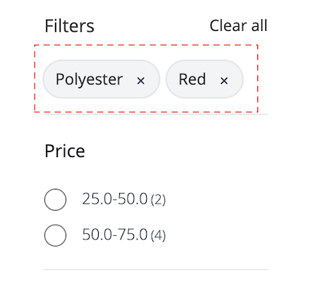

# Widget pagina met productaanbiedingen

De [!DNL Live Search Product Listing Page Widget] (PLP) gebruikt het Commerce Services-platform om een pagina met producten met een presterende, doorzoekbare en facetbare aanbieding te maken. In dit onderwerp wordt beschreven hoe u de PLP-widget kunt inschakelen en opmaken.

## De PLP-widget inschakelen

Wanneer de [!DNL Live Search] de dienst wordt geïnstalleerd, wordt de standaardonderzoeksfunctionaliteit omgezet in [!DNL Live Search] automatisch.

De [!DNL Live Search] PLP-widget is standaard ingeschakeld voor nieuwe installaties. Als u een upgrade uitvoert [!DNL Live Search] en de PLP-widget al is uitgeschakeld, zal dit zo blijven.

>[!IMPORTANT]
>
>Wanneer de [!DNL Live Search Product Listing Page Widget] is ingeschakeld, kan de richting van de sorteervolgorde op een pagina met productlijsten niet worden gewijzigd.

## De PLP-widget uitschakelen

De PLP-widget uitschakelen:

1. Ga naar **Winkels** > Instellingen > **Configuratie** > **[!DNL Live Search]** > **Storefront-functies** en instellen **Widgets productlijst inschakelen** naar &quot;Nee&quot;.
1. Selecteren **Config opslaan** om de instelling op te slaan.

## Widget-functies

De PLP-widget biedt een aantal functies die op een doorzoekbare productpagina worden verwacht. Deze omvatten:

* Filteren op kenmerken
* Ondersteuning voor kleurstalen
* Toevoegen aan winkelwagentje
* Ondersteuning voor meerdere talen
* Prijsschuifregelaars

Zie voor informatie over hoe u de PLP-widget kunt aanpassen aan de bovenstaande functies `storefront-product-listing-page` Lees mij in het volgende [repo](https://github.com/adobe/storefront-product-listing-page/).

## Voorbeeld van stijlen

U kunt het uiterlijk van de PLP-widget aanpassen aan uw site met [CSS](https://developer.adobe.com/commerce/frontend-core/guide/css/).

>[!NOTE]
>
>Elementen met aangepaste klassen binnen een Adobe Commerce-thema worden niet overgeërfd. Deze elementen moeten door hun specifieke klasse worden gericht om de douaneklassen aan te passen; de primaire actieklassen zullen niet aan een widgetknoop werken.
>Algemene doelelementen in de CSS worden overgeërfd; `button` is van toepassing op widgetknoppen.

De gemarkeerde div&#39;s bevatten de doelklasse `ds-sdk-product-item__product-name`.



Pas de productnaam aan door een regel toe te voegen die in hoofdletters wordt geschreven.

```css
.ds-sdk-product-item__product-name {
 text-transform: uppercase;
}
```


## CSS-klassen

### Productlijst

* `.ds-sdk-product-list`: Div buiten
* `.ds-sdk-product-list__grid`: div binnen


#### Paginering van de productlijst

* `.ds-plp-pagination`


* `.ds-plp-pagination_item`


* `.ds-plp-pagination_item--current`


### Widgets

* `.ds-widgets`: Div buiten
* `.ds-widgets__actions`: binnenste div aan linkerkant
* `.ds-widgets__results`: Div aan rechterkant binnenste div


### Vervolgkeuzelijst sorteren

* `.ds-sdk-sort-dropdown`


* `.ds-sdk-sort-dropdown__button`


* `.ds-sdk-sort-dropdown__items`


* `.ds-sdk-sort-dropdown__items--item`


* `.ds-sdk-sort-dropdown__items--item-selected`


* `.ds-sdk-sort-dropdown__items--item-active`


### Facetten

* `.ds-plp-facets`
* `.ds-plp-facets__header`
* `.ds-plp-facets__header_title`
* `.ds-plp-facets__header__clear-all`

{width="350"}

* `.ds-plp-facets__pills`
* `.ds-sdk-pill`

{width="350"}

* `.ds-sdk-pill__label`
* `.ds-sdk-pill__cta`

{width="350"}

* `.ds-plp-facets__list`

{width="350"}

* `.ds-sdk-input`
* `.ds-sdk-input__label`
* `.ds-sdk-product-item__product-swatch-group`
* `ds-sdk-product-item__product-swatch-item`
* `.ds-sdk-input_fieldset_show-more`


* `.ds-sdk-labelled-input`


* `.ds-sdk-labelled-input__input`
* `.ds-sdk-labelled-input__label`


### Product-item

* `.ds-sdk-product-item`
* `.ds-sdk-product-item__image`
* `.ds-sdk-product-item__product-name`
* `.ds-sdk-product-item__product-options`
* `.ds-sdk-product-price`
   * `.ds-sdk-product-price--no-discount`
   * `.ds-sdk-product-price--grouped`
   * `.ds-sdk-product-price--bundle`
   * `.ds-sdk-product-price--discount`


### Laden

* `.ds-sdk-loading`
* `.ds-sdk-loading__spinner`
* `.ds-sdk-loading__spinner-label`


