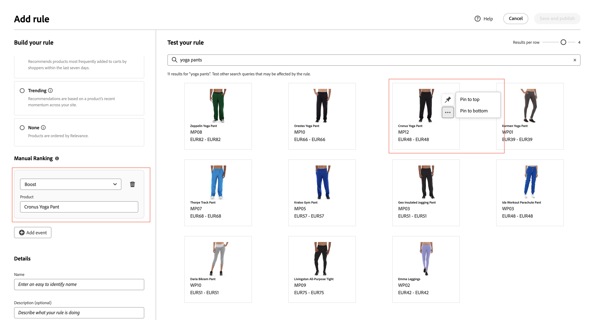

# Regels toevoegen

Om een regel te bouwen, moet de eerste stap de regelredacteur gebruiken om de voorwaarde(n) in de vraagtekst van de verkoopster te bepalen die de bijbehorende gebeurtenis(sen) teweegbrengt. Dan, voltooi de regeldetails, test de resultaten, en publiceer de regel.

## Stap 1: Een regel toevoegen

1. Ga in Beheer naar **Marketing** > SEO &amp; Search > **Live zoeken**.
1. Stel de **Toepassingsgebied** om de [winkelweergave](https://docs.magento.com/user-guide/configuration/scope.html) wanneer de regel van toepassing is.
1. Klik op de knop **Regels** tab.
1. Klikken **Regel toevoegen** om de regeleditor te starten.

   

## Stap 2: Beschrijf de voorwaarde(n)

Voorwaarde(n) zijn de vereisten om een gebeurtenis te activeren. Een regel kan tot tien voorwaarden en 25 gebeurtenissen hebben.

### Eén voorwaarde

1. Onder *Uw regel samenstellen*, selecteert u de **Voorwaarde** en volgt u de instructies om de instructie te voltooien.

   * Zoekquery bevat - Voer de tekenreeks in die in de query van de winkels moet staan. De instelling Afstemmen bepaalt de mate waarin de query van de winkels overeenkomt met de catalogus. Opties:  Willekeurig - Elk deel van de querytekst van de winkels kan overeenkomen met de voorwaarde. Alles - Alle query&#39;s van de klant moeten overeenkomen met de voorwaarde.
   * Zoekquery is - Voer een tekenreeks in die exact overeenkomt met de query van de gebruiker. Bijvoorbeeld: &quot;yoga broek&quot;. Regels met `Search query is` en Overeenkomst `All` kan slechts één voorwaarde hebben.
   * Zoekopdracht begint met - Voer een teken of tekenreeks in die aan het begin van de zoekopdracht van de gebruiker moet staan.
   * Zoekopdracht eindigt met - Voer een teken of tekenreeks in die aan het einde van de zoekopdracht van de gebruiker moet staan.

   De resultaten worden direct weergegeven in het dialoogvenster *Uw regel testen* en worden genummerd op prioriteit. U kunt de *Resultaten per rij* schuifregelaar rechtsboven om het aantal producten in elke rij te wijzigen.

   

1. Om andere vragen te testen, verander de vraagtekst in *Uw regel testen* zoekvak en drukken op **Return**.
Aanvankelijk, geeft de testruit de vraag van het de onderzoeksvakje van de Voorwaarden terug. Maar nu geeft het de vraag van de doos van de testvraag terug. De testruit geeft slechts één vraag tegelijkertijd terug.

   

1. Als het resultaat u bevalt, werkt u de tekst in het dialoogvenster *Voorwaarden* zoekvak. Klik vervolgens ergens op de pagina om de resultaten in het testvenster bij te werken.
1. Ga naar Stap 3 om een eenvoudige regel met één voorwaarde te bouwen: [Gebeurtenis(sen) toevoegen](#events).

### Meerdere voorwaarden

1. Als u een regel met meerdere voorwaarden wilt maken, klikt u op **Voorwaarde toevoegen**.
Een regel kan tot 10 voorwaarden hebben. De logische operator die zich bij twee voorwaarden aansluit, is gebaseerd op de huidige *Overeenkomst* instellen. Standaard, *Overeenkomst* is `All` en de logische operator `AND`.

   

1. Selecteer de tweede voorwaarde en voer de vereiste querytekst in.

   

1. Als u de logica van de regel wilt wijzigen, wijzigt u de **Overeenkomst** het plaatsen om te bepalen hoe dicht de het onderzoekscriteria van de klant de vraagvoorwaarde moeten aanpassen. Set **Overeenkomst** op een van de volgende wijzen:

   * Willekeurige - (Standaard) Alle logische operatoren in de regel zijn ingesteld op `OR` en de resultaten worden weergegeven in het testvenster.
   * Alles - Alle logische operatoren in de regel zijn ingesteld op `AND` en de resultaten worden weergegeven in het testvenster.

   De *Overeenkomst* value bepaalt de logische operator die wordt gebruikt om meerdere voorwaarden samen te voegen. Het wijzigen van *Overeenkomst* bij het instellen worden alle logische operatoren in de regel gewijzigd. Het is niet mogelijk om `AND` en `OR` in dezelfde regel.

   In dit voorbeeld zijn er twee aparte query&#39;s die zoeken naar &#39;yoga&#39; of &#39;broek&#39; in plaats van naar &#39;yoga-broek&#39; te zoeken. Deze regel is minder specifiek en zal vaker in de storefront dan andere teweeggebracht worden.

   

1. Als u nog een voorwaarde wilt toevoegen, klikt u op **Voorwaarde toevoegen** en herhaal het proces.

## Stap 3: Gebeurtenis(sen) toevoegen

Gebeurtenissen zijn acties die de zoekresultaten wijzigen wanneer aan de voorwaarde(n) wordt voldaan. Eén regel kan maximaal 25 gebeurtenissen bevatten.

1. Onder *Gebeurtenissen*, kiest u de **Gebeurtenis** plaatsvinden wanneer aan de desbetreffende voorwaarde(n) is voldaan.

   Kies bijvoorbeeld `Pin a product`. Voer vervolgens de naam in van het product dat u wilt vastzetten. Als u hulp nodig hebt, kunt u de naam in de testruit vinden.
Voer vervolgens de *Positie* waar het vastgezette product moet worden weergegeven. Het product wordt verplaatst naar de nieuwe positie in het testvenster en wordt gemarkeerd met een *Vastgezet* voorvertoningsbadge.

   

1. Kies voor meerdere gebeurtenissen andere gebeurtenissen die u wilt activeren als aan de voorwaarde(n) is voldaan.

   * Verhogen - Selecteer Verhogen. Voer vervolgens de productnaam of SKU in die u hoger wilt verplaatsen in de zoekresultaten. In het testvenster heeft elk geboost product een *Gebost* voorvertoningsbadge.
   * Branden - Verplaatst een SKU lager in de zoekresultaten. Elke SKU is gemarkeerd met een *begraven* voorvertoningsbadge in het testvenster.
   * Een product vastzetten - Voer de productnaam of SKU in. Selecteer vervolgens Positie in de zoekresultaten waar het product moet worden weergegeven. Het product is gemerkt met een *Vastgezet* voorvertoningsbadge in het testvenster.
   * Een product verbergen - Hiermee sluit u een SKU uit van de zoekresultaten.

## Stap 4: De details invullen

De hier ingevoerde informatie wordt weergegeven in het dialoogvenster [Regeldetails](rules-workspace.md) deelvenster.

1. Onder *Details*, voert u een **Naam** voor de regel.
1. Voer een korte beschrijving in **Beschrijving** van de regel.
1. Voer de **Begindatum** en **Einddatum** wanneer de regel actief zal zijn of de data van de kalender kiest.

   Als u een datumbereik wilt selecteren, klikt u op de eerste datum en sleept u om het bereik te selecteren.

   

## Stap 5: De regel testen

1. Onderzoek de resultaten van de regel in de testruit.
1. Als de regel veelvoudige vragen heeft, test elk die door de regel zou kunnen worden beïnvloed.

## Stap 6: Opslaan en publiceren

1. Klik op **Opslaan en publiceren**.

   De regel wordt toegevoegd aan de lijst in de regelwerkruimte.

1. Hoewel de actieve regels onmiddellijk in werking treden, zou u tot 15 minuten kunnen moeten wachten op de caching vraagresultaten in de storefront om worden verfrist.

## Veldomschrijvingen

### Voorwaarden (indien)

| Voorwaarde | Beschrijving |
|--- |--- |
| Zoekquery bevat | Een teken of tekenreeks die wordt opgenomen in de query van de verkoper. De vraag van de verkoopster moet slechts één enkel karakter aanpassen om aan deze voorwaarde te voldoen. |
| Zoekquery is | Een teken of tekenreeks die exact overeenkomt met de query van de winkelier. Complexe query&#39;s met meerdere voorwaarden kunnen niet worden samengesteld wanneer deze voorwaarde wordt gebruikt. |
| Zoekquery begint met | De query van de winkelier begint met dit teken of deze tekenreeks. |
| Zoekquery eindigt met | De query van de winkelier eindigt met dit teken of deze tekenreeks. |

### Logische operatoren

| Operator | Beschrijving |
|--- |--- |
| OF | (Standaard) De logische operator `OR` vergelijkt twee voorwaarden en voldoet aan de vereisten om een gebeurtenis te activeren als minstens één voorwaarde waar is. |
| EN | De logische operator `AND` vergelijkt twee voorwaarden en voldoet aan de vereisten om een gebeurtenis te activeren als beide voorwaarden waar zijn. |

### Operatoren afstemmen

| Operator | Beschrijving |
|--- |--- |
| Alle | Hiermee wijzigt u alle logische operatoren in de regel in `OR` en retourneert de set van overeenkomende producten. |
| Alles | Hiermee wijzigt u alle logische operatoren in de regel in `AND` en retourneert de set van overeenkomende producten. |

### Gebeurtenissen

| Gebeurtenis | Beschrijving |
|--- |--- |
| Verhogen | Hiermee verplaatst u een SKU of reeks SKU&#39;s hoger in de zoekresultaten. Elk object wordt gemarkeerd met een &#39;gebooste&#39; voorvertoningsbadge in de zoekresultaten van de test. |
| Bury | Verplaatst een SKU of een waaier van SKUs lager in de onderzoeksresultaten. Elk object wordt gemarkeerd met een voorvertoningssymbool &quot;begraven&quot; in de resultaten van de testzoekopdracht. |
| Een product vastzetten | Koppelt één SKU aan een specifieke positie in de zoekresultaten. Het product wordt gemarkeerd met een &#39;vastgezette&#39; voorvertoningsbadge in de zoekresultaten van de test. |
| Een product verbergen | Sluit SKU, of waaier van SKUs, van de onderzoeksresultaten uit. |

### Details

| Veld | Beschrijving |
|--- |--- |
| Naam | De naam van de regel. |
| Begindatum | De begindatum van de regel, indien gepland. |
| Einddatum | De einddatum van de regel, indien gepland. |
| Beschrijving | Een korte beschrijving van de regel. |
