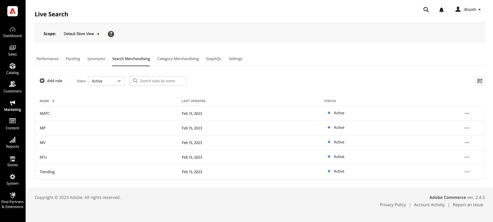
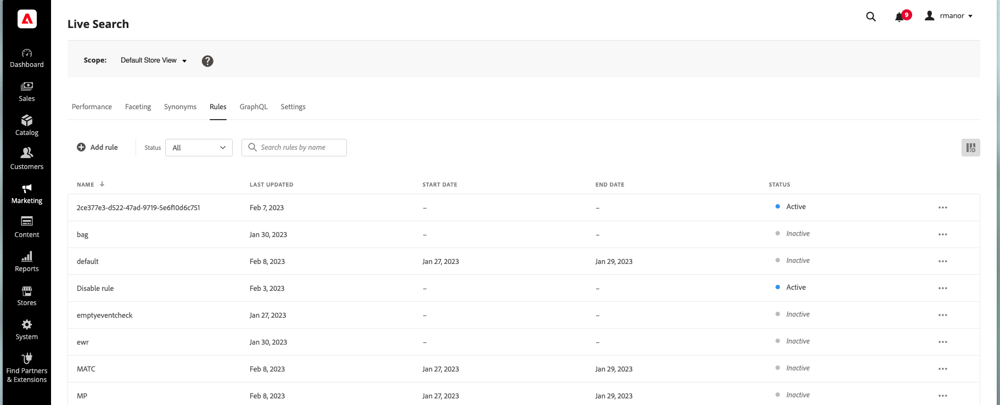

# Werkruimte Regels

De werkruimte van Regels maakt een lijst van de huidige selectie van regels en hun status, en verleent toegang tot hulpmiddelen u regels moet creëren en beheren. Vanuit de werkruimte kunt u:

* Zoeken naar regels
* Regeldetails weergeven
* Regels activeren/deactiveren
* Regels verwijderen
* Toegang tot de regeleditor

## Bereik instellen

Als uw Adobe Commerce-installatie meerdere winkelweergaven bevat, stelt u **Toepassingsgebied** aan de [winkelweergave](https://docs.magento.com/user-guide/configuration/scope.html) waar uw regels van toepassing zijn.

## Kolommen tonen/verbergen

1. Klik in de rechterbovenhoek op **Tonen/verbergen**  kolommen.
De zichtbare kolommen hebben een blauw vinkje in het optiemenu. De regelnaam is de enige kolom die niet kan worden verborgen.

   

1. Voer in het menu een van de volgende handelingen uit:

   * Als u een verborgen kolom wilt weergeven, klikt u op een kolomnaam zonder vinkje.
   * Als u een zichtbare kolom wilt verbergen, klikt u op een kolomnaam met een vinkje.

   

## Regels filteren op status

1. Als uw winkel veel regels heeft, kunt u de regels filteren op status om de lijst te verkorten. Standaard worden in de lijst Regels alle regels weergegeven.

   

1. Als u alleen regels met een specifieke statusinstelling wilt weergeven, stelt u **Status** op een van de volgende wijzen:

   * Alles
   * Actief
   * Inactief
   * Gepland

   

## Regels zoeken op naam

Typ de naam van de regel of een willekeurig woord in de regelnaam.
Met Zoeken zoekt u de overeenkomende regel(s) terwijl u typt. De tekenreeks met overeenkomende tekens wordt gemarkeerd in de naam van elke gevonden regel.

## Details weergeven

In het deelvenster Details ziet u de naam, de status, de voorwaarden en gebeurtenissen van de regel, de begin- en einddatum, de beschrijving en de datum die het laatst is bewerkt. Regels kunnen worden ingeschakeld, bewerkt en verwijderd in het deelvenster Details.

1. Op de *Regels* tabblad, zoekt u de regel in het raster die u wilt weergeven en klikt u op **Meer** (...).
1. Klikken **Details weergeven**.
U kunt de volgende handelingen uitvoeren in het deelvenster Details weergeven:

   * Regel bewerken
   * Regel verwijderen
   * Regel in-/uitschakelen

1. Als u het dialoogvenster *Details weergeven* deelvenster, klikt u op **Sluiten** (X) in de rechterbovenhoek.

   

## Kolombeschrijvingen

| Kolom | Beschrijving |
|--- |--- |
| Naam | De naam van de regel. |
| Laatst bijgewerkt | De datum waarop de regel voor het laatst is bijgewerkt. |
| Begindatum | De begindatum van een geplande regel. |
| Einddatum | De einddatum van een geplande regel. |
| Status | De status met kleurcodes geeft de huidige status van de regel aan. Gebruik het besturingselement Status boven het raster om regels op status te filteren. Waarden: Alle status - Geeft alle regels weer, ongeacht de status. Actief (blauw) - Toont slechts actieve regels. Gepland (oranje) - toont slechts geplande regels. Inactief (grijs) - geeft alleen inactieve regels weer. |

## Besturingselementen

| Control | Beschrijving |
|--- |--- |
| Regel toevoegen | Hiermee opent u de [regeleditor](). |
| Status | Hiermee filtert u de lijst met regels op status. Opties: Alles, Actief, Inactief, Gepland |
|  | Hiermee geeft u de kolommen op die zichtbaar zijn in het raster. Opties: Laatst bijgewerkt, Begindatum, Einddatum, Status |
| Zoeken | Zoekt naar een regel op volledige naam of gedeeltelijke gelijke. |
|  | Toont een menu van meer acties die op de geselecteerde regel kunnen worden toegepast. Opties: Bewerken, Details weergeven, Verwijderen |

## Regeldetails

| Veld | Beschrijving |
|--- |--- |
| Status | De huidige status van de regel. |
| Voorwaarden | De zoekquery die de voorwaarde(n) beschrijft die aan de regel is gekoppeld. |
| Begindatum | De datum waarop de regel van kracht wordt, indien gepland. |
| Einddatum | De datum de regel verloopt, indien gepland. |
| Beschrijving | Een korte beschrijving van de regel. |
| Laatst bijgewerkt | De datum en de tijd de regel het laatst werd bijgewerkt. |
| Ingeschakeld | Een besturingselement dat de status van de regel wijzigt. Opties: Ingeschakeld/Uitgeschakeld |
