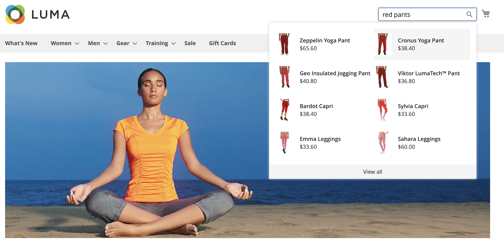

# Storefront Popover

Wanneer [!DNL Live Search] is [geïnstalleerd](install.md), wordt een pop-up weergegeven in de winkel wanneer kopers tekst typen in de [Zoeken](https://docs.magento.com/user-guide/catalog/search-quick.html) doos. Als elk teken wordt getypt, wordt de pop-up bijgewerkt met voorgestelde producten en miniatuurafbeeldingen van de bovenste zoekresultaten.

[!DNL Live Search] retourneert resultaten voor een query van twee tekens of meer. Voor een gedeeltelijke overeenkomst, is het maximumaantal karakters per woord 20. Het aantal karakters in een &quot;onderzoek aangezien u&quot;vraag typt is niet configureerbaar.

>[!NOTE]
>
>De [!DNL Live Search] popover van de opslag is beschikbaar slechts voor winkels die gebruiken *Luminantie* thema of een aangepast thema dat is gebaseerd op *Luminantie*. De *Luminantie* thema is opgenomen in het [!DNL Commerce] voorbeeldgegevens. De popover biedt geen ondersteuning voor de *Leeg* thema. Zie [Werken met een gewijzigd thema](#working-with-modified-theme) voor meer informatie .

## Doorzoekbare kenmerken

Als u gerichte resultaten wilt bereiken, kunt u de set [doorzoekbaar](https://docs.magento.com/user-guide/stores/attributes-product.html#storefront-properties) (`searchable=true`) productkenmerken. Om relevantie te verzekeren, maak attributen doorzoekbaar slechts als zij inhoud bevatten die een duidelijke en beknopte betekenis heeft. Gebruik geen kenmerken die minder nauwkeurige, lange tekst bevatten, zoals `description`Deze optie is standaard ingeschakeld, maar hierdoor kan de precisie van zoekresultaten afnemen. Als iemand bijvoorbeeld zoekt naar &quot;korte broeken&quot; en er overhemden zijn met een beschrijving die de term &quot;korte mouwen&quot; bevat, worden de overhemden opgenomen in de zoekresultaten.

De volgende kenmerken kunnen altijd worden doorzocht:

* `sku`
* `name`
* `categories`

## Pop-paginaformaat

De paginagrootte van popover bepaalt hoeveel lijnen autocompleted producten kunnen zijn teruggekeerd. Eerder was het paginaformaat gecodeerd als zes regels. De `page_size` de waarde is nu een het plaatsen die van kan worden gevormd *Beheer*. Tijdens de installatie van Live zoeken worden de `page_size` De waarde verandert in de huidige waarde van de [Catalogus zoeken](https://docs.magento.com/user-guide/configuration/catalog/catalog.html#catalog-search) - `Autocomplete Limit` instellen.

Standaard is de waarde voor Zoeken in catalogus - automatisch aanvullen van limiet ingesteld op acht regels (of rijen). Ga als volgt te werk om het paginaformaat van de pop-up te wijzigen:

1. Op de *Beheer* zijbalk, ga naar **Winkels** > Instellingen > **Configuratie**.
1. Vouw in het linkerdeelvenster uit **Catalogus** en kiest u **Catalogus** in de lijst met instellingen.
1. Breid uit *Catalogus zoeken* sectie.
1. Stel de **Limiet automatisch aanvullen** op het aantal regels dat u wilt toestaan in de pop-up.
1. Klik op **Config opslaan**.
