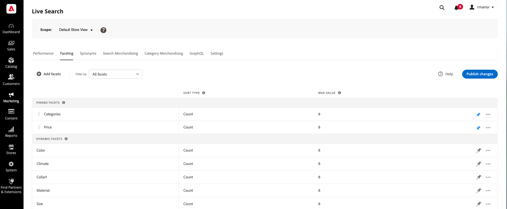

# [!DNL Live Search] Werkruimte

In de werkruimte kunt u de prestaties van [!DNL Live Search]. Het menu boven biedt toegang tot de gereedschappen in elk functioneel gebied.  De beschikbare functies weerspiegelen de huidige menuselectie.

## Bereik instellen

In eerste instantie [bereik](https://experienceleague.adobe.com/docs/commerce-admin/start/setup/websites-stores-views.html#scope-settings) van alle [!DNL Live Search] instellingen zijn ingesteld op `Default Store View`. Als uw [!DNL Commerce] installatie bevat meerdere winkelweergaven, set **Toepassingsgebied** aan de [winkelweergave](https://experienceleague.adobe.com/docs/commerce-admin/start/setup/websites-stores-views.html) waar uw facetinstellingen van toepassing zijn.

## Menuopties

| Option | Beschrijving |
|--- |--- |
| [Prestaties](performance.md) | Het dashboard biedt inzicht in de zoekprestaties van producten. |
| [Faceting](facets.md) | Krachtig filteren waarbij meerdere dimensies van kenmerkwaarden worden gebruikt om zoekcriteria te verfijnen. |
| [Synoniemen](synonyms.md) | Breid het bereik van de zoekopdracht uit tot woorden die kopers kunnen gebruiken om producten te zoeken die afwijken van de producten in uw catalogus. |
| [Regels](rules.md) | Vorm de onderzoekservaring met logische regels die geplande acties teweegbrengen. Verhoog, bury, speld, of verberg producten om onderzoeksresultaten te kalibreren om uw bedrijfsdoelstellingen te steunen. |
| [GraphQL](https://developer.adobe.com/commerce/webapi/graphql/schema/live-search/) | Ontwikkelaars die zijn aangemeld bij de beheerder van uw winkel, kunnen query&#39;s samenstellen en testen met werkelijke catalogusgegevens. Ga voor meer informatie naar [GraphQL - Overzicht](https://developer.adobe.com/commerce/webapi/graphql/) in de [!DNL Live Search] ontwikkelaarsdocumentatie. |
| [Instellingen](settings.md) | Bepaal hoe prijswaarden worden gegroepeerd op prijsbereik in de winkel. |
