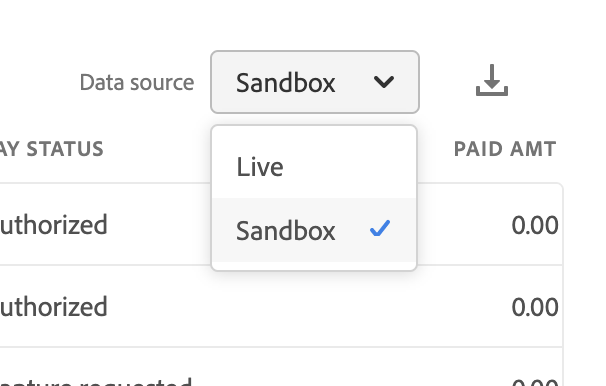

# Betalingsstatusrapport bestellen

[!DNL Payment Services] for [!DNL Adobe Commerce] en [!DNL Magento Open Source] biedt u uitgebreide rapportage zodat u een duidelijk beeld krijgt van de bestellingen en betalingen van uw winkel.

Met het rapport Betalingsstatus bestelling kunt u eenvoudig zien waar een specifieke bestelling zich binnen de bestelling bevindt om de kasstroom te verwerken. Met dit rapport kunt u snel de betalingsstatus van uw bestellingen bekijken en mogelijke problemen identificeren.

U hoeft geen meerdere weergaven te openen om handmatig kruisverwijzingsorders en betalingen te doorlopen. [!DNL Payment Services] for [!DNL Adobe Commerce] en [!DNL Magento Open Source] kunt u een overzicht krijgen van uw bestellingen en betalingen, allemaal in het rapport Betalingsstatus bestellen.

Zie de betalingsstatussen, gefactureerde en verzonden statussen, terugbetalingsstatussen, geschillenstatus en meer in dit rapport in de Admin.

U kunt betalingstransacties voor bestellingen downloaden in de indeling .csv en deze gebruiken in bestaande software voor boekhouding of orderbeheer.

>[!NOTE]
>
>U kunt geen financiële rapporten weergeven als u [Aan boord en geactiveerd Live-modus](production.md#enable-live-payments) for [!DNL Payment Services].

## In het rapport gebruikte gegevens

De [!DNL Payment Services] -module gebruikt bestelgegevens en combineert deze met geaggregeerde betalingsgegevens uit andere bronnen (waaronder PayPal) voor zinvolle en zeer nuttige rapporten.

Bestelgegevens worden geëxporteerd en blijven in de betalingsservice staan. Wanneer u [orderstatussen wijzigen of toevoegen](https://docs.magento.com/user-guide/sales/order-status-custom.html){target=&quot;_blank&quot;} of [een winkelweergave bewerken](https://docs.magento.com/user-guide/stores/stores-all-view-edit.html){target=&quot;_blank&quot;}, [winkel](https://docs.magento.com/user-guide/stores/store-information.html){target=&quot;_blank&quot;}, of de naam van de website, dat de gegevens met betalingsgegevens worden gecombineerd en het rapport Betalingsstatus bestellen wordt gevuld met de gecombineerde informatie.

Er zijn twee stappen in dit proces:

1. De index wordt gewijzigd: `ON SAVE` (telkens wanneer orderinfo of opslaginformatie wordt gewijzigd) of `BY SCHEDULE` (op een vooraf gevormd bouwplan), afhankelijk van hoe het binnen wordt gevormd [Indexbeheer](https://docs.magento.com/user-guide/system/index-management.html){target=&quot;_blank&quot;} in de beheerfunctie.

   Standaard wordt gegevensindexering uitgevoerd `ON SAVE`, wat betekent dat wanneer er iets verandert in de volgorde, de orderstatus, de winkelweergave, de winkel of de website, het opnieuw indexeren onmiddellijk plaatsvindt.

1. De geïndexeerde gegevens worden verzonden naar de betalingsdienst, die vervolgens het rapport over de betalingsstatus van de bestelling invult.

De enige gegevens die voor rapportagedoeleinden worden geëxporteerd en gesorteerd, zijn gegevens die worden gebruikt in het rapport betreffende de betalingsstatus van de betalingsopdracht.

>[!NOTE]
>
>De gegevens in deze tabel worden in aflopende volgorde gesorteerd (`DESC`) standaard gebruikt de `ORDER DATE`. De `ORDER DATE` Dit is de tijdstempel op de datum waarop de bestelling is gemaakt.

### Gegevens exporteren configureren

Alhoewel, door gebrek, gebeurt het opnieuw indexeren binnen `ON SAVE` wordt aanbevolen om te indexeren in `BY SCHEDULE` in. De `BY SCHEDULE` De index wordt uitgevoerd volgens een uitsnijdschema van één minuut en alle gewijzigde gegevens worden weergegeven in het statusrapport van uw bestelling binnen twee minuten na elke gegevenswijziging. Deze geplande herindexering helpt u om het even welke druk op uw opslag te verminderen, vooral als u een groot volume van inkomende orden hebt, omdat het op een programma gebeurt (niet aangezien elke orde wordt geplaatst).

U kunt de indexmodus wijzigen—`ON SAVE` of `BY SCHEDULE`—[in de beheerder](https://docs.magento.com/user-guide/system/index-management.html#change-the-index-mode){target=&quot;_blank&quot;}.

Om te leren hoe te om de gegevensuitvoer te vormen, zie [Configuratie van opdrachtregel](configure-cli.md#configure-data-export).

## Beschikbaarheid

Op de _Beheer_ zijbalk, ga naar **[!UICONTROL Sales]** > **[!UICONTROL Payment Services]** > **[!UICONTROL Order payment status]** om de betalingsstatussen voor uw bestellingen te bekijken.

## Gegevensbron selecteren

In de weergave van het rapport Betalingsstatus bestellen kunt u de gegevensbron selecteren—_[!UICONTROL Live]_of_[!UICONTROL Sandbox]_—waarvoor u rapportresultaten wilt zien.

Indien _[!UICONTROL Live]_is de geselecteerde gegevensbron, kunt u rapportinformatie voor uw opslag zien die gebruikt [!DNL Payment Services] in_[!UICONTROL Live]_ in. Indien [!UICONTROL Sandbox]_ is de geselecteerde gegevensbron, kunt u rapportinformatie voor uw milieu zien Sandbox.

Gegevensbronselecties werken als volgt:

* Als u geen winkels hebt die [!DNL Payment Services] in Live-modus wordt de gegevensbronselectie standaard ingesteld op [!UICONTROL Sandbox]_.
* Als u opslagruimten (één of meerdere) hebt die [!DNL Payment Services] in Live-modus wordt de gegevensbronselectie standaard ingesteld op _[!UICONTROL Live]_.
* De uitvoer van het rapport respecteert altijd de gegevensbronselectie.

Om de gegevensbron voor uw te selecteren [!UICONTROL Order Payment Status] rapport:

1. Op de _Beheer_ zijbalk, ga naar **[!UICONTROL Sales]** > **[!UICONTROL [!DNL Payment Services]]** > **[!UICONTROL Order payment status]**.
1. Klikken **[!UICONTROL Data source]** en selecteert u _[!UICONTROL Live]_of [!UICONTROL Sandbox]_.

   De rapportresultaten regenereren op basis van de geselecteerde gegevensbron.

## Datumtijdframe aanpassen

In de weergave van het rapport Betalingsstatus bestellen kunt u de tijdsperiode van de statussen die u wilt weergeven aanpassen door specifieke datums te selecteren. Standaard worden de betalingsstatussen van 30 dagen voor bestellingen weergegeven in het raster.

1. Op de _Beheer_ zijbalk, ga naar **[!UICONTROL Sales]** > **[!UICONTROL [!DNL Payment Services]]** > **[!UICONTROL Order payment status]**.
1. Klik op de knop **[!UICONTROL Order dates]** Kalenderkiezerfilter.
1. Kies het toepasselijke datumbereik.
1. Bekijk de betalingsstatussen voor de bestelling voor de opgegeven datums in het raster.

## Kolommen tonen en verbergen

Het rapport Betalingsstatus bestelling toont standaard alle beschikbare kolommen met informatie. U kunt, echter, aanpassen welke kolommen u in uw rapport ziet.

1. Op de _Beheer_ zijbalk, ga naar **[!UICONTROL Sales]** > **[!UICONTROL [!DNL Payment Services]]** > **[!UICONTROL Order payment status]**.
1. Klik op de knop _Kolominstellingen_ icon ().
1. Als u wilt aanpassen welke kolommen u in het rapport ziet, schakelt u de kolommen in de lijst in of uit.

   In het rapport Betalingsstatus bestellen worden direct alle wijzigingen weergegeven die u hebt aangebracht in het menu Kolominstellingen. De kolomvoorkeuren worden opgeslagen en blijven van kracht als u niet in de rapportweergave navigeert.

## Statussen weergeven

Standaard worden de betalingsstatussen van 30 dagen voor bestellingen weergegeven in het raster.

Naar links en rechts schuiven om weer te geven [betalingsstatus bestellen](#column-descriptions), inclusief opdrachtdatum, geoorloofde datum, facturering, verzending, status van betaling en meer.

Het aantal rijen dat wordt geretourneerd in een zoekopdracht of dat wordt weergegeven in de standaardbetalingsstatus van 30 dagen van een bestelling, wordt boven het weergaveraster voor betalingsstatus van bestelling weergegeven naast het filter Kalender voor orderdatums.

## Rapportgegevens bijwerken

De weergave van het rapport Betalingsstatus bestelling toont een _[!UICONTROL Last updated]_timestamp die de laatste tijd toont dat de rapportinformatie werd bijgewerkt. Standaard worden de gegevens in het rapport Betalingsstatus van bestelling elke drie uur automatisch vernieuwd.

U kunt ook handmatig afdwingen dat de gegevens in het rapport Betalingsstatus van bestelling worden vernieuwd om de meest actuele rapportgegevens te zien.

1. Op de _Beheer_ zijbalk, ga naar **[!UICONTROL Sales]** > **[!UICONTROL [!DNL Payment Services]]** > **[!UICONTROL Order payment status]**.
1. Klik op de knop _Vernieuwen_ icon ().

   De gegevens van het rapport met de betalingsstatus van de bestelling worden vernieuwd, en *[!UICONTROL Update complete]* de bevestiging verschijnt en de recentste informatie is aanwezig in het net.

## Geschillen bekijken

Je kunt geschillen over bestellingen van je winkel bekijken en naar het PayPal Resolution Center navigeren om actie te ondernemen vanuit het statusrapport voor bestellingen.

1. Op de _Beheer_ zijbalk, ga naar **[!UICONTROL Sales]** > **[!UICONTROL [!DNL Payment Services]]** > **[!UICONTROL Order payment status]**.
1. Ga naar de **[!UICONTROL Disputes column]**.
1. Geschillen voor een bepaalde bestelling bekijken en bekijken [de status van het geschil](#order-payment-status-information).
1. Klik op de link voor het geschil-ID (beginnen met _PP-D-_) om naar de [PayPal-afwikkelingscentrum](https://www.paypal.com/us/smarthelp/article/what-is-the-resolution-center-faq3327).
1. Indien nodig passende maatregelen nemen voor het geschil.

   Klik op de kolomkop Geschillen oplossen als u geschillen wilt sorteren op status.

## Betalingsstatus van bestellingen downloaden

U kunt een CSV-bestand downloaden met alle statussen die zichtbaar zijn in het weergaveraster voor betalingsstatus van bestelling, of u nu de standaardstatus van 30 dagen bekijkt of een aangepast tijdframe.

1. Op de _Beheer_ zijbalk, ga naar **[!UICONTROL Sales]** > **[!UICONTROL [!DNL Payment Services]]** > **[!UICONTROL Order payment status]**.
1. Als u statussen wilt zien gedurende een ander tijdsbestek dan de laatste 30 dagen, [de tijdlijn voor het datumbereik voor uw statussen aanpassen](#customize-dates-timeframe).
1. Klik op de knop _Downloaden_ ().

De betalingsstatus van uw bestelling wordt gedownload in de indeling .csv.

<!-- ## Default order payment status timeframes

These order payment status timeframes are currently available in [!DNL Payment Services].

| Report       | Description          |
| ------------ | -------------------- |
| Yesterday | Available from the Order payment status dates selector, this shows information for the prior date. |
| | Today | Available from the Order payment status dates selector, this shows information for the current day. |
| Last 7 days | Available from the Order payment status dates selector, this shows information for the last seven days. |
| Last 30 days | Available from the Order payment status dates selector and by default in the Order payment statuses view, this shows information for the last 30 days. |
| Last 90 days | Available from the Order payment status dates selector, this shows information for the last 90 days. |
| Year to date | Available from the Order payment status dates selector, this shows information for the the entire year to date. |
| Custom range | Available from the Order payment status dates selector, this can be filtered to show a custom date range. |
-->

## Betalingsstatus bestellen

De weergave Betalingsstatus bestellen bevat uitgebreide informatie over elke status die in het raster wordt weergegeven.

### Kolombeschrijvingen

Betalingsstatusrapporten voor bestellingen bevatten de volgende informatie.

| Kolom | Beschrijving |
| ------------ | -------------------- |
| [!UICONTROL Order ID] | Handelsorder-ID   Verwante items weergeven [orderinfo](https://docs.magento.com/user-guide/sales/orders.html){target=&quot;_blank&quot;}, klikt u op de id. |
| [!UICONTROL Order Date] | Tijdstempel van besteldatum |
| [!UICONTROL Authorized Date] | Tijdstempel van betalingsvergunning |
| [!UICONTROL Order Status] | Huidige handel [orderstatus](https://docs.magento.com/user-guide/sales/order-status.html){target=&quot;_blank&quot;} |
| [!UICONTROL Invoiced] | Factuurstatus van de bestelling—*[!UICONTROL No]*, *[!UICONTROL Partial]*, of *[!UICONTROL Yes]* |
| [!UICONTROL Shipped] | Verzendstatus van bestelling—*[!UICONTROL No]*, *[!UICONTROL Partial]*, of *[!UICONTROL Yes]* |
| [!UICONTROL Order Amt] | Totaalbedrag van de beschikking |
| [!UICONTROL Cur] | Valutatype van order |
| [!UICONTROL Pay Status] | Status van betaling voor een specifieke bestelling |
| [!UICONTROL Paid Amt] | Op bestelling betaald bedrag |
| [!UICONTROL Cur] | Valutatype van het op een bestelling betaalde bedrag |
| [!UICONTROL Refund Status] | Status van een terugbetaling op een bestelling (zoals informatie uit geretourneerde bedragen, RMA&#39;s en kredietmemo&#39;s)—   *[!UICONTROL Requires refund]*, *[!UICONTROL Refund requested]*, *[!UICONTROL Refunded]*, *[!UICONTROL Refund failed]*, of *[!UICONTROL Voided]* |
| [!UICONTROL Refund Amount] | Totaal terugbetaald bedrag voor een bestelling |
| [!UICONTROL Cur] | Valutatype van het bedrag dat voor een order wordt terugbetaald |
| [!UICONTROL Disputes] | Status van een geschil over een bestelling (informatie uit geschillen en terugbetalingen)—*[!UICONTROL Open]*, *[!UICONTROL Waiting for buyer response]*, *[!UICONTROL Waiting for seller response]*, *[!UICONTROL Under review]*, *[!UICONTROL Resolved]*, of *[!UICONTROL Other]* |
| [!UICONTROL Payment Method] | Bij de handelstransactie gebruikte betalingsmethode voor een order |
| [!UICONTROL Website] | Website van waaruit de bestelling is geplaatst |
| [!UICONTROL Store] | Winkel van waaruit de bestelling is geplaatst |
| [!UICONTROL Store View] | Winkelweergave van waaruit de bestelling is geplaatst |
