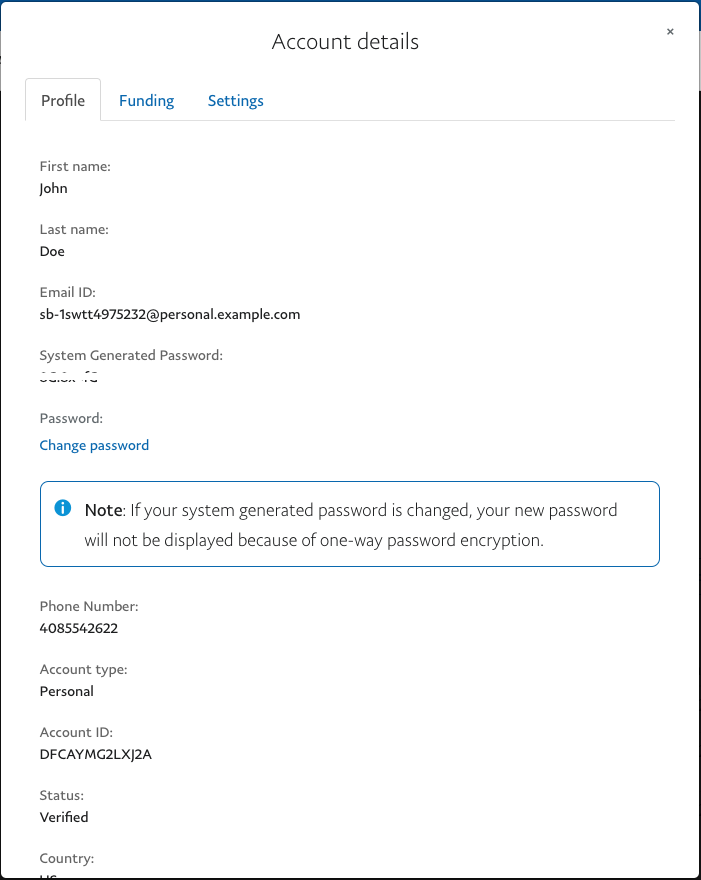
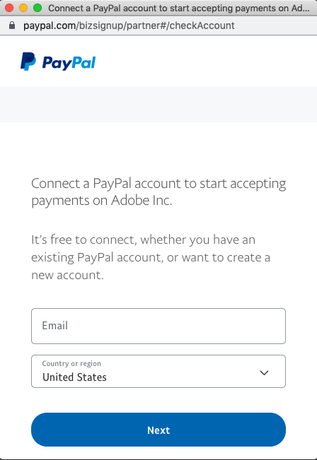

# De testsandbox instellen

Voordat u de sandbox aan boord gaat, moet u zich aanmelden voor een gratis PayPal Developer&#39;s account en zowel zakelijke accounts (voor instaptoegang) als winkelaccounts maken (voor het testen van uw afhandeling). U kunt desgewenst meerdere Developer-accounts maken.

Met een PayPal-sandboxaccount kunt u [!DNL Payment Services] in de testmodus. PayPal vereist dat u een door PayPal Developer Portal gegenereerde Business-sandbox testaccount, e-mail en wachtwoord gebruikt voor het aan boord nemen van sandboxen. *Maak geen andere account tijdens het proces van het instappen van de sandbox.*

## Sandbox aan boord

Sandbox aan boord voltooien:

1. Ga naar de [Pagina PayPal Developer-account](https://developer.paypal.com/developer/accounts/).
1. Klikken **[!UICONTROL Log in to Dashboard]** en meld u aan met uw bestaande door PayPal Developer Portal gegenereerde Business sandbox-testaccount of klik op **Aanmelden** om een account te maken.
1. Een PayPal-sandboxaccount maken:
   1. Ga naar _[!UICONTROL Testing Tools]_>**[!UICONTROL Sandbox Accounts]**.
   1. Klikken **[!UICONTROL Create account]**.

      Als u tijdens het PayPal-instapproces een PayPal-sandboxaccount hebt gemaakt, moet u [de instapsandbox opnieuw instellen](#reset-your-sandbox-account) omdat of omdat je je e-mail niet kunt verifiëren.

   1. Selecteren **[!UICONTROL Business]** als het accounttype en klik op **[!UICONTROL Create]**.
   1. In de _[!UICONTROL Sandbox Accounts]_op de drie stippen in de_[!UICONTROL Manage accounts]_ kolom voor de sandboxaccount die u hebt gemaakt.
   1. Klikken **[!UICONTROL View/edit account]**.

      

   1. Kopieer en sla de e-mailid en het door het systeem gegenereerde wachtwoord op voor toekomstig gebruik.

1. Op de _Beheer_ zijbalk, ga naar **[!UICONTROL Sales]** > **[!UICONTROL Payment Services]**.
1. Klikken **[!UICONTROL Sandbox onboarding]**.

   Deze optie is zichtbaar als u de sandbox voor het instappen nog niet hebt voltooid [!DNL Payment Services].

   Er wordt automatisch een handelings-id voor een sandbox gegenereerd en ingevuld in [instellingen](settings.md). Wijzig of wijzig deze id niet.

   Je krijgt een PayPal-venster te zien waarin je een PayPal-rekening verbindt om betalingen te accepteren.

1. Voer het e-mailadres en het wachtwoord in van de Paypal-sandboxaccount die u hebt gegenereerd in stap 3 (niet uw Paypal-zakelijke accountgegevens) en uw land of regio.
1. Klikken **[!UICONTROL Next]**.

   

1. Ga door met het volgen van de PayPal-stroom en gebruik de gegevens van uw eerder opgeslagen sandbox-account.
1. Op de _Beheer_ zijbalk, ga naar **[!UICONTROL Sales]** > **[!UICONTROL Payment Services]**.

   De **[!UICONTROL Sandbox onboarding]** is niet meer zichtbaar en ziet u de tekst &quot;Sandbox-betalingen in behandeling&quot;.

Wanneer uw PayPal-sandbox is goedgekeurd, wordt een melding weergegeven dat uw betalingssysteem zich in de sandboxmodus bevindt en geen live betalingen verwerkt.

>[!IMPORTANT]
>
>Als u de toestemming intrekt om [!DNL Payment Services] for [!DNL Adobe Commerce] en [!DNL Magento Open Source] voor het verwerken van je betalingen (in de instellingen van je PayPal-rekening) kunnen bestellingen in je winkel niet worden verwerkt door [!DNL Payment Services]. Op de homepage van Betalingsdiensten verschijnt een waarschuwing over de ingetrokken toestemming. Klik op **[!UICONTROL Do not show again]**.

### Uw sandboxaccount opnieuw instellen

Als u een Paypal-sandboxaccount hebt gemaakt tijdens het PayPal-instapproces in de sandbox, moet u de instapsandbox opnieuw instellen, omdat of omdat u uw e-mail niet kunt verifiëren.

Uw sandboxaccount opnieuw instellen:

1. Klikken **[!UICONTROL Reset sandbox]**. [Een PayPal-account voor een zakelijke sandbox maken](https://developer.paypal.com/docs/api-basics/sandbox/accounts/#create-a-business-sandbox-account).
1. Klikken **[!UICONTROL Sandbox onboarding]** en voltooi de volgende reeks stappen.

## Telefoonnummer van contactpersoon inschakelen

Met het telefoonnummer waarmee je contact kunt opnemen, kun je telefoonnummers opvragen die PayPal van je klanten ophaalt. PayPal verzamelt altijd telefoonnummers van PayPal-rekeninghouders om hun identiteit te bevestigen en contact met hen op te nemen om problemen op hun accounts op te lossen of om hun afhandeling te voltooien. PayPal ontmoedigt echter het gebruik van contacttelefoonnummers rechtstreeks van de handelaar, omdat dit negatieve gevolgen kan hebben voor de verkoop. Zie de [PayPal ontvang telefoonnummers](https://developer.paypal.com/docs/admin/checkout-settings/#get-contact-telephone-numbers) documentatie voor meer informatie.

Deze functie is `off` standaard. Wanneer u het toelaat, kunnen de opslagbeheerders telefoonaantallen zien wanneer een klant een Branded stroom van de Controle buiten de controlepagina voltooit.

>[!IMPORTANT]
>
>Deze instelling is niet van toepassing op andere uitcheckstromen.

## Testen in sandboxomgeving

Zie [Testen en valideren](test-validate.md) voor meer informatie .
