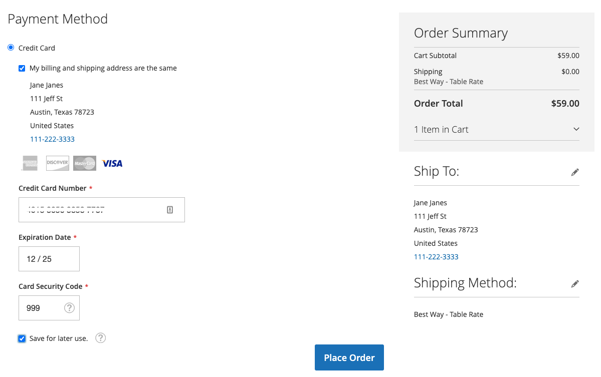

# Creditcard vauleren

Eenmalige klanten converteren naar loyale klanten met een creditcardkluis. Klanten kunnen hun creditcardgegevens tijdens het afrekenen opslaan (of &#39;vault&#39;) en deze gebruiken in een latere aankoop voor dezelfde of een andere winkel binnen dezelfde zakelijke account.

{width="400" zoomable="yes"}

Winkelaars gebruiken het opgeslagen token om een toekomstige afhandeling met hun opgeslagen creditcardgegevens te voltooien.

{width="400" zoomable="yes"}

Ze kunnen ook gemakkelijk hun gefactureerde creditcards verwijderen van [Opgeslagen betalingsmethoden](https://docs.magento.com/user-guide/customers/account-dashboard-stored-payment-methods.html) in hun Mijn account.

{width="400" zoomable="yes"}

## Vulling inschakelen

U kunt creditcardarchivering inschakelen—voor klanten _en_ handelaren in de Admin-voor uw winkels in [!DNL Payment Services] [Instellingen](settings.md#card-vaulting).

## Vullingen gebruiken in de Admin

Als een klant een eerder gearchiveerde creditcard heeft, kan een handelaar een volgende bestelling voor die klant in Admin tot stand brengen gebruikend hun gefactureerde betalingsmethodes.

U kunt alleen in Admin gearchiveerde kaarten gebruiken als de klant zowel een bestaande account als een geldige token in het systeem heeft opgeslagen vanaf een eerder uitgevoerde betaling.

U kunt als volgt een bestelling voor een klant maken in de Admin met de gefactureerde creditcard:

1. [Een bestelling maken en producten toevoegen](https://experienceleague.adobe.com/docs/commerce-admin/stores-sales/point-of-purchase/assist/customer-account-create-order.html).
1. In _[!UICONTROL Payment & Shipping Information]_, selecteert u **[!UICONTROL Stored Cards]**als betalingsmethode.
1. Selecteer de gewenste betalingsmethode voor creditcard.
1. Na het uitvoeren van alle andere noodzakelijke stappen voor de bestelling, [verzenden](https://experienceleague.adobe.com/docs/commerce-admin/stores-sales/point-of-purchase/assist/customer-account-create-order.html?lang=en#step-3%3A-submit-the-order).

   {width="600" zoomable="yes"}

## Beveiliging

Minimale creditcardgegevens worden met de klant gedeeld; deze ziet alleen de laatste vier cijfers, de vervaldatum en het merk van de gefactureerde creditcard. Creditcardgegevens worden bij de betalingsaanbieder opgeslagen om te voldoen aan [PCI](security.md#PCI-compliance) nalevingsnormen.
