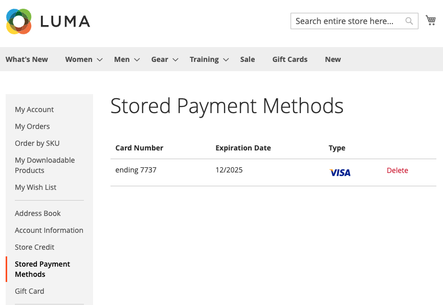

# Creditcard vauleren

Eenmalige klanten converteren naar loyale klanten met een creditcardkluis. Klanten kunnen hun creditcardgegevens tijdens het afrekenen opslaan (of &#39;vault&#39;) en deze gebruiken in een latere aankoop voor dezelfde of een andere winkel binnen dezelfde zakelijke account.

{width="400" zoomable="yes"}

Winkelaars gebruiken het opgeslagen token om een toekomstige afhandeling met hun opgeslagen creditcardgegevens te voltooien.

{width="400" zoomable="yes"}

Zij kunnen hun gefactureerde creditcards van [ Opgeslagen Methoden van de Betaling ](https://docs.magento.com/user-guide/customers/account-dashboard-stored-payment-methods.html) in hun Mijn Rekening ook gemakkelijk schrappen.

{width="400" zoomable="yes"}

>[!WARNING]
>
>PayPal kan momenteel maximaal vijf in kluizen opslaan.

## Vulling inschakelen

U kunt creditcard het in dienst nemen-voor klanten _en_ verkopers in Admin-voor uw opslag in [!DNL Payment Services] [ Montages ](settings.md#card-vaulting) toelaten.

## Vullingen gebruiken in de Admin

Als een klant een eerder gearchiveerde creditcard heeft, kan een handelaar een volgende bestelling voor die klant in Admin tot stand brengen gebruikend hun gefactureerde betalingsmethodes.

U kunt alleen in Admin gearchiveerde kaarten gebruiken als de klant zowel een bestaande account als een geldige token in het systeem heeft opgeslagen vanaf een eerder uitgevoerde betaling.

U kunt als volgt een bestelling voor een klant maken in de Admin met de gefactureerde creditcard:

1. [ creeer een orde en voeg producten ](https://experienceleague.adobe.com/docs/commerce-admin/stores-sales/point-of-purchase/assist/customer-account-create-order.html) toe.
1. Selecteer **[!UICONTROL Stored Cards]** als betalingsmethode in _[!UICONTROL Payment & Shipping Information]_.
1. Selecteer de gewenste betalingsmethode voor creditcard.
1. Na de voltooiing van andere noodzakelijke stappen voor de orde, [ voorlegt het ](https://experienceleague.adobe.com/docs/commerce-admin/stores-sales/point-of-purchase/assist/customer-account-create-order.html?lang=en#step-3%3A-submit-the-order).

   {width="600" zoomable="yes"}

## Beveiliging

Minimale creditcardgegevens worden met de klant gedeeld; deze ziet alleen de laatste vier cijfers, de vervaldatum en het merk van de gefactureerde creditcard. De informatie van de creditcard wordt opgeslagen met de betalingsleverancier om [ te voldoen PCI ](security.md#PCI-compliance) nalevingsnormen.
