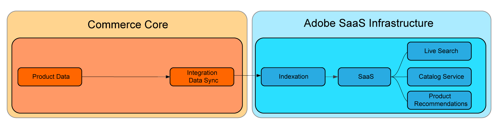

# Prijsindexering SaaS

SaaS-prijsindexering versnelt de tijd die nodig is om prijswijzigingen door te voeren [Commerciële diensten](../landing/saas.md) nadat zij zijn ingediend. Op deze manier kunnen handelaren met grote, complexe catalogi of met meerdere websites of klantengroepen doorlopend prijswijzigingen verwerken.
Als u een koploze winkel hebt of de [catalogusadapter](./catalog-adapter.md) klanten kunnen de Adobe Commerce-indexfunctie voor de basisprijs uitschakelen.

Computationele zware processen zoals indexering en prijsberekening zijn verplaatst van de commercescore naar de cloudinfrastructuur van de Adobe. Op deze manier kunnen handelaren snel hun resources vergroten om de indexatietijden van de prijzen te verhogen en deze wijzigingen sneller te laten doorwerken.

De de indexerende gegevensstroom van de Kern aan de diensten van SaaS ziet als:


Met SaaS-prijsindexering is de stroom:



Alle handelaren kunnen van deze verbeteringen profiteren, maar zij die de grootste winst zullen zien zijn klanten met:

* Constante prijswijzigingen: handelaren die herhaalde prijswijzigingen nodig hebben om strategische doelstellingen te bereiken, zoals veelvuldige promoties, seizoenskortingen of voorraadafwaarderingen.
* Meerdere websites en/of klantgroepen: verkopers met gedeelde productcatalogi op meerdere websites (domeinen/merken) en/of klantgroepen.
* Groot aantal unieke prijzen voor websites of klantgroepen: verkopers met uitgebreide gedeelde productcatalogi die unieke prijzen bevatten voor websites of klantgroepen, zoals B2B-verkopers met vooraf overeengekomen prijzen, merken met verschillende prijsstrategieën.

De prijsindexering van SaaS is gratis beschikbaar voor klanten die de diensten van Adobe Commerce gebruiken en steunt prijsberekening voor alle ingebouwde productsoorten van Adobe Commerce.

In deze minihandleiding wordt beschreven hoe SaaS-prijsindexering werkt en hoe deze kan worden ingeschakeld.

## Vereisten

* Adobe Commerce 2.4.4+
* Minstens één van de volgende Diensten van de Handel met de recentste versie van de uitbreiding van Adobe Commerce:

   * [Catalogusservice](../catalog-service/overview.md)
   * [Live zoeken](../live-search/guide-overview.md)
   * [Product Recommendations](../product-recommendations/guide-overview.md)

Gebruikers van Luma en Adobe Commerce Core GraphQL kunnen de [`catalog-adapter`](catalog-adapter.md) extensie die Luma en Core GraphQl-compatibiliteit biedt en de Adobe Commerce Product Price-index uitschakelt.

## Gebruik

Nadat u uw Adobe Commerce-exemplaar hebt geüpgraded met SaaS-ondersteuning voor prijsindexering, synchroniseert u de nieuwe feeds:

```
bin/magento saas:resync --feed=scopesCustomerGroup
bin/magento saas:resync --feed=scopesWebsite
bin/magento saas:resync --feed=prices
```

## Prijzen voor aangepaste productsoorten

Prijsberekeningen worden ondersteund voor aangepaste productsoorten zoals basisprijs, speciale prijs, groepsprijs, catalogusregelprijs enz.

Als u een aangepast producttype hebt dat een specifieke formule gebruikt om de uiteindelijke prijs te berekenen, kunt u het gedrag van de feed van de productprijs uitbreiden.

## Gebruik

```xml
<config xmlns:xsi="http://www.w3.org/2001/XMLSchema-instance"
        xsi:noNamespaceSchemaLocation="urn:magento:framework:ObjectManager/etc/config.xsd">
    <type name="Magento\ProductPriceDataExporter\Model\Provider\ProductPrice">
        <plugin name="custom_type_price_feed" type="YourModule\CustomProductType\Plugin\UpdatePriceFromFeed" />
    </type>
</config>
```

Nieuwe feeds moeten handmatig worden gesynchroniseerd met de `resync` [CLI, opdracht](https://experienceleague.adobe.com/docs/commerce-merchant-services/user-guides/data-services/catalog-sync.html#resynccmdline). Anders worden de gegevens in het standaardsynchronisatieproces vernieuwd. Meer informatie over de [Catalogus synchroniseren](../landing/catalog-sync.md) proces.

## Gebruiksscenario&#39;s

### Luminantie zonder extensieafhankelijkheid

* Een Luma- of Adobe Commerce Core GraphQL-handelaar die een vereiste service heeft geïnstalleerd (Live Search, Product Recommendations, Catalog Service)
* Geen uitbreidingen van derden die afhankelijk zijn van de PHP-basisprijsindexeerder
* Eenvoudige, configureerbare, gegroepeerde, virtuele en bundeldynamische producten verkopen

1. Nieuwe feeds inschakelen.
1. Installeer de catalogusadapter.

### Luma en Adobe Commerce Core GraphQl met PHP core price indexer afhankelijkheden

* Een Luma- of Adobe Commerce Core GraphQL-handelaar die een ondersteunde service heeft geïnstalleerd (Live Search, Product Recommendations, Catalog Service)
* Met een extensie van derden die afhankelijk is van de PHP-basisprijsindexer
* Eenvoudige, configureerbare, gegroepeerde, virtuele en bundeldynamische producten verkopen

1. De nieuwe feeds inschakelen
1. Installeer de catalogusadapter.
1. Schakel de PHP-index voor de basisprijs opnieuw in.
1. Nieuwe feeds en de Luminantiecode gebruiken in het dialoogvenster `catalog-adapter` -module.

### Hoofdkoopman

* Een headless-leverancier die een ondersteunde service heeft geïnstalleerd (Live Search, Product Recommendations, Catalog Service)
* Geen afhankelijkheid van PHP core price indexer
* Eenvoudige, configureerbare, gegroepeerde, virtuele en bundeldynamische producten verkopen

1. Nieuwe feeds inschakelen
1. Installeer de catalogusadapter, waardoor de PHP-indexfunctie voor de basisprijs wordt uitgeschakeld.

## Aangepaste prijzen

De SaaS-prijsindexer ondersteunt aangepaste productprijskenmerken die beschikbaar zijn in de Adobe Commerce, zoals speciale prijs, groepsprijs en catalogusregelprijs.

Er is bijvoorbeeld een aangepast producttype  `custom_type` en een product met de SKU &quot;Product van het Type van Douane&quot;.

Standaard verzendt de extensie Commerce Data Export de volgende prijsfeed naar de prijsindexer:

```json
{
    "sku": "Custom Type Product",
    "type": "SIMPLE", // must be "SIMPLE" regardless of the real product type
    "customerGroupCode": "0",
    "websiteCode": "base",
    "regular": 123, // the regular base price found in catalog_product_entity_decimal table
    "discounts":    // list of discounts: special_price, group, catalog_rule
    [
        {
            "code": "catalog_rule",
            "price": 102.09
        }
    ],
    "deleted": false,
    "updatedAt": "2023-07-31T13:07:54+00:00"
}
```

Als &quot;Type van Product van de Douane&quot;een unieke formule gebruikt om productprijs te berekenen, kunnen de systeemintegrators de prijs en kortingsgebieden met voeten treden door de uitbreiding van de Uitvoer van Gegevens van de Handel uit te breiden.

1. Een plug-in maken op het tabblad `Magento\ProductPriceDataExporter\Model\Provider\ProductPrice` klasse.

`di.xml` bestand:

```xml
<config xmlns:xsi="http://www.w3.org/2001/XMLSchema-instance"
        xsi:noNamespaceSchemaLocation="urn:magento:framework:ObjectManager/etc/config.xsd">
    <type name="Magento\ProductPriceDataExporter\Model\Provider\ProductPrice">
        <plugin name="custom_type_price_feed" type="YourModule\CustomProductType\Plugin\UpdatePriceFromFeed" disabled="false" />
    </type>
</config>
```

1. Maak een methode met de aangepaste formule:

```php
class UpdatePriceFromFeed
{
    /**
    * @param ProductPrice $subject
    * @param array $result
    * @param array $values
    *
    * @return array
    */
    public function afterGet(ProductPrice $subject, array $result, array $values) : array
    {
        // Get all custom products, prices and discounts per website and customer groups
        // Override the output $result with your data for the corresponding products
        return $result;
    }
}
```
