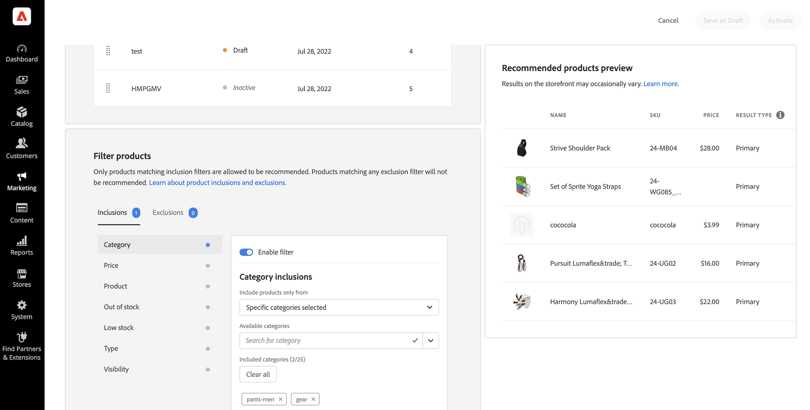

# Nieuwe aanbeveling maken

Wanneer u een aanbeveling creeert, creeert u de eenheid van de a _aanbeveling_ die de geadviseerde product _punten_ bevat.

_eenheid van de Aanbeveling_

Wanneer u de aanbevelingseenheid activeert, begint Adobe Commerce [ gegevens ](workspace.md) te verzamelen om beelden, meningen, klikken, etc. te meten. In de tabel [!DNL Product Recommendations] worden de maatstaven voor elke aanbevolen eenheid weergegeven om u te helpen geïnformeerde zakelijke beslissingen te nemen.

1. Op _Admin_ sidebar, ga **Marketing** > _Bevorderingen_ > **Recommendations van het Product** om de _werkruimte van Recommendations van het Product_ te tonen.

1. Specificeer de [ Mening van de Opslag ](https://experienceleague.adobe.com/docs/commerce-admin/start/setup/websites-stores-views.html#scope-settings) waar u de aanbevelingen aan vertoning wilt.

   >[!NOTE]
   >
   > De aanbevelingen van de Bouwer van de pagina moeten de eenheden in de standaardarchiefmening worden gecreeerd, maar kunnen dan overal worden gebruikt. Meer leren over het creëren van productaanbevelingen met de Bouwer van de Pagina, zie [ Inhoud toevoegen - Recommendations van het Product ](https://experienceleague.adobe.com/docs/commerce-admin/page-builder/add-content/recommendations.html).

1. Klik **creëren Aanbeveling**.

1. In de _Naam uw sectie van de Aanbeveling_, ga een beschrijvende naam voor interne verwijzing, zoals `Home page most popular` in.

1. In de _Uitgezochte paginatype_ sectie, selecteer de pagina waar u de aanbeveling van de volgende opties wilt verschijnen:

   >[!NOTE]
   >
   > Het product Recommendations wordt niet gesteund op de pagina van het Kart wanneer uw opslag aan [ wordt gevormd tonen de het winkelwagentje pagina onmiddellijk na het toevoegen van een product aan de kar ](https://experienceleague.adobe.com/docs/commerce-admin/stores-sales/point-of-purchase/cart/cart-configuration.html#redirect-to-cart).

   * Startpagina
   * Categorie
   * Productgegevens
   * Kar
   * Bevestiging
   * [ de Bouwer van de Pagina ](https://experienceleague.adobe.com/docs/commerce-admin/page-builder/add-content/recommendations.html)

   U kunt maximaal vijf actieve aanbevelingen maken voor elk paginatype en maximaal 25 voor Page Builder. Het paginatype wordt grijs weergegeven wanneer de limiet is bereikt.

   
   _naam van de Aanbeveling en paginaplaatsing_

1. In de _Uitgezochte het type van Aanbeveling_ sectie, specificeer het [ type van aanbeveling ](type.md) u op de geselecteerde pagina wilt verschijnen. Voor sommige pagina&#39;s, is de [ plaatsing ](placement.md) van aanbevelingen beperkt tot bepaalde types.

1. In de _sectie van het vertoningsetiket van de Storefront_, ga het [ etiket ](placement.md#recommendation-labels) in dat aan uw kopers zichtbaar is, zoals &quot;Hoogste verkopers&quot;.

1. In _kies aantal producten_ sectie, gebruik de schuif om te specificeren hoeveel producten u in de aanbeveling eenheid wilt verschijnen.

   De standaardwaarde is `5` , met een maximum van `20` .

1. In de _Uitgezochte plaats_ sectie, specificeer de plaats waar de aanbeveling eenheid op de pagina moet verschijnen.

   * Onderaan de hoofdinhoud
   * Bovenaan de hoofdinhoud

1. (Facultatief) om de orde van de aanbevelingen te veranderen, selecteer, en beweeg de rijen in _kiezen positie_ lijst.

   _kies positie_ sectie toont alle (als om het even welk) gemaakte aanbevelingen voor het paginatype u selecteerde.

   
   _orde van de Aanbeveling op pagina_

1. (Facultatief) in de _sectie van Filters_, [ past filters ](filters.md) toe om te controleren welke producten in de aanbeveling eenheid verschijnen.

   
   _het productfilters van de Aanbeveling_

1. Klik op een van de volgende opties als u klaar bent:

   * **sparen als ontwerp** om de aanbeveling eenheid later uit te geven. U kunt het paginatype of het aanbevelingen type voor een aanbeveling eenheid in een ontwerpstaat niet wijzigen.

   * **activeer** om de aanbeveling eenheid op uw storefront toe te laten.

## Gereedheidsindicatoren

Sommige aanbevelingstypes gebruiken gedragsgegevens van uw klanten aan [ machine het leren modellen ](behavioral-data.md) om gepersonaliseerde aanbevelingen te bouwen.

Alleen catalogusgegevens zijn vereist. Er zijn geen gedragsgegevens nodig voor deze:

* _het meest als dit_
* _onlangs Bekeken_
* _Visuele Gelijkaardig_

Gebaseerd op de laatste zes maanden van de gedragsgegevens van de storefront:

* _Bekeken dit, bekeken dat_
* _Bekeken dit, kocht dat_
* _kocht dit, kocht dat_
* _geadviseerd voor u_

Op populariteit gebaseerde aanbevelingen gebruiken de laatste zeven dagen van storefront gedragsgegevens:

* Meest bekeken
* Meest aangekocht
* Toegevoegd aan winkelwagentje
* Trend

De waarden van de gereedheidsindicator zullen naar verwachting fluctueren als gevolg van factoren zoals de totale grootte van de catalogus, het volume van productinteractiegebeurtenissen (weergaven, toevoegingen aan winkelwagentje, aankopen) en het percentage skus dat deze gebeurtenissen binnen een bepaald tijdvenster registreert, zoals hierboven vermeld. Zo kunnen de gereedheidsindicatoren tijdens piekvakantieseizoensverkeer hogere waarden laten zien dan in tijden van normaal volume.

Om u te helpen de opleidingsvooruitgang van elk aanbevelingstype visualiseren, _Uitgezochte het type van Aanbeveling_ sectie toont een maatregel van bereidheid voor elk type. Deze gereedheidsindicatoren worden berekend op basis van een aantal factoren:

* Voldoende resultaat vastgestelde grootte: Zijn er genoeg resultaten die in de meeste scenario&#39;s worden teruggekeerd om te vermijden gebruikend [ reserveaanbevelingen ](behavioral-data.md#backuprecs)?

* Voldoende variëteit van resultaatsets: vertegenwoordigen de producten die worden geretourneerd een verscheidenheid aan producten uit uw catalogus? Het doel van deze factor is te voorkomen dat een minderheid van producten de enige producten is die op de hele site worden aanbevolen.

Op basis van de bovenstaande factoren wordt een gereedheidswaarde berekend en weergegeven. Een aanbevelingstype wordt beschouwd als klaar om op te stellen wanneer zijn gereedheidswaarde 75% of hoger is. Een aanbevolen type wordt gedeeltelijk geschikt geacht wanneer het voor minstens 50% gereed is. Een aanbevelingstype wordt beschouwd als niet klaar om te worden opgesteld wanneer zijn gereedheidswaarde minder dan 50% is. Dit zijn algemene richtsnoeren, maar elk individueel geval kan verschillen afhankelijk van de aard van de verzamelde gegevens, zoals hierboven beschreven.

_Type van Aanbeveling_

>[!NOTE]
>
>Indicatoren mogen nooit 100% bereiken.

## Voorvertoning Recommendations {#preview}

Het _Aanbevolen paneel van de productvoorproef_ is altijd beschikbaar met een steekproefselectie van producten die in de aanbeveling eenheid zouden kunnen verschijnen wanneer het aan de opslag wordt opgesteld.

Om een aanbeveling te testen wanneer het werken in een niet productiemilieu, kunt u aanbevelingsgegevens van a [ verschillende bron ](settings.md) halen. Dit staat verkopers toe om met regels te experimenteren en de aanbevelingen voor te vertonen alvorens aan productie op te stellen.

| Veld | Beschrijving |
|---|---|
| Naam | De naam van het product. |
| SKU | De voorraadbewaareenheid die aan het product is toegewezen |
| Prijs | De prijs van het product. |
| Resultaattype | Primair - geeft aan dat er voldoende trainingsgegevens zijn verzameld om een aanbeveling weer te geven.  Steun - wijst erop dat er niet genoeg opleidingsgegevens worden verzameld zodat wordt een reserveaanbeveling gebruikt om de groef te vullen. Ga naar [ Gegevens van het Gedrag ](behavioral-data.md) om meer over machine het leren modellen en reserveaanbevelingen te leren. |

Als u een aanbevolen eenheid maakt, experimenteert u met het paginatype, het aanbevolen type en de filters om direct real-time feedback te krijgen over de producten die worden opgenomen. Aangezien u begint te begrijpen welke producten verschijnen, kunt u de aanbeveling eenheid vormen om aan uw bedrijfsbehoeften te voldoen.

Adobe Commerce [ filters ](filters.md) aanbevelingen vermijden tonend dubbele producten wanneer de veelvoudige aanbevelingen eenheden op één enkele pagina worden opgesteld. Hierdoor kunnen de producten die in het voorvertoningsvenster worden weergegeven afwijken van de producten die in het voorvertoningsvenster worden weergegeven.

>[!NOTE]
>
> U kunt geen voorvertoning van het `Recently viewed` -aanbevelingen weergeven, omdat de gegevens niet beschikbaar zijn in Admin.
