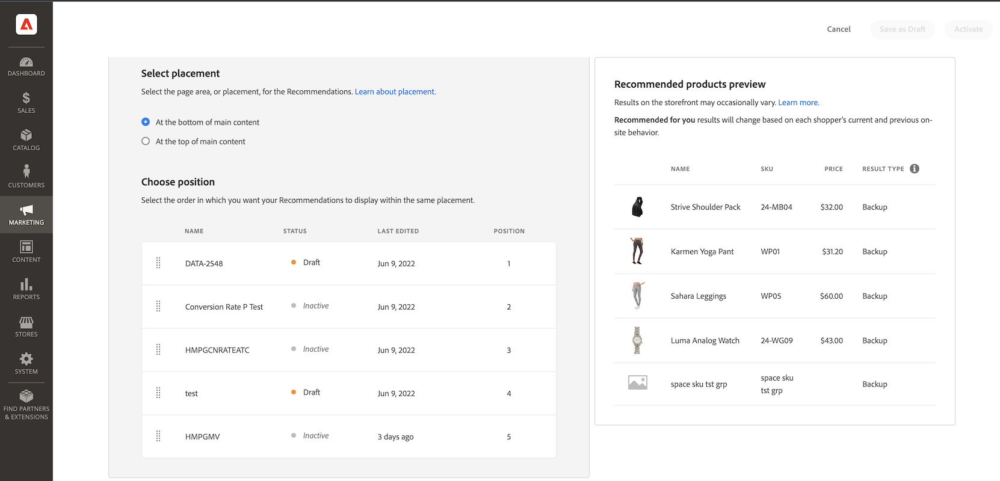

# Nieuwe aanbeveling maken

Wanneer u een aanbeveling maakt, maakt u een _aanbeveling-eenheid_ die het aanbevolen product bevat _items_.

_Aanbevolen eenheid_

Als u de aanbevolen eenheid activeert, begint Adobe Commerce [gegevens verzamelen](workspace.md) om indrukken, weergaven, klikken enzovoort te meten. De [!DNL Product Recommendations] de lijst toont de metriek voor elke aanbevelingseenheid om u te helpen geïnformeerde bedrijfsbesluiten nemen.

1. Op de _Beheerder_ zijbalk, ga naar **Marketing** > _Aanbiedingen_ > **Product Recommendations** om de _Product Recommendations_ werkruimte.

1. Geef de [Winkelweergave](https://experienceleague.adobe.com/docs/commerce-admin/start/setup/websites-stores-views.html#scope-settings) waar u de aanbevelingen wilt tonen.

   >[!NOTE]
   >
   > De aanbevelingen van de Bouwer van de pagina moeten de eenheden in de standaardarchiefmening worden gecreeerd, maar kunnen dan overal worden gebruikt. Meer informatie over het creëren van productaanbevelingen met de Bouwer van de Pagina, zie [Inhoud toevoegen - Product Recommendations](https://experienceleague.adobe.com/docs/commerce-admin/page-builder/add-content/recommendations.html).

1. Klikken **Aanbeveling maken**.

1. In de _Geef uw aanbeveling een naam_ in, voert u een beschrijvende naam in voor interne referentie, zoals `Home page most popular`.

1. In de _Paginatype selecteren_ selecteert u de pagina waarop u de aanbeveling wilt weergeven in de volgende opties:

   - Startpagina
   - Categorie
   - Productgegevens
   - Kar
   - Bevestiging
   - [Page Builder](https://experienceleague.adobe.com/docs/commerce-admin/page-builder/add-content/recommendations.html)

   U kunt maximaal vijf actieve aanbevelingen maken voor elk paginatype en maximaal 25 voor Page Builder. Het paginatype wordt grijs weergegeven wanneer de limiet is bereikt.

   
   _Naam en plaatsing van aanbevelingen_

1. In de _Type aanbeveling selecteren_ in, geeft u de [soort aanbeveling](type.md) u wilt op de geselecteerde pagina verschijnen. Voor sommige pagina&#39;s [plaatsing](placement.md) van aanbevelingen is beperkt tot bepaalde soorten.

   Sommige soorten aanbevelingen gebruiken gedragsgegevens van uw kopers naar [leren van machinemodellen](behavioral-data.md) om gepersonaliseerde aanbevelingen te bouwen. Om u te helpen de opleidingsvooruitgang van elk aanbevelingstype visualiseren, toont deze sectie een maat van bereidheid voor elk type. Deze gereedheidsindicatoren worden berekend op basis van een aantal factoren:

   - Voldoende ingestelde resultaatgrootte: zijn er voldoende resultaten die in de meeste scenario&#39;s worden geretourneerd om het gebruik te vermijden [aanbevelingen voor back-up](behavioral-data.md#backuprecs)?

   - Voldoende variëteit van resultaatsets: vertegenwoordigen de producten die worden geretourneerd een verscheidenheid aan producten uit uw catalogus? Het doel van deze factor is te voorkomen dat een minderheid van producten de enige producten is die op de hele site worden aanbevolen.

   Op basis van de bovenstaande factoren wordt een gereedheidswaarde berekend en weergegeven. Een aanbevelingstype wordt beschouwd als klaar om op te stellen wanneer zijn gereedheidswaarde 75% of hoger is. Een aanbevolen type wordt gedeeltelijk geschikt geacht wanneer het voor minstens 50% gereed is. Een aanbevelingstype wordt beschouwd als niet klaar om te worden opgesteld wanneer zijn gereedheidswaarde minder dan 50% is.

   >[!NOTE]
   >
   >De indicator mag nooit 100% bedragen.

   
   _Type aanbeveling_

1. In de _Weergavelabel Storefront_ in, voert u de [label](placement.md#recommendation-labels) die zichtbaar is voor kopers, zoals Topverkopers.

1. In de _Aantal producten kiezen_ in, gebruikt u de schuifregelaar om op te geven hoeveel producten u wilt weergeven in de aanbevolen eenheid.

   De standaardwaarde is `5`, met een maximum van `20`.

1. In de _Plaatsing selecteren_ , geeft u de locatie op waar de aanbevolen eenheid op de pagina moet worden weergegeven.

   - Onderaan de hoofdinhoud
   - Bovenaan de hoofdinhoud

1. (Optioneel) Als u de volgorde van de aanbevelingen wilt wijzigen, selecteert u de rijen en verplaatst u deze in het dialoogvenster _Positie kiezen_ tabel.

   De _Positie kiezen_ in deze sectie worden alle aanbevelingen weergegeven die (indien van toepassing) zijn gemaakt voor het geselecteerde paginatype.

   
   _Volgorde van aanbevelingen op pagina_

1. (Optioneel) In het dialoogvenster _Filters_ deel [filters toepassen](filters.md) om te controleren welke producten in de aanbevolen eenheid worden vermeld.

   
   _Aanbevelingsproductfilters_

1. Klik op een van de volgende opties als u klaar bent:

   - **Opslaan als concept** om de aanbevolen eenheid later te bewerken. U kunt het paginatype of het aanbevelingen type voor een aanbeveling eenheid in een ontwerpstaat niet wijzigen.

   - **Activeren** om de aanbeveling-eenheid in te schakelen op uw winkel.

## Voorvertoning Recommendations {#preview}

De _Voorvertoning van aanbevolen producten_ het paneel is altijd beschikbaar met een steekproefselectie van producten die in de aanbeveling eenheid zouden kunnen verschijnen wanneer het aan de opslagplaats wordt opgesteld.

Om een aanbeveling te testen wanneer het werken in een niet productiemilieu, kunt u aanbevelingsgegevens van halen [verschillende bron](settings.md). Dit staat verkopers toe om met regels te experimenteren en de aanbevelingen voor te vertonen alvorens aan productie op te stellen.

| Veld | Beschrijving |
|---|---|
| Naam | De naam van het product. |
| SKU | De voorraadbewaareenheid die aan het product is toegewezen |
| Prijs | De prijs van het product. |
| Resultaattype | Primair - geeft aan dat er voldoende trainingsgegevens zijn verzameld om een aanbeveling weer te geven. Back-up - geeft aan dat er onvoldoende trainingsgegevens zijn verzameld, zodat een back-upaanbeveling wordt gebruikt om de sleuf te vullen. Ga naar [Gedragsgegevens](behavioral-data.md) voor meer informatie over modellen voor computerleren en aanbevelingen voor back-ups. |

Als u een aanbevolen eenheid maakt, experimenteert u met het paginatype, het aanbevolen type en de filters om direct real-time feedback te krijgen over de producten die worden opgenomen. Aangezien u begint te begrijpen welke producten verschijnen, kunt u de aanbeveling eenheid vormen om aan uw bedrijfsbehoeften te voldoen.

Adobe Commerce [filters](filters.md) aanbevelingen om dubbele producten te vermijden wanneer de veelvoudige aanbevelingen eenheden op één enkele pagina worden opgesteld. Hierdoor kunnen de producten die in het voorvertoningsvenster worden weergegeven afwijken van de producten die in het voorvertoningsvenster worden weergegeven.

>[!NOTE]
>
> U kunt geen voorvertoning weergeven van de `Recently viewed` het type aanbeveling, omdat de gegevens niet beschikbaar zijn in Admin.
