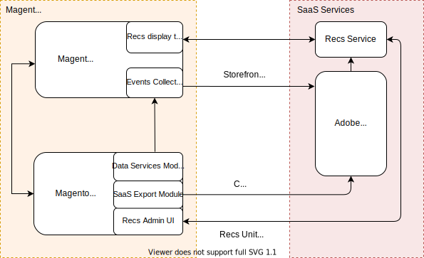

# Recommendations-beheerprogramma voor producten

Product Recommendations is een krachtig marketinginstrument dat u kunt gebruiken om conversies te verhogen, inkomsten te verhogen en de betrokkenheid van winkeliers te stimuleren. Het product Recommendations wordt in de winkel weergegeven in de vorm van eenheden zoals &quot;Klanten die dit product ook bekeken hebben&quot;, &quot;Klanten die dit product ook hebben gekocht&quot;, &quot;Aanbevolen voor u&quot;, enzovoort. Het Product Recommendations van Adobe Commerce wordt aangedreven door [ Adobe Sensei ](https://www.adobe.com/sensei.html), die kunstmatige intelligentie en machine-leert algoritmen gebruikt om een diepe analyse van samengevoegde verkoopgegevens uit te voeren. Deze gegevens, in combinatie met uw Commerce-catalogus, resulteren in zeer boeiende, relevante en persoonlijke ervaringen voor de klant.

>[!NOTE]
>
>Als uw storefront gebruikend PWA Studio wordt uitgevoerd, verwijs naar de [ documentatie van de PWA ](https://developer.adobe.com/commerce/pwa-studio/integrations/product-recommendations/). Als u een douane frontend technologie zoals React of Vue JS gebruikt, verwijs naar de gebruikersgids om te leren hoe te om Product Recommendations in a [ te integreren hoofd ](headless.md) milieu. De instanties zonder kop moeten gebeurtenis uitvoeren om de werkruimte van de Aanbeveling van het Product te aandrijven.

## Overzicht van architectuur

Op hoog niveau wordt Commerce Product Recommendations geïmplementeerd als SaaS. De zijde van Commerce omvat storefront, die de de lay-outmalplaatje van de gebeurtenisinzamelaar en van de aanbevelingen, en het achterste eind bevat, dat de Diensten van Gegevens, de module van de Uitvoer SaaS, en Admin UI omvat. Adobe Sensei-inlichtingendiensten zijn aan SaaS-zijde van de bank geleend.

Zodra de aanbevelingen modules worden geïnstalleerd en gevormd, zal uw opslag beginnen het verzamelen van gedragsgegevens. Adobe Sensei verwerkt deze gedragsgegevens samen met uw catalogusgegevens en berekent productkoppelingen die worden gebruikt door de service met aanbevelingen. Op dit punt, kan de handelaar, producten tot stand brengen leiden en, eenheden van de aanbeveling aan hun winkel direct van Admin UI opstellen.

## Volgende stappen

Lees de volgende onderwerpen om aan de slag te gaan met Product Recommendations:

- [Hoe te om Product Recommendations uit te voeren](implementation-workflow.md)

- [Product Recommendations installeren en configureren](install-configure.md)

- [Product Recommendations maken](create.md)
