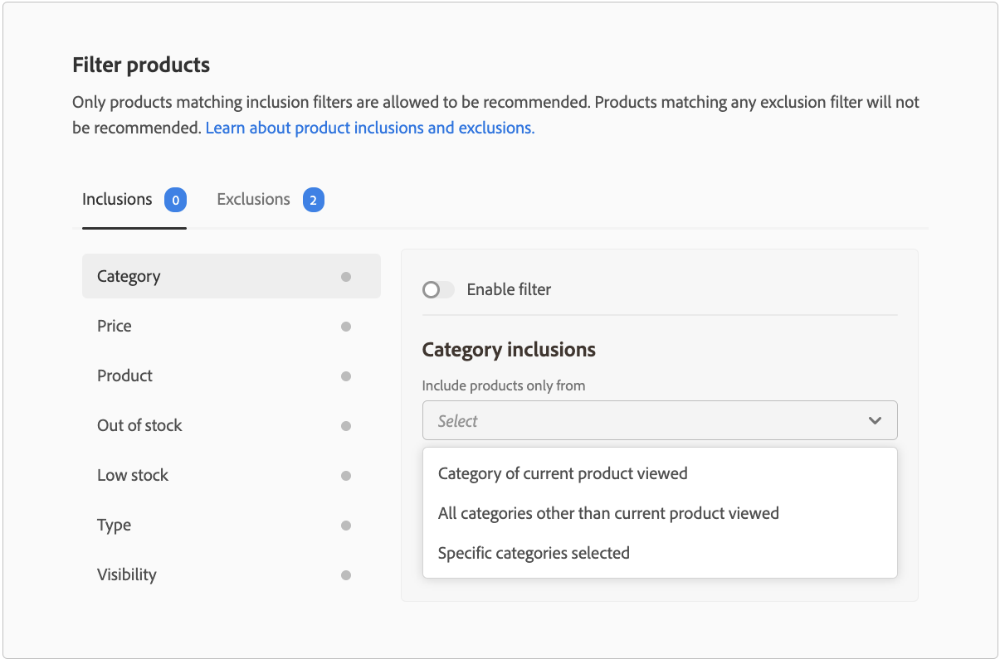

# Filterproducten

Adobe Commerce past automatisch niet-configureerbare standaardfilters op aanbeveling-eenheden toe. Als u meerdere aanbevelingen-eenheden op een pagina hebt geïmplementeerd, filtert Adobe Commerce alle producten uit die in de eenheden worden herhaald. Alleen de eerste verwijzing naar een herhaald product wordt gebruikt om ruimte te maken voor andere producten die kunnen worden aanbevolen. Adobe Commerce filtert ook alle eerder aangeschafte producten en producten die zich in de winkelwagen bevinden.

Wanneer u [maken](create.md) een aanbeveling-eenheid, kunt u filters definiëren die bepalen welke producten in aanbevelingen kunnen worden weergegeven. Deze filters zijn gebaseerd op een reeks opname- of uitsluitingsvoorwaarden die u definieert. In aanbevelingen worden alleen producten weergegeven die aan alle inclusiemogelijkheden voldoen. Producten die aan een van de uitsluitingsvoorwaarden voldoen, worden niet aanbevolen.

U kunt veelvoudige filters vormen en slechts die toelaten u wilt door de knevel op elke filterpagina te selecteren. Op deze manier kunt u concepten van filters maken voor toekomstig gebruik. Het aantal ingeschakelde filters wordt weergegeven op elk tabblad.

## Voorwaarden

De voorwaarden kunnen statisch of dynamisch zijn.

- Een statische voorwaarde gebruikt bestaande productkenmerken om te bepalen welke producten in de eenheid kunnen verschijnen. U kunt bijvoorbeeld opgeven dat alleen producten in voorraad met een prijs hoger dan € 25 in de eenheid worden weergegeven. Statische voorwaarden zijn beschikbaar op alle paginatypen.

- Een dynamische voorwaardensleutel van de huidige context van een winkelier, zoals de momenteel bekeken categorie of het product. Wanneer u bijvoorbeeld een productaanbeveling maakt die moet worden geïmplementeerd op pagina&#39;s met productdetails, kunt u een voorwaarde maken om alleen producten aan te bevelen die binnen een relatief prijsbereik van het momenteel weergegeven product vallen. Dynamische voorwaarden zijn beschikbaar voor elk paginatype, behalve voor de startpagina en op pagina&#39;s met aanbevelingen die bij de Page Builder zijn geplaatst.

### Logische operatoren

Logische operatoren `AND` en `OR` worden gebruikt om meerdere voorwaarden samen te voegen. Als zowel insluitings- als uitsluitingsfilters worden gebruikt, worden de insluitingen eerst geëvalueerd om te bepalen welke producten kunnen worden aanbevolen, waarna producten die overeenkomen met eventuele uitsluitingsfilters uit de lijst worden verwijderd.

- `AND` - Sluit aan bij twee insluitingsfiltervoorwaarden
- `OR` - Voegt twee uitsluitingsfiltervoorwaarden samen

>[!NOTE]
>
> De uitsluitings- en insluitingsfilters vervangen de uitsluitingen van oudere categorieën in versie 3.2.2 en hoger van het dialoogvenster `magento/product-recommendations` module. Zie de [releaseopmerkingen](release-notes.md) voor meer informatie over Adobe Commerce-releases.

## Filtertypen {#filtertypes}

### Categorie

Filters op basis van de categorie van een product maken gebruik van directe categorietoewijzingen en de bijbehorende subcategorieën. Bijvoorbeeld het toelaten van een uitsluitingsvoorwaarde voor categorie `Gear` exclusief producten die zijn toegewezen aan `Gear` en alle subcategorieën ervan, zoals `Gear/Bags` of `Gear/Fitness Equipment`. Voor B2B-handelaren houdt het filter Categorie zich aan alle [klantspecifieke productcategorieën](https://experienceleague.adobe.com/docs/commerce-admin/catalog/categories/category-permissions.html) u hebt gevormd.

Adobe Commerce raadt u aan de volgende configuratie voor categoriefilters te gebruiken wanneer u aanbevelingen op uw paginatypen toepast:

| Pagina | Filteren op |
|---|---|
| Home | Filtreer geen producten. |
| Categorie | Filterproducten in de specifieke categorie. |
| Productgegevens | Producten in dezelfde categorieën filteren. |
| Kar | Filtreer de productcategorieën in het winkelwagentje. |
| Bevestiging van bestelling | Filtercategorieën van aangekochte producten. |

### Product

Productfilters geven aan welke specifieke producten in aanmerking komen of niet in aanmerking komen om in aanbevelingen te worden weergegeven. U kunt geen producten selecteren die gehandicapt of niet individueel zichtbaar zijn omdat die producten nooit in aanbevelingen kunnen verschijnen.

### Type

Een filter op basis van het producttype omvat of sluit alle producten van een specifiek type uit. Tot de ondersteunde typen behoren _Eenvoudig_, _Configureerbaar_, _Virtueel_, _Downloadbaar_, of _Cadeaukaart_. _Bundel_ en _Gegroepeerd_ producten worden nog niet ondersteund.

### Zichtbaarheid

Filterproducten die zijn gebaseerd op zichtbaarheid, zoals: _Catalogus_, _Zoeken_, of beide.

### Prijs

Een filter op basis van de productprijs gebruikt de uiteindelijke prijs om de vergelijking uit te voeren. De uiteindelijke prijs omvat alle kortingen of speciale prijzen die beschikbaar zijn voor anonieme kopers. Voor B2B-handelaren weerspiegelt de weergegeven prijs de [klantspecifieke groepsprijsstelling](https://experienceleague.adobe.com/docs/commerce-admin/catalog/products/pricing/pricing-advanced.html) u hebt gevormd.

### Status van voorraad

De volgende uitsluitingsfilters kunnen worden gebruikt om producten te filteren op basis van de voorraadstatus:

- Niet in voorraad - (alleen Uitsluiting) Omvat geen producten die niet in voorraad zijn.
- Lage voorraad - (Uitsluiting alleen) Omvat geen producten die weinig voorraad hebben. De status van de lage voorraad is gebaseerd op de _Alleen X-linkerdrempel_ waarde in [Inventarisconfiguratie](https://experienceleague.adobe.com/docs/commerce-admin/config/catalog/inventory.html).
