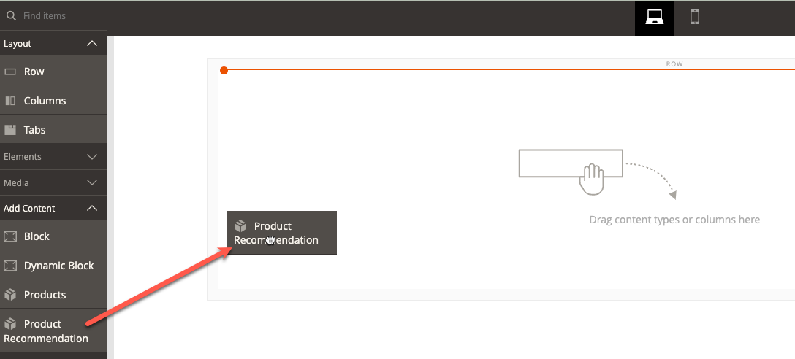

# [!DNL Page Builder] Integratie

Product Recommendations kan worden geïntegreerd in elke pagina Builder-inhoud die u op uw site implementeert.

>[!NOTE]
>
> U kunt maximaal 25 aanbevelingen op een native pagina van de Bouwer van de Pagina hebben. Niet-native pagina&#39;s van de Bouwer van de Pagina kunnen tot 5 aanbevelingen eenheden hebben. Zie [Nieuwe aanbeveling maken](create.md) voor meer informatie .

## Product Recommendations gebruiken met Page Builder-inhoud

1. Maak een aanbeveling-eenheid in de standaardwinkelweergave van een website. Ze moeten in de standaardwinkelweergave worden gemaakt, zelfs als u ze in verschillende winkelweergaven wilt gebruiken.
1. Selecteer in Page Builder de Product Recommendations-inhoudwidget en plaats deze op uw site.

1. Klikken **Productaanbeveling bewerken**
1. Klikken **Selecteren**
1. Selecteer de eerder gemaakte eenheid Aanbeveling en klik op **Geselecteerde toevoegen**

1. Breng eventuele andere wijzigingen in de inhoud van de Page Builder aan en sla uw wijzigingen op.

Bij het teruggeven tijd, wordt de context en het werkingsgebied van de inhoud van de Bouwer van de Pagina geëerbiedigd door de eenheid van de Aanbeveling.
