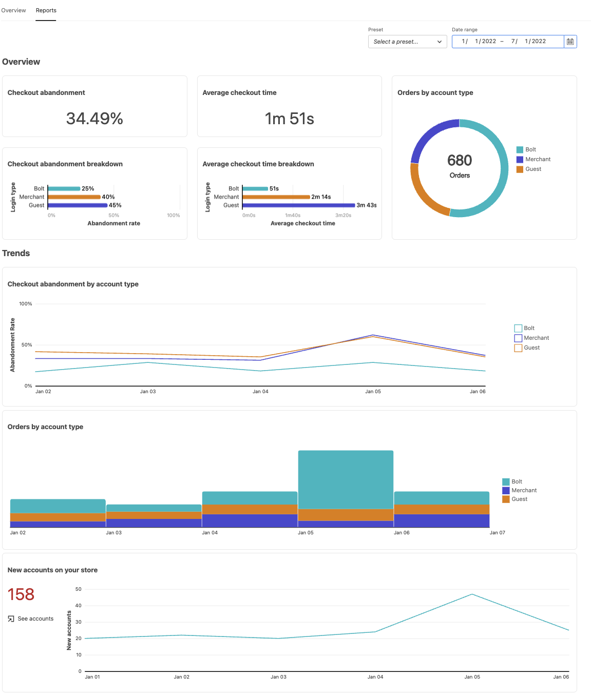

# Rapporten

[!DNL Quick Checkout] voor Adobe Commerce en Magento Open Source biedt u uitgebreide rapportage zodat u gedetailleerde informatie kunt krijgen over de statistieken van uw uitcheckervaring.

>[!WARNING]
>
> U moet [**Afhandeling volgen**](../quick-checkout/settings-quick-checkout.md) in het deelvenster Beheer, zodat Adobe Commerce afrekeninformatie kan delen met Bolt. Deze configuratieoptie is standaard ingesteld op **Ja**. Als deze optie is uitgeschakeld (instellen op **Nee**), wordt de rapportage beïnvloed.

## Overzichtsrapporten

De grafieken in de sectie Overzicht bevatten gedetailleerde informatie over de afrekenprestaties van uw winkel, zoals de gemiddelde afhandelingstijd, nieuwe accounts die zijn gemaakt tijdens het afrekenen of afschaffen van de afhandeling.

| Diagram | Beschrijving |
|---|---|
| [!UICONTROL Checkout abandonment] | Het percentage bezoekers dat het afhandelingsproces verlaat zonder een aankoop te voltooien. |
| [!UICONTROL Checkout abandonment breakdown] | De afhandeling gedeeld door het type bezoeker. Knopinfo geeft een percentage weer dat verschilt tussen Bolt en Gast. Opties: [!UICONTROL Bolt] / [!UICONTROL Merchant] / [!UICONTROL Guest] |
| [!UICONTROL Average checkout time] | De gemiddelde tijd die een bezoeker nodig heeft om het afrekenen te voltooien. |
| [!UICONTROL Average checkout time breakdown] | Gemiddelde afhandelingstijd gedeeld door type bezoeker. Knopinfo geeft een percentage weer dat verschilt tussen Bolt en Gast. Opties: [!UICONTROL Bolt] / [!UICONTROL Merchant] / [!UICONTROL Guest] |
| [!UICONTROL Orders by account type] | Geplaatste bestellingen gedeeld door het type bezoeker. Opties: [!UICONTROL Bolt] / [!UICONTROL Merchant] / [!UICONTROL Guest] |

## Trends-rapporten

De grafieken in de sectie van Trends tonen uw tendensen die van de controleervaring door rekeningstype wordt gefilterd, of nieuwe rekeningen tijdens kassa worden gecreeerd.

| Diagram | Beschrijving |
|---|---|
| [!UICONTROL Checkout abandonment by account type] | De trend van het verlaten van de kassa gedeeld door het type bezoeker. Opties: [!UICONTROL Bolt] / [!UICONTROL Merchant] / [!UICONTROL Guest] |
| [!UICONTROL Orders by account type] | De orders lieten een trend zien gedeeld door het type bezoeker. Opties: [!UICONTROL Bolt] / [!UICONTROL Merchant] / [!UICONTROL Guest] |
| [!UICONTROL New accounts on your store] | Nieuwe accounts in je winkel. |

## Gegevens filteren

U kunt de resultaten filteren die op datum worden weergegeven, of bestaande voorinstellingen, zoals **Laatste 30 dagen**.

| Veld | Beschrijving |
|---|---|
| [!UICONTROL Preset] | Een vervolgkeuzelijst met standaardvoorinstellingen die kunnen worden gebruikt om specifieke gegevensbereiken weer te geven. Standaard: Laatste 30 dagen |
| [!UICONTROL Date range] | Een vervolgkeuzelijst waarmee u een specifiek gegevensbereik kunt selecteren, afhankelijk van de geselecteerde datums. |
